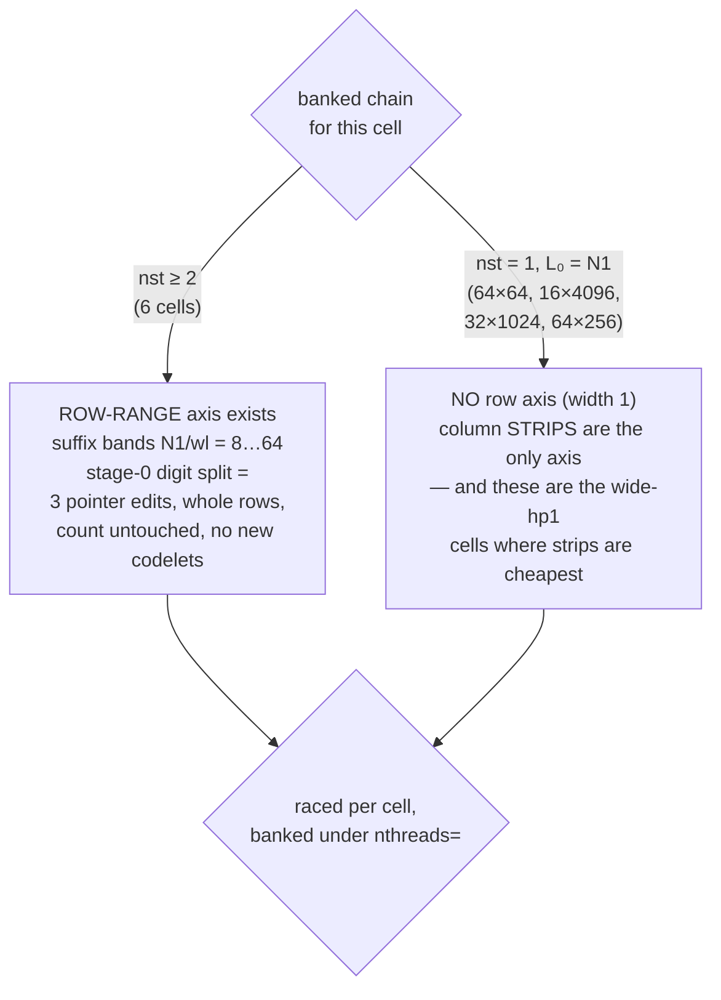

# MT for the native IL 2D real tier — the plan of record

**STATUS: DESIGN 2026-08-26, researched by two independent multi-agent
passes (an evidence track over FFTW + our own tree + the literature, and
a five-way design competition judged on correctness / performance /
cost). This file is the merge. Nothing here is built yet.** Companions:
`rowsplit_rowmode.md`, `../roadmap/fft2d_real_il_design.md`.

## Verdict

**Intra-transform MT is PRIMARY. Plane-per-core is a documented
concurrency CONTRACT, not the strategy.** Two reasons, both measured
rather than argued:

- The four cells whose 8-plane working set stays inside L3 are **7.3%
  of the tier's wall clock**; the cells that break L3 are 92.7%. A
  primary strategy cannot rest on a premise that holds on 7% of the
  work and inverts on the rest.
- Per-core cache residency selects intra-MT unanimously: an
  intra-transform slice is WS/8 (8 KB … 2.05 MB — fits or grazes a
  2 MB private L2 on **10/10** cells), while a whole plane per core is
  WS (fits on 6/10, 5/10 for c2r). The batching argument refutes
  itself on its own cache premise.
- And plane-per-core is the one thing callers can already do by hand.
  Threading one plane is the thing only the library can provide.

## 🔴 Correction to an earlier claim in this project

"MKL can't usefully thread 2D real, so our serial column pass is fine"
is **INVALID**. The v1_0 tables showing ~0.78× MT regressions were
committed *before* the 2026-07-06 pin fix and measured 8 threads on 4
HT-contended cores. This project's own memory records MKL rank-2
scaling **2.2–5.6× at T=8** once its team cannot park, and MKL
documents that all multidimensional transforms on large data are
threaded. Shipping batch-only MT would invert our 20/20 single-thread
record at the thread count a customer actually runs.

## 🔴 A live bug found by both passes (fix regardless of MT)

The 2D real tier forces every child plan to `nthreads=1`
(`vfft.c` rc/sc/ro sites), and `vfft_set_num_threads(1)` **destroys the
pool**. Measured: pool 8 → 1 after a create, and 8 → 1 again after
**every execute**. Creating one 2D real IL plan tears down the thread
pool for the whole process — every other tier included. Fix = a
create-scoped pool freeze plus honest `nthreads` plumbing.

Two more verified hazards ride along: `_stride_worker_t` is 40 B, so
workers share 64 B lines and one worker's dispatch write invalidates a
neighbour's spin line; and the pin stride hard-defaults to 2, so on a
non-SMT or SMT-disabled part workers pin to cores 2,4,6… or run
**unpinned**, silently voiding every L2-privacy argument.

## Why the columns must be threaded (not just the rows)

The sibling tier's 1.4–1.7× plateau reproduces on our own tier — but
the cause is **Amdahl, not pinning**: an engagement-proven, bitwise,
same-run A/B of the row door alone measured 1.47× / 1.74× / 1.58× /
1.52×, which back-solves to a threaded fraction of only 0.37–0.49. The
in-tree probe agrees (at 4096×16: rows ≈ 40 µs of a 104 µs plane). The
serial column pass is the ceiling, so it is the target.

## The partition is chain-determined — and must be RACED



Neither axis may be fixed. Row-range is unavailable on four cells;
strips carry a real false-sharing hazard on the others, because
**hp1 = N2/2+1 is always odd**, so the 16·hp1-byte row pitch is never
64 B aligned — only 1 row in 4 starts on a line boundary, and a strip
boundary then splits a line between two workers on 3 rows in 4. Both
arms go in the racer's pool, or we bank one by default and hit the
*banked-rule-blocks-its-own-racer* trap.

**MT == ST bitwise is a theorem here**, not a hope: every column kernel
is a pure map over (block, digit, column), and the odd-count tail runs
the same DAG at VEX-128 with the same FMA order — so any partition of
{block, digit, count} is bit-neutral. The gate must compare *this plan
at T* against *this plan at 1* (never against the ST-banked plan, whose
chain may differ).

## Increments

| # | what | cost | expected |
|---|---|---|---|
| **0** | pool freeze + honest `nthreads` plumbing; pad the worker struct to 64 B; fix the pin map; add `vfft_cpu_l3_bytes()`; add `nthreads=` to the 2D key (matched only via `vw2_key_serves`) | ~40 lines, 4 files | no speed — fixes a live bug and makes MT legally expressible |
| **1** | turn on the TC row door's existing clone MT (it is already the right handle shape, safety-gated by `_tc_inner_mt_safe` / `_tc_clone_equiv`) | ~5 lines on top of 0 | **measured 1.47–1.74×** |
| **2** ✅ | *measurement only*: price the row→column exchange and the barrier constant (`benches/il2d_exchange_probe.c`) | done | **see the measured verdict below** |
| **3** | column-pass MT with the partition RACED (row-range ⟷ strip), one dispatch + one internal barrier, engagement counters | one file, existing functions already take (base, nrows, pitch, cnt) separately | unlocks the 55–62% serial remainder: **4–6×** on row-range cells, 2.5–4× on strip cells |
| **4** | **conditional on 2**: match the row partition to the column partition so the stage-0 exchange is zero (the "sliding seam" — rows and stage 0 become one exchange-free phase, leaving exactly one barrier) | medium; breaks the TC dispatch's no-tail property | ≤20% at 300 GB/s, up to ~90% at 30 GB/s. **If the probe says ≥100 GB/s, do not build it** |
| **5** | plane-per-core as a documented, gate-tested contract + refcounted read-only tables + a batched-2D wrapper gated by `8 × per-plane WS ≤ L3` | small | throughput only, on the 7% |

## INC-2 measured (2026-08-26) — the barrier is cheap, the exchange is everything

T=8, pinned, min-of-15, on the plane sizes of the banked cells. `W` = 8
workers each write their own row range; `R1` = each reads **its own**
rows back; `R2` = each reads a **column strip** (so every worker touches
every other's dirty lines); `R0` = one core does it all.

```
 cell        plane KB    W      R1 own    R2 strips   R0 1 core
 256x256        516     9500      3100       9200       23100
 512x512       2056    33300     11800      32000       92300
 1024x1024     8208    38600     46400     109000      368600
 4096x64       2112    25900     12100      42800       94800
 8192x64       4224    36700     24000      63500      190000
 4096x16        576    10600      3500      13800       25800
      barrier (dispatch 7 + wait_all) = 100 ns
```

- **Matched partition scales ~8× (R0/R1 = 7.8–7.9×); orthogonal scales
  ~3× (R0/R2 = 2.9–3.4×).** Reading your own rows out of your private
  L2 is near-linear; reading columns someone else wrote is not.
- The exchange (R2−R1) is 6–63 µs = 4–10% of a cell's *single-thread*
  transform, but **40–60% of its ideal T=8 time** — that is precisely
  the missing ~2.5× of column scaling.
- Effective strip bandwidth is 42.7–77.1 GB/s, **below the 100 GB/s
  line**, so the exchange is worth engineering away.
- **The barrier costs 100 ns** — ~25× cheaper than the estimate the
  plan was priced against. Two barriers are ~5% even at 64×64, so the
  one-barrier "sliding seam" is **not** justified by barrier cost; the
  create-time pruner it implied prunes nothing and is dropped.

**The structural consequence — INC-3's partition ordering is now
decided by measurement, not taste:** the row-range column partition
reads exactly the rows the row pass just wrote, so it is
**exchange-free by construction** (the ~8× column), while strips pay
the full exchange (~3×). Race row-range first wherever it exists (the
six multi-stage cells); strips are the fallback axis for the four
single-stage cells — which conveniently have hp1 = 33/129/513/2049,
the benign end (≥64 B per row segment). The pathological strip case
(hp1 = 9, 16 B per row, 42.7 GB/s) belongs to 4096×16, which *has* a
row axis and should never take it.

## Refused (with the reason)

- **Plane-per-core as primary** — cache premise inverted, 7.3% of the
  wall clock, and callers can already do it themselves.
- **ROWSPLIT band MT** — a genuine data race (bands share one lazily
  allocated `rowwork` / `c2r_im_buf` / `rowscr` on the plan), one cell
  of benefit, and it would unwind the row-mode fusion just shipped.
- **Any fixed column partition** — strips-always and row-range-always
  are both refuted; it is a raced axis.
- **Transposing the plane to turn columns into rows** — 4C of streaming
  traffic against 0.875C of exchange; dead under any exchange rate the
  probe could return.
- **Rounding strip boundaries to 64 B** — does not fix the split lines
  (the row start rotates because hp1 is odd) *and* collapses parallel
  width (hp1=33 → 5 workers, hp1=9 → 3).
- **Padding the complex plane pitch** — breaks the unpadded CCE
  interop contract the entire vs-MKL record is measured against.
- **Reusing `_tc_mt_floor`'s 2048 complex points** as a whole-transform
  gate — calibrated for a one-barrier embarrassingly-parallel batch,
  ~10× too permissive here (two barriers are 46% of a 3.9 µs 64×64).
  Equally refused: inventing a replacement constant.
- **Intra-transform MT at 64×64** — 34 KB, ~4 µs; the barriers cost
  more than the work.

## Laws

- **No engage floor is written down.** `nthreads` is a *key axis*: at
  create with a live pool the cell races {T=1, T=pool × partition arms}
  and banks the winner under `nthreads=T`. If T=1 wins, the banked row
  says so and MT never engages for that cell. A measured pruner may
  skip racing MT arms when `2 × barrier_cost > 0.25 × banked ST`, but
  that is a create-time economy, never a serving decision.
- A `T=4` verdict must never serve a `T=8` request.
- Caller on core 0; workers 1..T−1 (a collision anti-scales 10–100×).
- Engagement printed and asserted (clones built **and** dispatch taken)
  — an all-1.00× table that never threaded has happened here before.
- MT == ST bitwise, same plan, per cell, per direction, T ∈ {2,4,8}.
- Same-run alternated arms only; never ≥200 ms pacing between threaded
  arms (the `KMP_BLOCKTIME` parking trap).
- The row width `rw` must be **re-raced at the threaded row count**: a
  worker at 1024×1024 with T=8 holds 128 rows, so the banked W=256 is
  *illegal*, not merely suboptimal.
