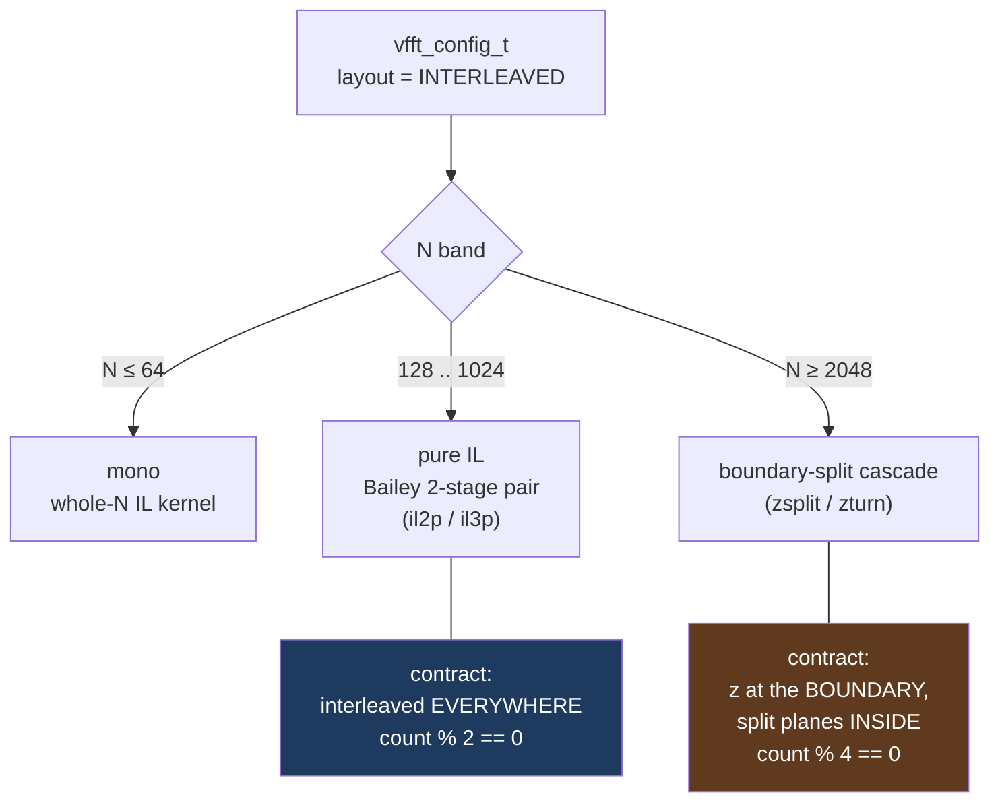
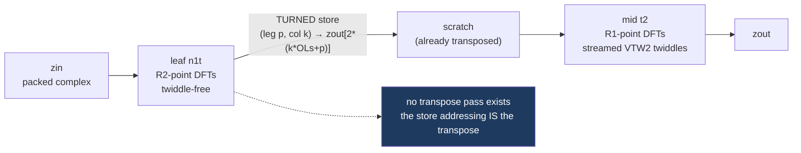
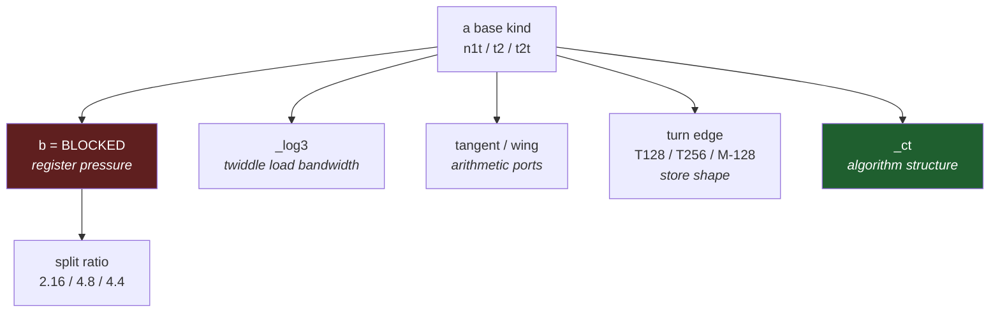
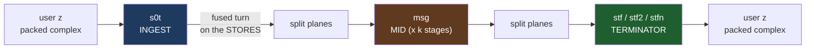
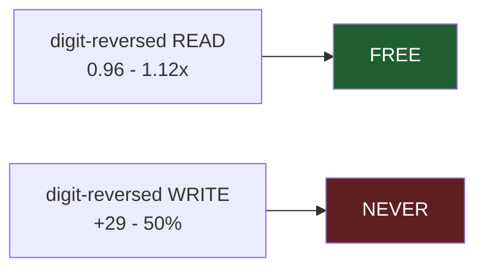

# IL codelets: what each kind is for, and which bottleneck each variant attacks

**Scope.** The interleaved-complex (IL) codelet families — pure IL (`codelets/zil/avx2/pure_il/`)
and the boundary-split cascade (`codelets/zil/avx2/boundary_split/`). What job each *kind*
does, what each *modifier* optimizes, and which are actually reachable.

**Audience.** Someone who has to decide where a new IL kernel belongs, or why an existing one
is shaped the way it is.

**Reading rules.**

* Live/dead status and the historical measurements come from `CODELET_TAXONOMY.md`, which
  carries its own `[R]`/`[V]`/`[D]` evidence marks. Figures reproduced here keep their
  vintage. `IL_SUPPORT_MATRIX.md` is stamped **2026-08-05** and gitignored — its ratios
  predate the tangent/wing32/T256 work.
* This host (i9-14900KF, AVX2 only) is thermally noisy: only same-run arms compare, and
  third digits are not stable.
* 🔴 **The path, directory and basename tell you nothing about the emitter.** Only the
  provenance header does. `radix32_z_n1_avx2.c` (zil, legacy sketch) and
  `radix32_z_n1t_avx2.c` (cil, canonical) sit one line apart in `ls`.

---

## 1. Two families, two contracts

The cascade's hybrid is **at the route level, never inside a codelet** — a codelet whose
signature mixes `zin` with `in_re`/`in_im` is the forbidden shape.

---

## 2. Pure IL — one structural idea

A Bailey pair computes `N = R1 x R2` in two stages. The four-step algorithm normally needs a
transpose between them. **IL does not have one: the transpose is fused into the leaf's store
addressing.**

That single decision explains the whole naming scheme. The suffix letters name **where the
store lands** and **where the twiddle sits** — decoupling store-form from kind is what made
`t2t` expressible at all.

### Base kinds

| kind | job | status |
|---|---|---|
| **n1** | Flat leaf: natural in/out, **twiddle-free**, straight leg-major store | fwd **DEAD** (all 20 radices), bwd LIVE — stage 2 of the F-DIAG decomposition |
| **n1t** | `n1` + **t**urned store. *This is the fused transpose.* THE stage-1 leaf | **LIVE** |
| **t2** | THE stage-2 **mid**. Streamed VTW2: one 8-double record per (col-group, leg), cursor advances per group | **LIVE** |
| **t2t** | `t2` + turned + **post**-twiddle. THE canonical backward flat codelet. POST / TURNED / strides are all *forced* by the derivation — perturb one and you get O(1) error | **LIVE** |
| **t2tg** | `t2t` with the otherwise-`(void)` `OGs` wired as a **leg stride**, for the 3-stage odd chain where `l' = e + A*f` puts legs at stride A | **LIVE** |

### Optimization axes — each attacks a different bottleneck

* **`b` (blocked) — register pressure.** Splits the DFT into passes through a spill array so
  peak live registers drops to `max(m,p)`. At r32 it collapses 26 multi-stored frame slots
  (21.6% of body instructions = ymm stack traffic) to 0–4. **Wins at pow2 R=16/32; lost at
  odd radices (`n1b`, +13.5%, E9).**
* **split ratio — *which* blocking.** Raced per cell. `t2b48` won −18…−20% at kernel level,
  −5…−14% through `execute_fwd`, 3/3. 🔴 The `48` is a post-emit **sed rename**, not emitter
  output.
* **`_log3` — twiddle *load* bandwidth.** Load only power-of-two legs, derive the rest
  in-register (`w^j = w^p * w^(j-p)`). R=8 loads 3 records instead of 7. Derive-then-apply,
  so derivation is loop-invariant per column-group and off the critical path. **T2-only** —
  the emitter refuses it on n1/n1t.
* **tangent / wing — *arithmetic ports*.** Factors `w = cos(th) * (1 + i*tan(th))`: the shear
  runs un-normalized in one FMA and the `cos` normalization folds into the butterfly pair, so
  naked adds are promoted off the FADD ports. Measured −25% R16 mid, −17% R16 leaf.
* **turn-edge variants — *store shape*.** Same math, different store width/pairing. Raced per
  cell, and the verdict genuinely flips between N=512 and N=1024.
* **`_ct` — *algorithm structure*.** Factor odd composites (9→3x3, 25→5x5, 27→3x9) instead of
  a direct conjugate-pair DFT. Added 2026-08-23.

### The part worth internalising

`b` and `_ct` **both factor the radix.** They differ only in whether the intermediate is
spilled:

| radix 25, forward | spill array | ops |
|---|---|---|
| `n1b` (blocked CT) | **1** (`__m256d zspill[R]`) | 192 |
| `n1t_ct` (fused CT) | **0** | 192 |
| `n1t` (direct) | 0 | 332 |

Same factorization, same op count — 13.5% *slower* versus 2.5x *faster*. **E9 raced
(factorization + spill) and recorded the loss against factorization.** These modifiers are
independent axes, and a composite verdict can blame the wrong one.

---

## 3. Boundary-split cascade — the N ≥ 2048 tier

Contract: **packed `z` at the buffer boundary, split re/im planes in the scratch interior.**
The split interior is not a leftover — it is the point.

### `msg` — the mid

**The one kernel both live routes run, and the highest-traffic file in the directory.** Split
planes on both edges, in place. Everything about it targets per-element and per-call overhead:

* **Shuffle-free.** A complex multiply is 4 real multiplies with **zero lane operations** —
  the whole reason the interior is split rather than interleaved. Interleaved would pay a
  shuffle per complex multiply.
* **Group-constant splat-pair twiddles** — broadcast, not streamed per column.
* **The group loop is INSIDE the kernel.** The column body is a `static always_inline` and the
  wrapper walks the `Gs` groups in-kernel (`bp += 2*R*Ls`). One call **per stage**, not per
  group — killing call overhead and the trip-count-2 mispredicts a 2-iteration outer loop
  would produce.

`msgb` (backward) uses a pre-conjugated table, so IDFT + post-twiddle needs no sign work in
the body.

### Terminators — the last stage

Three jobs at once: final twiddle, split planes back to packed `z`, and the correct output
**order**. Three lineages, each fixing the previous one's problem:

| kind | how it reads | what it solves |
|---|---|---|
| **sterm** | `E_blocks` + **TR4 register transposes** to swap column-lane ↔ leg-index | legacy; the transposes are pure overhead. R=8 only |
| **stf** | 4 **section taps**, 2 consecutive 64-B records = 128 B contiguous ⇒ **no load shuffles at all** | ZTURN's insight: make `s0t` *store* in exactly the geometry the terminator wants to *read*, and sterm's load-side TR4 disappears |
| **stfn** | stf's edges, but the IN side and the packed-w¹ stream addressed at `kn = 4*tbl[k>>2]` (rho-inverse digit reversal) | **natural order with no separate reorder pass** |

`sterm2` / `stf2` are 2-quad **unroll-and-jam** twins — **bit-identical by construction**,
pure scheduling variants. Which is exactly why the `t2q` bit is **measured per cell at create
and never hand-set**: the ±5% is code-placement luck.

### The load-side rule

So `stfn` smuggles the rho table in through the otherwise-unused `tw_im` argument cast to
`const size_t *`, applies it to the **reads**, and keeps the stores contiguous ascending.
That is the "emit a natural-writing terminator, never optimize a reorder pass" rule,
implemented.

The probe family confirms it negatively: **`dtso`** is the store-side twin of `dtsn`, built
specifically to try to reclaim the rho-scattered user reads. Verdict recorded as
**"NO reclaim."**

### The DIT-forward probes

`dts` / `dtsn` / `dtso` / `dtt` / `msd` are bench-only. They rest on one identity:

> **F = conj ∘ B ∘ conj** — conjugation flips only constant signs, so a DIT-forward kernel is
> an existing **backward** kind re-signed. No emitter-mechanics change.

`dtt` being twiddle-free and coming out *exact* while `dts`/`dtsn` were grossly wrong is what
isolated the `dif` flag — not the butterfly block — as the bug. 🔴 Twiddle placement travels
with **(direction, sign)**: `msd` is deliberately *not* `msg`-fwd, because msg-fwd is DIT
PRE-twiddle and gives kernels that are conj-exact individually but wrong in composition.

---

## 4. Tail contracts

| family | columns/iteration | ragged count |
|---|---|---|
| pure IL monolithic | 2 | **narrow arm** at `Isa.sse2` (2026-07-29) |
| pure IL blocked | 2 | **narrow arm** (2026-08-23) |
| boundary-split cascade | 4 | **refused by design** — `zsplit_create` rejects every non-{4,8} factor by name |

The cascade has no odd-count exposure at all; it is a refusal, not a tail.

---

## 5. Dead weight worth knowing about

* **`n1` forward, all 20 radices** — zero hits in `src/core`.
* **`n1b` / `t2b_log3` / `t2_log3`** — emitted, never consumed. `t2_log3` is not even declared
  in `il2p.h`.
* **The zil probe family** (`t2c` group-constant tables, `t2s` strided ingest, `t2sp`
  power-recurrence, `t2sq` power-tree, `t2st`/`t2spt`/`t2sqt` tile-loads, `t2d` post-twiddle
  forward) — all twiddle-sourcing experiments, all DEAD, all from the **legacy zil emitter**.
  Their value is as a record of what was tried.
* **`t2p`** — retired 2026-07-29, all 17 files deleted. 🔴 The `p` branch is still live in the
  symbol builder, so `~pretw:true` from OCaml bypasses the retirement.

🔴 **Never measure on zil.** Canonical is cil (pure IL) + zsplit (cascade).
