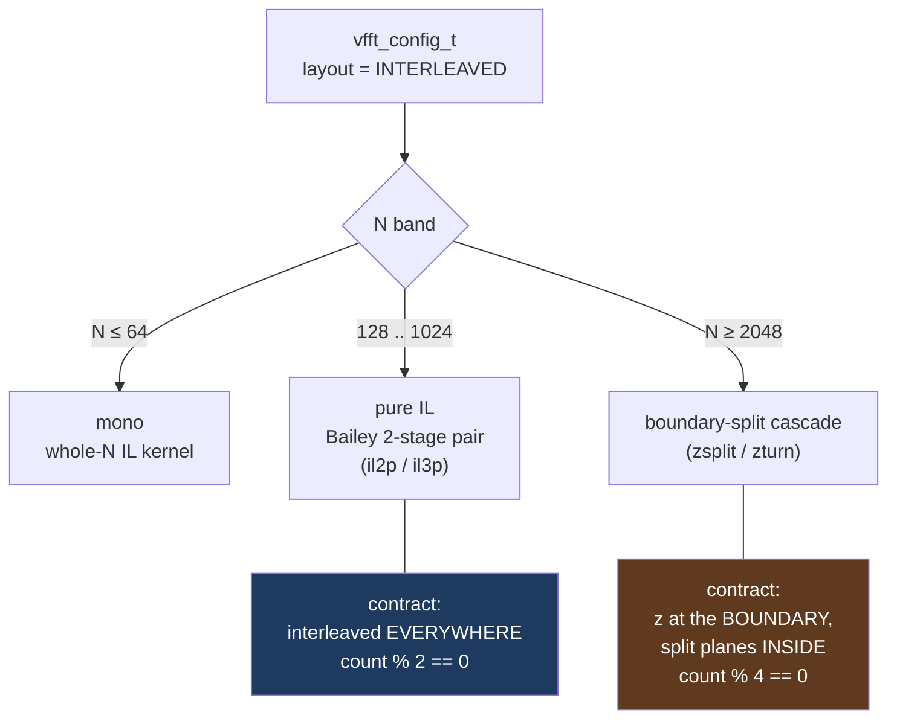
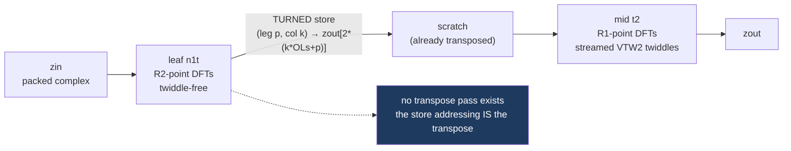
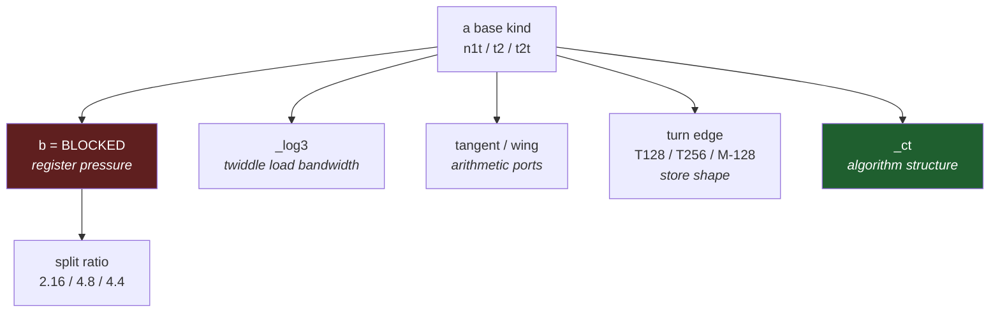
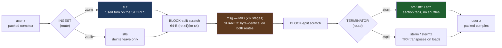
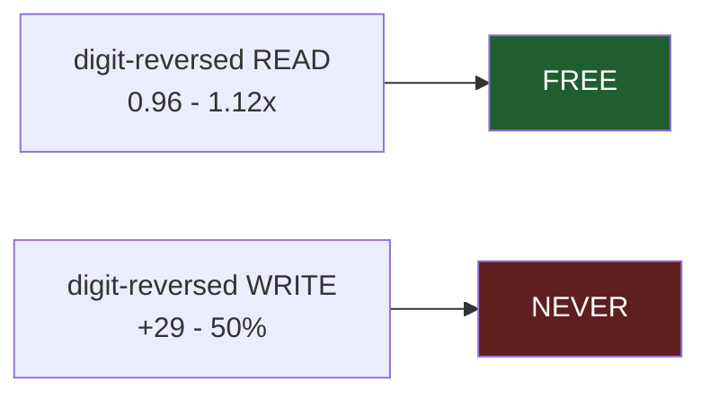
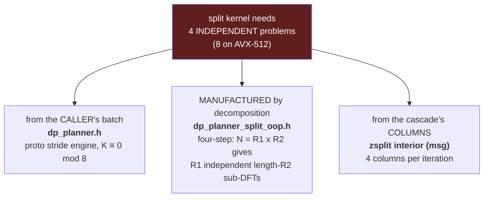

# IL codelets: what each kind is for, and which bottleneck each variant attacks

**Scope.** The interleaved-complex (IL) codelet families — pure IL (`codelets/zil/avx2/pure_il/`)
and the boundary-split cascade (`codelets/zil/avx2/boundary_split/`) — plus §4 on the
split-complex family they are contrasted against. What job each *kind*
does, what each *modifier* optimizes, and which are actually reachable.

**Audience.** Someone who has to decide where a new IL kernel belongs, or why an existing one
is shaped the way it is.

**Reading rules.**

* Live/dead status and the historical measurements come from `CODELET_TAXONOMY.md`, which
  carries its own `[R]`/`[V]`/`[D]` evidence marks. Figures reproduced here keep their
  vintage. `IL_SUPPORT_MATRIX.md` is stamped **2026-08-05** and gitignored — its ratios
  predate the tangent/wing32/T256 work.
* This host (i9-14900KF, AVX2 only) is thermally noisy: only same-run arms compare, and
  third digits are not stable.
* 🔴 **The path, directory and basename tell you nothing about the emitter.** Only the
  provenance header does. `radix32_z_n1_avx2.c` (zil, legacy sketch) and
  `radix32_z_n1t_avx2.c` (cil, canonical) sit one line apart in `ls`.

---

## 1. Two families, two contracts

The cascade's hybrid is **at the route level, never inside a codelet** — a codelet whose
signature mixes `zin` with `in_re`/`in_im` is the forbidden shape.

---

## 2. Pure IL — one structural idea

A Bailey pair computes `N = R1 x R2` in two stages. The four-step algorithm normally needs a
transpose between them. **IL does not have one: the transpose is fused into the leaf's store
addressing.**

That single decision explains the whole naming scheme. The suffix letters name **where the
store lands** and **where the twiddle sits** — decoupling store-form from kind is what made
`t2t` expressible at all.

### Base kinds

| kind | job | status |
|---|---|---|
| **n1** | Flat leaf: natural in/out, **twiddle-free**, straight leg-major store | fwd **DEAD** (all 20 radices), bwd LIVE — stage 2 of the F-DIAG decomposition |
| **n1t** | `n1` + **t**urned store. *This is the fused transpose.* THE stage-1 leaf | **LIVE** |
| **t2** | THE stage-2 **mid**. Streamed VTW2: one 8-double record per (col-group, leg), cursor advances per group | **LIVE** |
| **t2t** | `t2` + turned + **post**-twiddle. THE canonical backward flat codelet. POST / TURNED / strides are all *forced* by the derivation — perturb one and you get O(1) error | **LIVE** |
| **t2tg** | `t2t` with the otherwise-`(void)` `OGs` wired as a **leg stride**, for the 3-stage odd chain where `l' = e + A*f` puts legs at stride A | **LIVE** |

### Optimization axes — each attacks a different bottleneck

* **`b` (blocked) — register pressure.** Splits the DFT into passes through a spill array so
  peak live registers drops to `max(m,p)`. At r32 it collapses 26 multi-stored frame slots
  (21.6% of body instructions = ymm stack traffic) to 0–4. **Wins at pow2 R=16/32; lost at
  odd radices (`n1b`, +13.5%, E9).**
* **split ratio — *which* blocking.** Raced per cell. `t2b48` won −18…−20% at kernel level,
  −5…−14% through `execute_fwd`, 3/3. 🔴 The `48` is a post-emit **sed rename**, not emitter
  output.
* **`_log3` — twiddle *load* bandwidth.** Load only power-of-two legs, derive the rest
  in-register (`w^j = w^p * w^(j-p)`). R=8 loads 3 records instead of 7. Derive-then-apply,
  so derivation is loop-invariant per column-group and off the critical path. **T2-only** —
  the emitter refuses it on n1/n1t.
* **tangent / wing — *arithmetic ports*.** Factors `w = cos(th) * (1 + i*tan(th))`: the shear
  runs un-normalized in one FMA and the `cos` normalization folds into the butterfly pair, so
  naked adds are promoted off the FADD ports. Measured −25% R16 mid, −17% R16 leaf.
* **turn-edge variants — *store shape*.** Same math, different store width/pairing. Raced per
  cell, and the verdict genuinely flips between N=512 and N=1024.
* **`_ct` — *algorithm structure*.** Factor odd composites (9→3x3, 25→5x5, 27→3x9) instead of
  a direct conjugate-pair DFT. Added 2026-08-23.

### The threshold: when does restructuring pay?

Measured 2026-08-23 on compiled assembly, AVX2 bulk loop only:

| radix | ymm used | spill % | restructured form |
|---|---|---|---|
| 3 | 8 of 16 | **0.0%** | — |
| 4 | 7 | **0.0%** | — |
| 5, 7, 9 | 16 | **0.0%** | radix 9 `_ct` **LOSES** 0.89-0.94x |
| 8 | 14 | **0.0%** | — |
| 15 | 16 | 16.5% | `_ct` 1.32-1.35x |
| 16 | 16 | 7.6% | blocked +2.1..+9.0%, EVERY cell inside noise |
| 21 | 16 | 27.3% | `_ct` 1.40-1.60x |
| 25 | 16 | 37.6% | `_ct` **2.5x** |
| 27 | 16 | 39.3% | `_ct` **2.2x** |
| 32 | 16 | 26.5% | blocked **+17..+52%**, every cell outside noise |
| 64 | 16 | **34.8%** | **no forward blocked form exists** |

**One rule covers both restructuring axes**: blocking and factoring pay exactly
when the monolithic form SPILLS, and the payoff scales with how much. Where
there is no spill there is nothing to recover and the extra passes are pure
loss -- which is why radix 9 loses `_ct` and why radix <= 8 must never be
blocked.

The policy that follows, measured rather than assumed:

* **R <= 8** — monolithic always. 7 and 14 registers used, zero spill.
* **R = 16** — monolithic DEFAULT, blocked in the raced pool. The effect is
  real (blocked ahead in 6 of 6 cells, ~1-in-64 by chance) but smaller than
  this host resolves per cell, so it must never become a structural rule.
* **R >= 32** — blocked structurally.

🔴 **The cascade emitter reached the same boundary independently.**
`cascade_z.ml`'s tier gate: *"the split family is radix 4/8 ONLY and
monolithic BY DESIGN (16 planes fit the ymm file; 'r16 split = 32 live planes,
spills')"* — and it deliberately does NOT consult `Dft.should_spill`, *"its
n>=5 clause would put R=8 on the spill recipe and pay stack traffic the legacy
kernels don't have"*. A split kernel holds re and im as separate planes, so
radix 16 needs 32 live vectors against a 16-register file. Same wall, reached
from the other side.

### The part worth internalising

`b` and `_ct` **both factor the radix.** They differ only in whether the intermediate is
spilled:

| radix 25, forward | spill array | ops |
|---|---|---|
| `n1b` (blocked CT) | **1** (`__m256d zspill[R]`) | 192 |
| `n1t_ct` (fused CT) | **0** | 192 |
| `n1t` (direct) | 0 | 332 |

Same factorization, same op count — 13.5% *slower* versus 2.5x *faster*. **E9 raced
(factorization + spill) and recorded the loss against factorization.** These modifiers are
independent axes, and a composite verdict can blame the wrong one.

---

## 3. Boundary-split cascade — the N ≥ 2048 tier

Contract: **packed `z` at the buffer boundary, split re/im planes in the scratch interior.**
The split interior is not a leftover — it is the point.

### Why convert layout at all

Two requirements pull against each other. The public contract is **interleaved** complex
(`z` = re,im,re,im…) — that is the API, not a preference. But SIMD butterfly math wants re
and im in **separate registers**: a complex multiply on split data is 4 real multiplies and
zero lane operations, where interleaved data pays a shuffle per multiply.

Hold IL through a many-stage cascade and you pay those shuffles on *every* stage. zsplit's
answer is to pay the layout conversion **exactly twice** — once at ingest, once at the
terminator — and run the whole interior converted:

| | cost |
|---|---|
| convert at the two boundaries | O(N), **twice, total** |
| shuffles saved | one per complex multiply, on **every** interior stage |

So the trade only pays when there are many interior stages to amortize over. That is the
entire reason the tier starts at N ≥ 2048 and why the Bailey pair below it stays interleaved:
a 2-stage decomposition has nothing to amortize. **Full-IL interior has been refuted twice** —
the boundary conversion is load-bearing.

### The interior is BLOCK-split, not plane-split

The scratch is 64-B **`[re×4][im×4]`** blocks — "z addressing +4 for im; one stream per leg
row" — not two separate arrays. Two real planes would double the streams and the
prefetch/TLB pressure; a cache-line-sized block buys the register-level separation SIMD wants
while keeping re and im on one line and the traffic on a single stream.

### The constraint and the payoff are the same fact

Split doubles the live vectors, because re and im occupy separate registers. Radix 16 would
need **32 live planes against 16 ymm** — hence the tier gate: *"the split family is radix 4/8
ONLY and monolithic BY DESIGN."* Small radix forces many stages; many stages is exactly the
regime where two boundary conversions amortize. The register limit and the economics point
the same way.

🔴 **zsplit is an ARCHITECTURE, not a route.** Both live routes are zsplit — same boundary
contract, same `msg` interior, same emitter. See "Two routes, one interior" below before
concluding that anything here is superseded.

### `msg` — the mid

**The one kernel both live routes run, and the highest-traffic file in the directory.** Split
planes on both edges, in place. Everything about it targets per-element and per-call overhead:

* **Shuffle-free.** A complex multiply is 4 real multiplies with **zero lane operations** —
  the whole reason the interior is split rather than interleaved. Interleaved would pay a
  shuffle per complex multiply.
* **Group-constant splat-pair twiddles** — broadcast, not streamed per column.
* **The group loop is INSIDE the kernel.** The column body is a `static always_inline` and the
  wrapper walks the `Gs` groups in-kernel (`bp += 2*R*Ls`). One call **per stage**, not per
  group — killing call overhead and the trip-count-2 mispredicts a 2-iteration outer loop
  would produce.

`msgb` (backward) uses a pre-conjugated table, so IDFT + post-twiddle needs no sign work in
the body.

### Two routes, one interior

**ZTURN did not replace zsplit — it is a route inside it.** Both routes have the same boundary
contract, both run `radix{4,8}_z_msg_*` in place on the plane, both come out of `cascade_z.ml`,
and `zturn.h` includes `zsplit.h` to get those declarations plus the chain seeds, the
digit-reversal and the allocator. The split interior is on the hot path of **every** N ≥ 2048
transform whichever route runs.

What the routes differ on is one thing only: **where the digit-reversal turn is paid.**

| | pays the turn | how often |
|---|---|---|
| zsplit (`s0s` → `sterm`) | terminator LOADS, as TR4 register transposes | every iteration |
| zturn (`s0t` → `stf`) | ingest STORES, as an address choice | once |

Measured — same process, arms alternated, both routes agreeing elementwise and sharing `msg`
byte-for-byte, so the delta is ingest + terminator only:

| N | zsplit | zturn | |
|---|---|---|---|
| 2048 | 3209 ns | 2083 ns | +54% (one run read −30%; its spread was 51% — noise) |
| 4096 | 9933 ns | 7371 ns | **+31…+80%** |
| 8192 | 26507 ns | 10054 ns | **+164%** |
| 16384 | 54226 ns | 23921 ns | **+127%** |

Since the 2026-07-27 cutover, ZTURN is the default on a miss and **every** banked kind-4 line
reads `eng=zturn` (zero `eng=zsplit`). ZTURN is also a strict superset: `zsplit_create` builds
only chains ending in 8, ZTURN builds last==8 *and* last==4.

🔴 **The `s0s`/`sterm` route is not dead code and must not be deleted.** `dp_planner_il.h`
races `for (int rt = 0; rt < 2; rt++)` — both routes, on every cascade miss. It is the control
arm. Remove it and the ZTURN verdict becomes unfalsifiable, with no reference left to catch a
future regression.

### Terminators — the last stage

Three jobs at once: final twiddle, split planes back to packed `z`, and the correct output
**order**. Three lineages, each fixing the previous one's problem:

| kind | how it reads | what it solves |
|---|---|---|
| **sterm** | `E_blocks` + **TR4 register transposes** to swap column-lane ↔ leg-index | the first route. Transposes on every iteration. R=8 only — still raced as the control arm, never banked |
| **stf** | 4 **section taps**, 2 consecutive 64-B records = 128 B contiguous ⇒ **no load shuffles at all** | ZTURN's insight: make `s0t` *store* in exactly the geometry the terminator wants to *read*, and sterm's load-side TR4 disappears |
| **stfn** | stf's edges, but the IN side and the packed-w¹ stream addressed at `kn = 4*tbl[k>>2]` (rho-inverse digit reversal) | **natural order with no separate reorder pass** |
**The section-tap geometry** is what makes `stf`'s loads shuffle-free: leg `q` goes to
section `SEC[q & 3]` with `SEC = bitrev2 = {0,2,1,3}`, sections at `s*4*STRIDE` doubles,
**2 consecutive 64-B records** per section per column group. Plain `loadu`/`storeu` — because
`s0t` already stored in exactly that shape. It is radix-parametric, not radix-8-only: radix 8
taps 2 consecutive records (128 B), radix 4 taps one (64 B), and both collapse to the same
section double-offset `sec*N/2`.

`sterm2` / `stf2` are 2-quad **unroll-and-jam** twins — **bit-identical by construction**,
pure scheduling variants. Which is exactly why the `t2q` bit is **measured per cell at create
and never hand-set**: the ±5% is code-placement luck.

### The load-side rule

So `stfn` smuggles the rho table in through the otherwise-unused `tw_im` argument cast to
`const size_t *`, applies it to the **reads**, and keeps the stores contiguous ascending.
That is the "emit a natural-writing terminator, never optimize a reorder pass" rule,
implemented.

The probe family confirms it negatively: **`dtso`** is the store-side twin of `dtsn`, built
specifically to try to reclaim the rho-scattered user reads. Verdict recorded as
**"NO reclaim."**

And the emitter encodes the rule as a LEGALITY constraint, not a preference —
`nat_out` is *"only legal when the OUT edge writes the PLANE (E_sect_tap):
scattered 64B stores into the L2-resident plane, the cheap side; scattered
stores to USER memory are the P0c-condemned side and **no kind may do that**"*.
So the one place a store-side permutation is allowed is into the library's own
L2-resident scratch, never into the caller's buffer.

The permutation table itself rides in through the **unused `tw_im` argument**
cast to `const size_t *` — a plan-built rho-inverse (forward) / rho (backward)
block table. The z ABI's `tw_im` slot is dead for this family, so the natural
variant costs no signature change.

### Store placement is a scheduled decision (B2/B3)

`cascade_z.ml` makes memory operations first-class scheduled nodes. In B2 the
positions are **PINNED** to reproduce the committed output byte-for-byte:

* `ZS_legacy` — preamble loads, then arithmetic in exactly the scheduler's
  order, then stores in edge order (the committed placement, expressed as a
  real node sequence rather than an implicit one).
* `ZS_afterdef` — each singleton store emitted immediately after its sink's
  definition (this reproduces `stf_r4sk`'s body).
* `ZS_off` — the pre-B2 path, byte-untouched, and the default.

**The cost-driven placement SEARCH is B3 and has not been done.** That is a
documented, unexplored lever: the scaffolding exists and only the search is
missing.

### The DIT-forward probes

`dts` / `dtsn` / `dtso` / `dtt` / `msd` are bench-only. They rest on one identity:

> **F = conj ∘ B ∘ conj** — conjugation flips only constant signs, so a DIT-forward kernel is
> an existing **backward** kind re-signed. No emitter-mechanics change.

`dtt` being twiddle-free and coming out *exact* while `dts`/`dtsn` were grossly wrong is what
isolated the `dif` flag — not the butterfly block — as the bug. The emitter
states the mechanism: twiddle placement travels with **(direction, sign)**, so
`sign = Fwd` alone lands on PRE-twiddle and *"computes a DIFFERENT (wrong)
kernel"* — the conj-identity gate caught it because the twiddle-free kind could
not be affected by a placement error. 🔴 Twiddle placement travels
with **(direction, sign)**: `msd` is deliberately *not* `msg`-fwd, because msg-fwd is DIT
PRE-twiddle and gives kernels that are conj-exact individually but wrong in composition.

---

## 4. The split-complex family — where the lanes come from

`gen/c2c_split.ml` (renamed from `codelet_oop.ml`) is the largest emitter in the tree at
130 KB and **849 files, 59.3% of the corpus** — and until now it was absent from this
document.

### The constraint that shapes everything

From `dp_planner_split_oop.h`'s own naming note:

> *"split-layout SIMD has no intra-complex parallelism to exploit without shuffles, so its
> 4 AVX2 lanes must hold 4 independent same-shaped problems."*

That is the whole story. Compare what a 256-bit register holds:

| layout | register holds | complex multiply | needs |
|---|---|---|---|
| **interleaved** | 2 complex numbers | shuffles per multiply | `count % 2 == 0` |
| **split** | 4 reals of the *same component* from 4 *different* problems | 4 real multiplies, **zero lane ops** | 4 independent problems, `count % 4 == 0` |

Split buys shuffle-free arithmetic, but it cannot parallelise *within* one complex number —
there is nothing there to parallelise. So a split kernel is only usable if you can hand it
four independent same-shaped problems. **Every split engine in the tree is a different answer
to where those four come from.**

This also explains, after the fact, the cascade contract recorded in §1: `count % 4 == 0` is
not a quirk of the mid kernels, it is the lane requirement. The cascade converts to split
inside precisely because its interior *already has* four independent columns to fill the lanes
with — so it gets shuffle-free arithmetic without having to manufacture a batch.

🔴 **"split" names three different things.** They are not interchangeable:

| name | what is split | K at the API | where |
|---|---|---|---|
| **zsplit** | the cascade's interior SCRATCH; boundary stays IL | 1 | `cascade_z.ml` |
| **split_oop** | the caller's re/im PLANES; lane batch manufactured internally | 1 (4 sub-FFTs in the math) | `c2c_split.ml` |
| **proto stride** | the caller's re/im planes; lanes are the caller's OWN transforms | ≡ 0 mod 8 | `dp_planner.h` |

Never say "K=1 split engine" — say split_oop, and say which planner.

### What c2c_split.ml actually parameterises

One family subsumes five call shapes that would otherwise be five emitters: Bailey column
in-place, Bailey row with fused output transpose, 2D row FFT, and Stockham first and middle
stages. The variant space is the product of four axes:

* **edge pattern**, per side (load and store are configured separately):
  * `UnitLeg` (**UL**) — `leg_stride = 1`. The `vec_width` legs of one group land in one
    register only *after* an AOS→SOA transpose preamble.
  * `UnitGroup` (**UG**) — `group_stride = 1`. The `vec_width` groups for one leg are already
    contiguous, so **R** plain SIMD loads populate the lane registers with **no transpose at
    all**. This is the cheap side, and choosing it on the store edge is what fuses the Bailey
    row transpose into the write.
  * `StridedFallback` — neither stride is 1. Scalar load + insert. Never emitted; every real
    shape has at least one Unit edge.
* **buffer** — `InPlace` (one `rio_re`/`rio_im` pair) or `OutOfPlace`. OOP is always safe;
  in-place is legal only where the edge pair provably cannot clobber unread input.
* **twiddles** — `n1` none · `t1` per-group · `t1s` broadcast (splat) · `t1p` per-position.
  These are the `vars=flat.t1s.t1s…` tokens in banked wisdom lines.
* **direction** — `fwd` / `bwd`.

Read a split codelet name as `radix{R}_{tw}_{buffer}_{dir}_{isa}`, with the edge pair
abbreviated `UL`/`UG` where it appears.

⚠ **Known duplication, ratified not accidental.** `emit_body_spill` (578 lines) duplicates the
shared kernel engine's body/spill emitter. It survives by owner decision — merging it is "a
byte-risk numerical-campaign job, not a structural one". Its sibling gotcha: this module
mirrors `gen_main`'s recipe decisions (`should_spill` / `should_block_n1`), so a recipe change
in `gen_main` needs a matching change here.

---

## 5. Tail contracts

| family | columns/iteration | ragged count |
|---|---|---|
| pure IL monolithic | 2 | **narrow arm** at `Isa.sse2` (2026-07-29) |
| pure IL blocked | 2 | **narrow arm** (2026-08-23) |
| boundary-split cascade | 4 | **refused by design** — `zsplit_create` rejects every non-{4,8} factor by name |

The cascade has no odd-count exposure at all; it is a refusal, not a tail.

---

## 6. Dead weight worth knowing about

* **`n1` forward, all 20 radices** — zero hits in `src/core`.
* **`n1b` / `t2b_log3` / `t2_log3`** — emitted, never consumed. `t2_log3` is not even declared
  in `il2p.h`.
* **The zil probe family** (`t2c` group-constant tables, `t2s` strided ingest, `t2sp`
  power-recurrence, `t2sq` power-tree, `t2st`/`t2spt`/`t2sqt` tile-loads, `t2d` post-twiddle
  forward) — all twiddle-sourcing experiments, all DEAD, all from the **legacy zil emitter**.
  Their value is as a record of what was tried.
* **`t2p`** — retired 2026-07-29, all 17 files deleted. 🔴 The `p` branch is still live in the
  symbol builder, so `~pretw:true` from OCaml bypasses the retirement.

🔴 **Never measure on zil.** Canonical is cil (pure IL) + zsplit (cascade).
