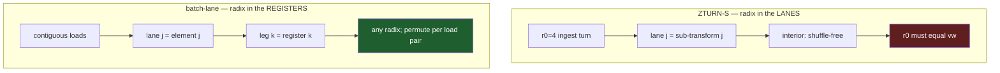

# Odd high-N: the batch-lane cascade geometry

**STATUS: DESIGN — nothing built.** It has not been raced in this tree. Read
[`docs/roadmap/odd_large_n_engine.md`](../roadmap/odd_large_n_engine.md) first
for the requirement and the served state.

**Scope, stated up front.** This is a **kernel-level** change that lives *inside*
chain3/chainK's existing four-step layout. It is not a new layout and not a
replacement for one. Its only purpose is to lift the radix ceiling — to let a
per-radix kernel exist for radices that do not divide the vector width. The
four-step arrangement (leaf, transposing store, constant-count interior,
transpose back) is the strong part of the current engine and stays exactly as it
is; see the layout section below before reading anything here as a substitution.

## The requirement, restated

Odd N (no factor of 2) served natively with cascade-class performance to
N ≈ 131 000. The native ceiling today is the three-stage chain, 27³ = 19 683;
above it, Bluestein at the next power of two, ~0.3×.

## The constraint is an assignment choice, not a law

ZTURN-S puts **the radix in the lanes**. `s0t` stores the radix-4 butterfly's
four outputs — one per sub-transform — as a single 64-B `[re×4][im×4]` record,
and the whole interior then runs those four sub-transforms lane-parallel. The
emitter asserts `r0 == vw` at every section edge for exactly this reason
(`cascade_z.ml`: *"section-record group only when r0 == vw; r0 <> vw needs a new
unroll"*).

Everything that makes odd N hard follows from that one assignment:

* r0 = 3 → three live lanes in a 4-wide record, −25% on every interior
  instruction, and the turns become 3×4 shuffles with padding.
* r0 = 9 → 2¼ vectors.
* No odd r0 fills the vector, because the vector width must divide the radix.

**That last sentence is only true if the radix occupies lanes.** It is not a
property of odd N, of AVX2, or of the cascade shape. It is a consequence of
where we chose to put the radix.

## The alternative assignment

Put **the radix across registers** and fill lanes with consecutive elements of
the contiguous axis.

| | ZTURN-S (today) | batch-lane (this design) |
|---|---|---|
| what a lane holds | one of the `r0` sub-transforms | consecutive elements on the contiguous axis |
| where the radix lives | across **lanes** | across **registers** |
| constraint | `r0 == vw` | **none** — width need not divide the radix |
| interior shuffles | zero | one permute per load pair |
| live registers | r0 planes (re+im) | radix legs, each a full vector |

A radix-3 butterfly becomes three registers, not three lanes. Radices 3, 5, 7,
11, 13 then fill the vector exactly as well as 4 does — there is no dead lane
because no quantity has to line up with the vector at all.

## 🔴 Layout: chain3's four-step already solves this — do not replace it

An earlier draft of this design put the width cost "at the ingest, with no `r0`
to match", and a later one moved it to a lane transition in the tail. **Both were
wrong**, because they described a *flat* single-level cascade, where the group
length `D[s]` collapses stage by stage and the contiguous run with it.

That is not what chain3 does, and not what chainK inherits. The four-step layout:

1. **Leaf first** (radix `R2`, e.g. 9) at `count = N/R2` — a huge run, full
   lanes. Its store is **transposing** (the `OLs` stride), so everything
   downstream sees contiguous runs of `R2`. The leaf radix becomes the lane-run
   width of the whole interior.
2. **Interior** = a mixed-radix FFT of length `R1 = N/R2`, batched over `R2`
   lanes. Every stage, however deep, runs at `count = R2`. **The interior's count
   is constant by construction** — `D[s]` shrinking is a property of a flat
   chain, not of this arrangement. That is what "unbounded depth" means here:
   stages 2…K all look alike.
3. **Last stage writes transposed back** to natural order (il3p's `tA_f` at
   `OLs = B·R2`; in the 2D-machinery form, the natural leaf scatter).

So the width cost is paid **at the two ends, as strided stores, once each** — not
as a per-instruction lane tax and not as a tail transition. Its residual is the
odd-count tail at `count = R2`: ~10% at `R2 = 9`, 3.6% at `R2 = 27`, which is why
the race prefers a wider odd leaf where one exists. All of that is already inside
chain3's measured 1.24× at 4095.

**Nothing in this design should change the layout.** The four-step arrangement is
the strong part of the existing engine. What follows applies *inside* it.

## What the batch-lane idea actually changes

Only the lane assignment inside the per-radix kernels, and only to lift the
radix ceiling.

| piece | unchanged / changed |
|---|---|
| four-step layout | **unchanged** — leaf, transposing store, batched interior, transpose back |
| interior count | **unchanged** — constant at `R2` |
| per-radix kernels | **changed**: radix across registers, lanes from the batch run, so radix need not equal `vw` |
| chain depth | unbounded, as chainK already provides |

The chain is then the factorisation of N to any depth — `3^9`, `3^10`, `5^7`,
`7^6` are ordinary chains, nothing special about three stages — and the radix set
is no longer restricted to values that divide the vector width.

**The ceiling moves from depth to factor size.** chainK removes the depth limit
with machinery that already exists. Lifting the radix limit is what this design
adds, and only that. A factor above the largest available radix kernel still
needs Bluestein.

## The trade, stated honestly

We give up the shuffle-free interior. Today's `msg` is 0 shuffles / 22 mem / 28
arith per 16 complex points; a batch-lane interior pays a permute per load pair
to arrange halves. In exchange, `r0 == vw` disappears and with it the −25%
lane-padding tax that Option B accepts by construction.

Which is cheaper is **not known and must be raced.** The permute cost is real
and recurring; the lane waste is real and recurring. Nothing here argues that
one dominates — only that they are different costs, and that this geometry is a
third option rather than a variant of Option B.

## Relation to the roadmap's options

These are not three alternatives — A is the plan, and this is a later addition
on top of it.

| | removes | layout | lane utilisation | new kernels |
|---|---|---|---|---|
| A — chainK | the **depth** limit (27³) | four-step, unchanged | full | none |
| B — lane-padded odd cascade | the radix limit | flat, r0 ≠ 4 | **−25% by construction** | ingest/terminator at r0 ≠ 4 |
| **this — batch-lane kernels** | the **radix** limit | four-step, **unchanged** | full | a per-radix interior family |

**A is the plan for the stated size target.** It reaches 27⁴ = 531 441 with no
new kernels, and it keeps the four-step layout that already earns chain3's
measured 1.24× at 4095. Measure A first.

This design matters only afterwards, and only for one thing: admitting radices
that do not divide `vw`. It is worth building if A's deeper chains hold their
per-pass efficiency at 59 049 / 98 415 (so the layout is proven) but the corpus
is then asked for odd radices A cannot express. **B is superseded** — it accepts
a −25% interior tax and abandons the four-step layout to buy the same thing this
buys without either cost.

## Open questions

1. **Register budget.** A radix-13 butterfly across registers needs 13 live
   vectors plus twiddles against 16 ymm. The practical radix ceiling on AVX2 is
   probably well under 13 before spilling; that ceiling is what decides where
   Bluestein still has to take over.
2. **Twiddle layout.** VTW2 records are shaped for lane-parallel consumption
   (`[c×4][s×4]`, lane-varying). A batch-lane interior wants a different record
   shape; the twiddle policy axis (`TP_Flat` / `TP_Log3` / `TP_PowW1`) would need
   an entry for it.
3. **Whether stages carry twiddles.** A coprime factorisation admits an index
   mapping with no inter-stage twiddles; a repeated factor such as 3⁹ does not.
   A general engine needs the twiddled form; the twiddle-free case is an
   optimisation on top, not a substitute.
4. **Interaction with `tcut`.** The cascade's banded walk is defined over the
   section geometry. A batch-lane interior has no sections; the banding would
   have to be re-derived.

## References

* [`docs/roadmap/odd_large_n_engine.md`](../roadmap/odd_large_n_engine.md) — the
  requirement, the served state, options A/B/C
* [`docs/design/il_codelet_design.md`](il_codelet_design.md) — §3, the
  boundary-split cascade and why the interior is BLOCK-split
* `src/dag-fft-compiler/generator/lib/gen/cascade_z.ml` — the section edges and
  the `r0 == vw` assertions
* `src/core/oop/zturn.h` — `s0t` → `msg` → `stf` and the plan tuple
