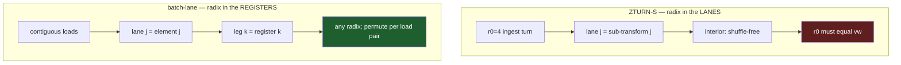

# Odd high-N: the batch-lane cascade geometry

**STATUS: DESIGN — nothing built.** This describes a third geometry for the
cascade, distinct from both options in
[`docs/roadmap/odd_large_n_engine.md`](../roadmap/odd_large_n_engine.md). It has
not been raced in this tree. Read that roadmap first for the requirement and
the served state.

## The requirement, restated

Odd N (no factor of 2) served natively with cascade-class performance to
N ≈ 131 000. The native ceiling today is the three-stage chain, 27³ = 19 683;
above it, Bluestein at the next power of two, ~0.3×.

## The constraint is an assignment choice, not a law

ZTURN-S puts **the radix in the lanes**. `s0t` stores the radix-4 butterfly's
four outputs — one per sub-transform — as a single 64-B `[re×4][im×4]` record,
and the whole interior then runs those four sub-transforms lane-parallel. The
emitter asserts `r0 == vw` at every section edge for exactly this reason
(`cascade_z.ml`: *"section-record group only when r0 == vw; r0 <> vw needs a new
unroll"*).

Everything that makes odd N hard follows from that one assignment:

* r0 = 3 → three live lanes in a 4-wide record, −25% on every interior
  instruction, and the turns become 3×4 shuffles with padding.
* r0 = 9 → 2¼ vectors.
* No odd r0 fills the vector, because the vector width must divide the radix.

**That last sentence is only true if the radix occupies lanes.** It is not a
property of odd N, of AVX2, or of the cascade shape. It is a consequence of
where we chose to put the radix.

## The alternative assignment

Put **the radix across registers** and fill lanes with consecutive elements of
the contiguous axis.

| | ZTURN-S (today) | batch-lane (this design) |
|---|---|---|
| what a lane holds | one of the `r0` sub-transforms | consecutive elements on the contiguous axis |
| where the radix lives | across **lanes** | across **registers** |
| constraint | `r0 == vw` | **none** — width need not divide the radix |
| interior shuffles | zero | one permute per load pair |
| live registers | r0 planes (re+im) | radix legs, each a full vector |

A radix-3 butterfly becomes three registers, not three lanes. Radices 3, 5, 7,
11, 13 then fill the vector exactly as well as 4 does — there is no dead lane
because no quantity has to line up with the vector at all.

## What the engine looks like

The cascade *shape* is unchanged — ingest, per-factor stages, terminator. Only
the lane assignment inside the kernels changes.

| piece | role |
|---|---|
| ingest | contiguous load, no turn; there is no `r0` to match |
| per-radix kernels | one per factor radix: 2, 3, 4, 5, 7, 11, 13, plus a generic kernel above that |
| stage driver | one full pass per factor of N — chain depth is unbounded |
| terminator | an output-ordering pass |

The chain is then just the factorisation of N, to any depth. `3^9`, `3^10`,
`5^7`, `7^6` are all ordinary chains; nothing is special about three stages.

**The natural ceiling moves from depth to factor size.** Chain depth stops being
the limit; the limit becomes the largest radix for which a kernel exists. A
factor above that bound still needs Bluestein — but the bound is a property of
the kernel corpus, which is generated, not of the geometry.

## The trade, stated honestly

We give up the shuffle-free interior. Today's `msg` is 0 shuffles / 22 mem / 28
arith per 16 complex points; a batch-lane interior pays a permute per load pair
to arrange halves. In exchange, `r0 == vw` disappears and with it the −25%
lane-padding tax that Option B accepts by construction.

Which is cheaper is **not known and must be raced.** The permute cost is real
and recurring; the lane waste is real and recurring. Nothing here argues that
one dominates — only that they are different costs, and that this geometry is a
third option rather than a variant of Option B.

## Relation to the roadmap's options

| | reach | lane utilisation | new kernels |
|---|---|---|---|
| A — chainK | 27⁴ = 531 441 | full | none |
| B — lane-padded odd cascade | cascade-class at large N | **−25% by construction** | ingest/terminator at r0 ≠ 4 |
| **this — batch-lane** | unbounded depth; limited by largest radix kernel | **full** | a new interior family |

A remains the cheapest path to the stated size target and should be measured
first — it needs no new kernels. This design matters if A's deeper chains lose
their per-pass efficiency at 59 049 / 98 415, or if the corpus is later asked
for odd radices that A cannot express.

## Open questions

1. **Register budget.** A radix-13 butterfly across registers needs 13 live
   vectors plus twiddles against 16 ymm. The practical radix ceiling on AVX2 is
   probably well under 13 before spilling; that ceiling is what decides where
   Bluestein still has to take over.
2. **Twiddle layout.** VTW2 records are shaped for lane-parallel consumption
   (`[c×4][s×4]`, lane-varying). A batch-lane interior wants a different record
   shape; the twiddle policy axis (`TP_Flat` / `TP_Log3` / `TP_PowW1`) would need
   an entry for it.
3. **Whether stages carry twiddles.** A coprime factorisation admits an index
   mapping with no inter-stage twiddles; a repeated factor such as 3⁹ does not.
   A general engine needs the twiddled form; the twiddle-free case is an
   optimisation on top, not a substitute.
4. **Interaction with `tcut`.** The cascade's banded walk is defined over the
   section geometry. A batch-lane interior has no sections; the banding would
   have to be re-derived.

## References

* [`docs/roadmap/odd_large_n_engine.md`](../roadmap/odd_large_n_engine.md) — the
  requirement, the served state, options A/B/C
* [`docs/design/il_codelet_design.md`](il_codelet_design.md) — §3, the
  boundary-split cascade and why the interior is BLOCK-split
* `src/dag-fft-compiler/generator/lib/gen/cascade_z.ml` — the section edges and
  the `r0 == vw` assertions
* `src/core/oop/zturn.h` — `s0t` → `msg` → `stf` and the plan tuple
