# How VectorFFT decides: the planning model

**Read this first.** Its companion, [`measurement_arms.md`](measurement_arms.md), is the
terse reference catalogue — useful only once the vocabulary here is in place.

**Who this is for.** Anyone who has to change planning code, add a kernel, choose a
benchmark cell, or understand why two runs of the same transform produced different bits.
It assumes you know what an FFT is and nothing else about this codebase.

**How it is organised, and why.** Part I is the shared model — how a decision is made,
stored and replayed. Parts II and III are **the two engine families, kept apart**:
interleaved first, then split. That separation is not editorial. It reflects the code:

| | interleaved | split |
|---|---|---|
| codelets | `codelets/zil/` | `codelets/{oop,inplace,strided}/` |
| planner | `dp_planner_il.h` | `dp_planner_split_oop.h`, `dp_planner.h` |
| executors | il2p / il3p / zturn / zsplit | the stride executors |

They share the wisdom store and nothing else. A reader working on interleaved should
never have to read Part III. **There is exactly one place where the two families meet,
and it is called out in Part IV.**

---

# PART I — THE SHARED MODEL

## 1. The single most important idea

**The library does not "plan" an FFT. It runs a cascade of small, independent
tournaments, and the wisdom store is the results table.**

Every competitor in every tournament is *correct*. They differ only in speed. A radix-4
chain and a radix-8 chain both compute the right answer; one is faster on this machine, at
this size, in this cache state. Because they are all correct, the library is free to pick
by **measurement** instead of by rule — and it does, roughly 40 separate times for some
configurations.

Three consequences follow, and they explain most of the surprising behaviour you will
meet:

**A plan is assembled, not chosen.** One `vfft_create` can consume six or more
independently-stored verdicts from three different files. There is no single place where
"the plan was decided".

**Two correct answers can differ in the last bits.** If two chains tie in the store and
the tournament is re-run, you can get a different chain — and therefore a different
rounding path. Measured: the 1D natural-order split cell at N=256 picks one chain in 8
runs of 10 and another in 2; both agree with a naive long-double DFT to 3.0e-16 and
3.1e-16 respectively.

**"Which arm won" is robust even when "how many nanoseconds" is not.** Races alternate
their arms within a single run, so both arms see the same thermal state. The verdict
survives a noisy machine; the recorded nanoseconds do not, and are informational only.

---

## 2. The master map

Layout branches first, because below that point the two sides share no code.

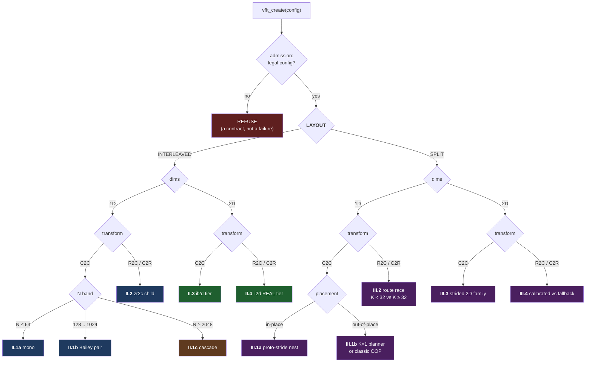

### Notes on the map

**layout** — how the caller stores complex numbers.
*Interleaved (IL)*: one array, `re,im,re,im,…`.
*Split*: two arrays, all reals in one, all imaginaries in the other.
This is a **caller declaration**, like placement — not something the library picks. Both
layouts are fully supported for every transform, in both placements.

**Why layout branches first.** A complex multiply on split data is 4 real multiplies with
*zero* lane operations. On interleaved data it costs a shuffle per multiply — but a split
kernel can only be used if you can hand it four independent same-shaped problems to fill
the SIMD lanes, because there is no parallelism *within* one complex number. Those two
facts drive entirely different kernel shapes, different planners, and different
strategies. Hence: different code, from the codelet up.

**transform** — `C2C` complex-to-complex, `R2C` real-to-complex, `C2R` complex-to-real.
Real transforms exploit conjugate symmetry: the output of a real input is redundant, so
only N/2+1 complex values are stored.

**placement** — *in-place* writes over the input; *out-of-place* writes to a separate
buffer. **This selects a different code path, not a flag.** Out-of-place engages a planner
in-place never touches. Measured: every in-place cell reports `k1=0 sp=0 il=0` regardless
of layout, because those fields belong to the out-of-place planner.

**admission / REFUSE** — some configurations are rejected outright. This is contract, not
breakage. The most useful example: **in-place real is accepted only for 1D interleaved** —
refused for 1D split and for all 2D, both layouts. A refusal is a promise that the library
will never silently mis-serve.

**order** — deliberately not on this map, because it is not a selector at this level. It
is covered next, and it matters more than it looks.

---

## 3. Order is a selector, not a modifier

The instinct is to read "order" as a flag that tweaks a shared plan. It is not. **Each
order value selects a different set of tournaments**, and the sets barely overlap. For
interleaved 1D c2c, scrambled has ~19 tournaments and natural ~12 — mostly *different*
ones, with different arms, engines and banked cells.

### What order means

An FFT's natural output order is the mathematical one: bin *k* at index *k*. The fastest
algorithms produce output in a **permuted** order, because the permutation falls out of
the recursion for free and un-permuting it costs a pass over memory.

- **`DEFAULT` / `SCRAMBLED`** — the caller accepts the permuted order. Fastest.
- **`NATURAL`** — the caller wants bin *k* at index *k*. The library must either apply a
  reorder pass, or use a kernel that writes natural order directly.

That second option is why natural order has its own tournaments rather than a shared plan
plus a fix-up: an engine that writes natural output directly **is a different engine**,
and must be raced against the reorder-pass approach on its own terms.

### 🔴 The trap: caller order ≠ key order

The order in a wisdom key is a property of the **plan**, not of the caller's request. The
store contains

```
@cell t=r2c n=64x64 q=1 ord=scr place=oop lay=il
```

but a caller passing `VFFT_ORDER_SCRAMBLED` for a 2D r2c transform is **refused**. The
`ord=scr` describes the internal plan shape, not what any caller may ask for.

**Never infer a caller configuration from a banked key.** This mistake was made twice
while assembling this document.

---

## 4. Anatomy of one tournament

Every race has the same five parts. Learning them once means every axis in the reference
catalogue reads the same way. ARMS and PROTOCOL are one shared body, `src/core/support/race.h`;
VERDICT, KEY and BANK belong to the site.

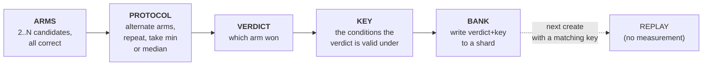

**arm** — one complete, correct way to compute the transform. Arms are usually *built in
full and executed*, not estimated: the library times the real thing.

**alternated arms** — A, B, A, B… rather than all of A then all of B. This is what makes
the verdict thermally robust: a machine that heats during the run heats for both arms
equally. On a noisy box the absolute times are worthless but the *ordering* survives.

**min vs median** — min is right when you want the least-disturbed sample; median when you
want to reject a single outlier in either direction. Different races use min-of-3, -5, -9,
or median-of-5.

**hysteresis** — the margin a challenger must beat the incumbent by (3%, 5%) before
displacing it. Without it, two arms within noise flip the verdict on every re-race and the
stored answer thrashes.

**verdict vs measurement** — the verdict (which arm won) is the durable product. The
nanoseconds are recorded alongside but are only comparable within one run, on one machine,
at one thermal state.

**cell** — one (transform, size, batch, order, placement, layout) coordinate.

**bank** — write the verdict, keyed. A verdict that is *not* banked is re-measured on every
`vfft_create`, in every process, forever.

**replay** — a later create finds a matching key and uses the verdict without measuring.
This is the normal path: a warmed store means creates are lookups, not races.

---

## 5. The gating principle — why this is a tree, not a list

**This is the structural idea a flat list of axes cannot express, and the one most likely
to be lost if this document does not exist.**

> **The outcome of one tournament decides whether another tournament exists at all.**

Not "influences" — *decides whether it exists*. Three verified instances:

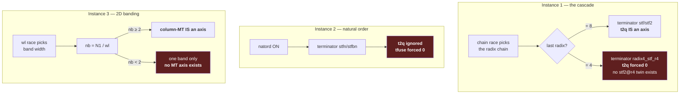

Instance 3, measured three independent ways:

| cell | `wl` | `nb = N1/wl` | outcome | measured |
|---|---|---|---|---|
| 256×256 | 256 (= N1) | 1 | no race possible | `wl=256`, no `cmt` |
| 64×64 | 8 | 8 | race runs | `wl=8 cmt=1` |
| 1024×1024 | 16 | 64 | race runs | `wl=16 cut=3 cmt=1` |

### Why you must care

**Choosing a benchmark or regression cell.** A cell only exercises an axis if that axis
*exists* in that cell. A cascade cell whose chain ends in 4 tests nothing about `t2q`; a
256×256 2D cell tests nothing about column threading. Cell choice follows the gating
chain, not the size.

**Changing planning code.** Deleting what looks like dead configuration may be deleting
the thing that makes another axis reachable.

---

## 6. How verdicts are stored

Four shard files under `generator/generated/`:

| shard | holds |
|---|---|
| `wisdom2_scr.txt` | the scrambled-era chains and variants (ord=scr; incl. the in-place IL mode cells) |
| `wisdom2_oop.txt` | out-of-place K=1 planner verdicts, classic OOP champions, and ALL 1D ord=nat verdicts (both placements) |
| `wisdom2_2d.txt` | the 2D interleaved tier |
| `wisdom2_real.txt` | 1D real routes and rfft chains |

A record:

```
@cell t=c2c n=1024 q=1 ord=nat place=oop role=comp lay=il | eng=k1 il_route=2p il_pair=32.32 il_kv=34 | ran=1 ns=1234 metric=fwd1 units=ns src=race
      \_______________________ KEY _______________________/  \______ PAYLOAD (verdict) ______/  \___ MEASUREMENT (informational) ___/
```

**The key says who may reuse this verdict.** The payload is the verdict. The measurement
records how it was obtained and is not comparable across runs.

### The three banking classes

**1 — Banked, key-matched.** A matching key replays deterministically. Most verdicts.

**2 — Banked with validity conditions.** The verdict carries the conditions it was measured
under, and a mismatch **re-races** rather than serving a stale answer. Worked example:
`cmt=1 cmtt=8` means "threading won, raced at 8 threads". A request at 4 threads does not
match, so it re-races. This is the design.

**3 — Plan-local (raced every time).** Never written down; re-measured on every create, in
every process. A **gap** pending the wisdom2 1D key convention — see §16.

### The MT rule: two classes, decided by who shares a transform

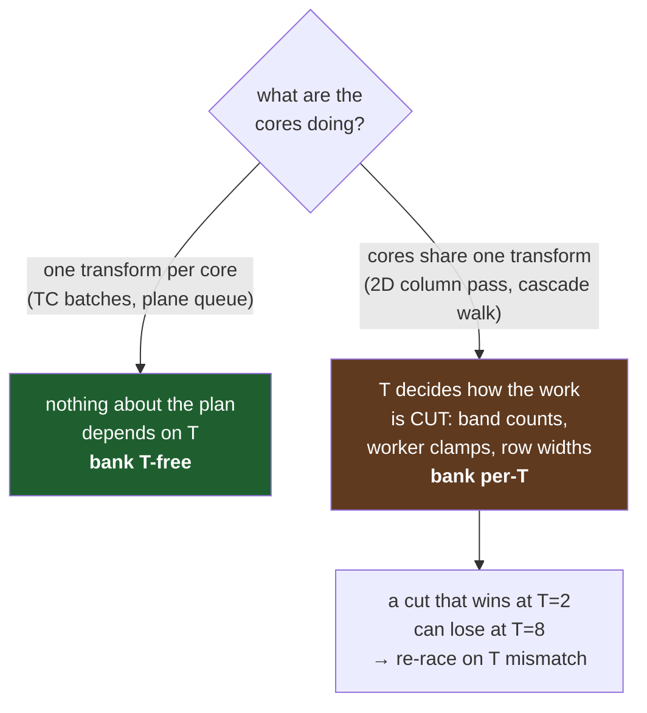

More cores running *separate* transforms changes nothing about any one plan, so that
verdict is valid at any thread count. Cores *cooperating* on one transform is different:
the thread count determines how the work is divided, and the best division at 2 threads can
be the wrong division at 8.

### 🔴 The `lay=` trap

Only 27 of 539 shipped records carry a `lay=` axis; the rest predate it and serve as a
**fallback tier**. So the absence of `lay=` does *not* mean "not banked for that layout".

Worse: for out-of-place K=1 the reader deliberately scans `lay=IL`, `lay=SPLIT` *and*
lay-less cells, filling both route axes regardless of what the caller asked. That is why a
split caller and an interleaved caller at the same N report **identical** `sp=` and `il=`.
The caller's layout picks which axis is *used*, not which is *read*.

---

## 7. Core vocabulary

**stage** — one step of the decomposition. N=1024 as 4·4·8·8 is a 4-stage chain.
**radix** — the size of one stage: the 4s and 8s above.
**chain / factorization** — the ordered list of radices. **Order matters**: 4·8 ≠ 8·4.
**twiddle factor** — the complex constants applied *between* stages; what makes a large
FFT out of small ones.
**leaf / mid** — in a two-stage decomposition, the *leaf* is the first stage (many small
transforms), the *mid* the second (recombination, carrying the twiddles).
**codelet / kernel** — a generated, fully-unrolled routine computing one stage at one
radix. Hundreds exist, in families with different tradeoffs.
**arm** — one candidate in a race. **verdict** — which arm won. **cell** — one coordinate.
**bank** — write a verdict. **replay** — serve from the store without measuring.
**hysteresis** — the margin needed to displace an incumbent.
**offline vs create-time** — some tournaments run only in dedicated calibration programs
(`build_tuned/benches/calibrate_*.c`), never during `vfft_create`. Their verdicts must
already be banked or the feature falls back.

---

# PART II — THE INTERLEAVED FAMILY

Interleaved is the public contract: `re,im,re,im,…` in one array. Its kernels live in
`codelets/zil/`, its planner is `dp_planner_il.h`, its executors are il2p / il3p / zturn /
zsplit. Nothing here shares code with Part III.

## II.1 — 1D c2c: three engines by size

Interleaved 1D is **three different engines**, not one with parameters:

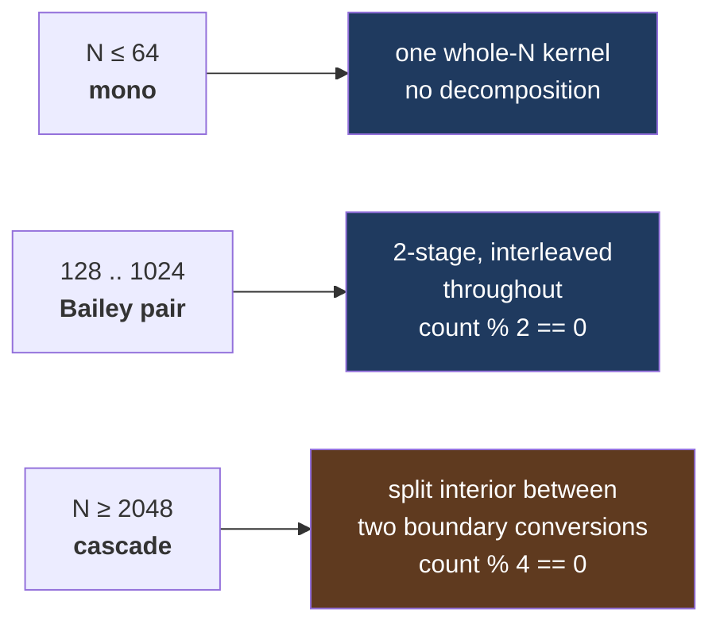

### II.1a — mono (N ≤ 64)

One emitted kernel computes the whole transform. No decomposition, so no chain, no pair,
no twiddle-strategy axis. It appears as one *arm* in the route race below, not as a tier
with its own tournaments.

### II.1b — the Bailey pair (128 … 1024)

#### The one structural idea

A two-stage decomposition normally needs a transpose between the stages. **Interleaved
does not have one — the transpose is fused into the leaf's store addressing.**

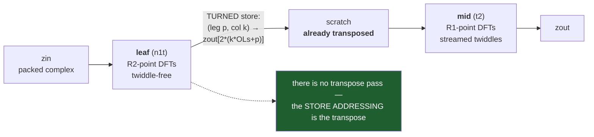

**turned store** — writing results to transposed addresses instead of writing them
naturally and transposing afterwards. The transpose becomes free: a different index
expression on stores you were doing anyway. This single decision explains the whole
naming scheme in `codelets/zil/`.

#### The route

| value | meaning |
|---|---|
| `MONO` | one whole-N interleaved kernel — **exists only at N=64** |
| `2P_PURE` | the Bailey 2-stage pair — this tier |
| `CHAIN3` | a 3-stage chain, for odd factors that must appear as kernel *radices* |
| `PRIME` | Rader or Bluestein, for prime N |
| `CASCADE` | the ≥2048 tier |

#### Pair enumeration

R2 comes from the generated leaf registry; R1 = N/R2, bounded 3 ≤ R1 ≤ 64. Pairs are
**ordered** — (32,8) and (8,32) are different plans, both tried.

Two design decisions worth preserving:

- **There is no power-of-two test on R1.** It was removed because the leaf/mid existence
  check is strictly tighter, and the pow2 test was what made every non-pow2 cell enumerate
  *zero* candidates and therefore never bank anything.
- **The pool refuses rather than truncates.** Past 1024 candidates the cell is rejected
  outright, because *a truncated pool is a biased pool* — silently keeping the first 1024
  would systematically favour whatever the enumeration order visits first.

#### `il_kv` — the kernel form pair

Once (R1,R2) is fixed, the mid and leaf can each be built in several *forms* computing the
same thing differently. `il_kv` packs two 4-bit choices: `mid | leaf<<4`.

| form | attacks | what it does |
|---|---|---|
| **monolithic** | — | the straightforward whole-radix kernel |
| **blocked** | register pressure | splits the DFT into passes through a spill array, so peak live registers drops to `max(m,p)` |
| **tangent / wing** | arithmetic ports | factors `w = cos·(1 + i·tan)`, so the shear runs in one FMA and normalization folds into the butterfly — moving adds off the FADD ports |
| **turn-edge (T256, M-128)** | store shape | same math, different store width and pairing |
| **`_ct`** | algorithm structure | factors an odd composite (9→3·3, 25→5·5) instead of a direct conjugate-pair DFT |

**When does restructuring pay?** One rule covers blocking and factoring: **they pay
exactly when the monolithic form spills registers, and the payoff scales with how much.**
Radix 3–9 use ≤16 of 16 registers with 0% spill, and restructuring is pure loss there —
radix 9's `_ct` *loses*. Radix 25 spills 37.6% and `_ct` wins 2.5×. Radix 32 spills 26.5%
and blocked wins +17…+52%.

That is why the arm sets are per-radix, and why **radix 16 is deliberately excluded from
the blocked-by-default rule**: it fits the register file (8.6% spill), so a non-monolithic
form there must win *per cell*, not by structural rule.

Nibble `0xF` means **force monolithic** — it exists so a machine where blocked measures
*slower* can still express that as a banked verdict.

#### The other Bailey axes

**`il_bkv`** — backward uses a different decomposition than forward, so it gets its own
verdict cell at `dir=bwd`, capped at 24 arms and roundtrip-gated before timing.

**Pair-order swap** — a create-time race of (R1,R2) against (R2,R1), 5 bursts, 3%
hysteresis. **Raced but never banked**, so it re-decides every create.

🔴 **`il_kv` and `il_bkv` have no fingerprint field.** Two plans differing only in kernel
form produce an identical fingerprint, so form changes are invisible to the migration
safety harness.

**Offline only.** `vfft.c` never calls `dp_planner_il.h`. The route, pair and `il_kv`
verdicts come from `calibrate_k1`, or the feature falls back.

### II.1c — the boundary-split cascade (N ≥ 2048)

#### Why convert layout at all

Two requirements pull against each other. The public contract is **interleaved**. But SIMD
butterfly arithmetic wants real and imaginary parts in **separate** registers: a complex
multiply on split data is 4 real multiplies and *zero* lane operations, where interleaved
data pays a shuffle per multiply.

Holding interleaved through a long chain pays those shuffles on every stage. The cascade's
answer is to convert **exactly twice** — once at ingest, once at the terminator — and run
the whole interior converted.

| | cost |
|---|---|
| convert at the two boundaries | O(N), twice, total |
| shuffles saved | one per complex multiply, on **every** interior stage |

That trade only pays with many interior stages to amortize over. **This is precisely why
the tier starts at 2048** and the Bailey pair below it stays interleaved: a 2-stage
decomposition has nothing to amortize. A full-interleaved interior has been refuted twice.

⚠️ **This is not the split family.** The interior uses split-*form* scratch — 64-byte
`[re×4][im×4]` blocks, so re and im stay on one cache line and the traffic stays one
stream. It is an internal representation of an interleaved-family engine, and it shares no
code with Part III. The conversion is at the **route** level, never inside a codelet: a
codelet whose signature mixes `zin` with `in_re`/`in_im` is the forbidden shape.

#### The tournament tree

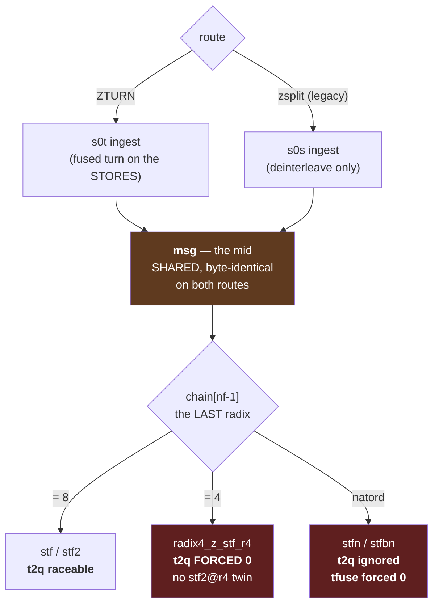

**The two routes differ in one thing only: where the digit-reversal turn is paid.**
`zsplit` pays it on the terminator's *loads*, as register transposes, every iteration.
`zturn` pays it on the ingest *stores*, as an address choice, once. Measured, that is worth
+54% at 2048 rising to +164% at 8192 — which is why ZTURN became the default.

**`zsplit` is not dead code.** The planner races both routes on every cascade miss; zsplit
is the **control arm**. Remove it and the ZTURN verdict becomes unfalsifiable, with no
reference left to catch a future regression. ZTURN is also a strict superset: zsplit builds
only chains ending in 8, ZTURN builds `last==8` *and* `last==4`.

**`t2q` — a conditional axis.** `stf` and `stf2` are *bit-identical* schedule twins
(2-quad unroll-and-jam), so the difference is pure code placement — exactly why it must be
measured per cell rather than ruled. But the twin only exists at `last==8`: there is no
`stf2@r4`, the calibrator refuses to race a `last==4` chain, and under natural order there
is no `stfn2` either.

**Terminators, three lineages.** `sterm` transposes on every load. `stf` makes the ingest
*store* in exactly the geometry the terminator wants to *read*, so the load-side transposes
disappear. `stfn` keeps `stf`'s edges but addresses its reads through a rho-inverse table,
producing **natural order with no separate reorder pass**.

That last one follows a hard rule: **a digit-reversed read is free (0.96–1.12×); a
digit-reversed write costs +29–50%.** So the permutation is always applied to reads, never
to stores into caller memory.

**Other axes:** `tcut` tile width (UNTILED is kept as an arm deliberately, so "tiled" stays
falsifiable); `tfuse` (derived; forced 0 under natord because rho spans the whole section);
`thonest` (env-only A/B, a bit-identical pair kept reachable as a discriminator); `zt_mt`
(serial vs threaded walk — raced, never banked).

### II.1d — in-place: the attach race

For interleaved **in-place** there is a create-time race deciding whether the native
interleaved engine is used at all:

- **arm 0 — CONVERT**: deinterleave to split planes, run the split engine, re-interleave.
- **arm 1 — NATIVE**: the interleaved engine directly (il2p/il3p/ilprime below 2048; the
  cascade above).

5 rounds, arms alternated, median-of-5, reps scaled by size. Banks as `mode=ilp|conv` or
`mode=zcasc|conv`. The fingerprint field `ilme=1` records that *the race ran*; which arm
won shows in the subplan presence bits.

### II.1e — natural order

Its own tournaments, not a fix-up pass:

- **nat-ilp** — il2p/il3p against the finished natural-*tape* handle.
- **nat-zcasc** — the natord cascade against the tape handle.
- **natoop-zcasc** — the natord cascade against the K=1 out-of-place handle.
- **scroop-zcasc** — the SCRAMBLED cascade against the K=1 out-of-place handle under
  order=DEFAULT (2026-09-03). DEFAULT is order-agnostic, so the scrambled cascade is a
  legal arm; it was never offered before (built only for an explicit SCRAMBLED request),
  which left DEFAULT out-of-place on the pair at 2048/4096 and on the classic champion
  behind a convert above (4.7x at 8192). Banked on the OOP `ord=scr` mode row
  (`mode=zcasc` with the `ref=` signpost, or `mode=free`), replayed at create.
- ⚪ **nat-tape opportunistic PSWAP** — no clock at all; a deterministic short-circuit that
  still **banks**. It belongs on a "banks without measuring" list, not among measurement
  arms.

### II.1f — prime N

**ilprime method** — Rader against Bluestein, both fully constructed, warmed once, then
min-of-3 **alternated** forward executes. Raced but never banked.

*(An earlier claim that the prime method is "never raced" was refuted by verification —
this race is real. The odd/prime axes remain the least-verified part of this document.)*

## II.2 — 1D real, interleaved

Interleaved real builds a **child plan** — a c2c transform at N/2 — and the child runs its
own complete set of c2c tournaments. So a 1D IL r2c plan carries two independent verdict
sets: its own route, and everything the child decided.

**The `zr2c` composite route** picks between `child_oop_il` (an out-of-place child plus a
fold into a separate plane) and `child_nat_ip` (an in-place child).

**In-place real lives only here.** 1D interleaved is the one place the library accepts an
in-place real transform.

Measured: `1d.il.ip.r2c.1024` → `zr2c=1` with a `zr2c` child; `1d.il.oop.r2c.1024` →
`zr2c=0` but *still* carries the child.

## II.3 — 2D c2c, interleaved (the il2d tier)

The widest decision surface in the library.

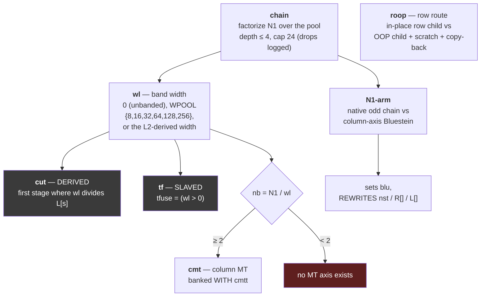

**banded column walk (`wl`)** — a 2D column pass touches every row, which blows the cache
in one sweep. Banding processes `wl` rows at a time so the working set stays resident. The
width is measured, not computed, because the best band depends on cache size *and* on the
chain's stage sizes.

**the tcut law: width is the INPUT, cut is the OUTPUT.** `cut` is not an independent
choice — given a band width, it is the first stage index where the width divides the
stage's stride. Trying to set both is how you get an illegal combination.

**`tf` (tfuse)** is slaved to `wl` the same way: `tfuse = (wl > 0)`.

**`roop`** — whether each row's transform runs in place, or out-of-place into a scratch
plane that is copied back. The copy costs; the out-of-place child may be enough faster to
pay for it. Engages at large N1.

**`blu` — the N1 arm.** When N1 is prime or not expressible over the radix pool, the column
axis uses Bluestein: a chirp-z transform computing any length via a longer power-of-two
convolution. This arm **rewrites the chain metadata** — it is a different column algorithm,
not a leaf choice.

**Natural order here is structural**, not raced: a closed-form leaf redirection (M4-lite)
builds, or the create refuses.

## II.4 — 2D real, interleaved (the REAL tier)

Everything from II.3, plus a **row route**:

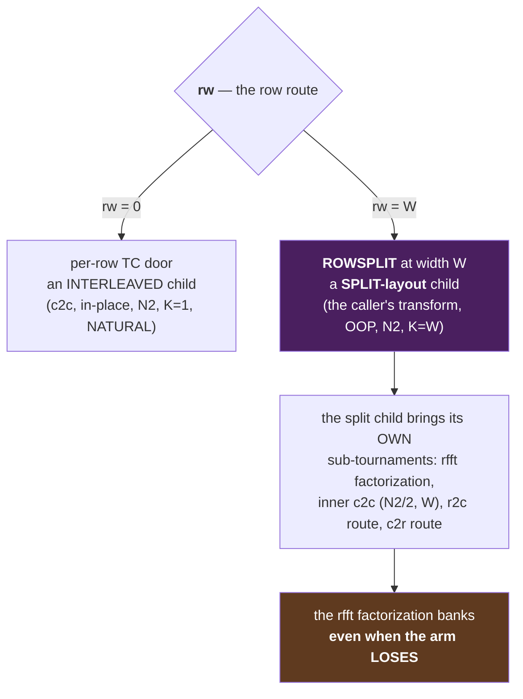

🔴 **This is the one bridge between the two families** — see Part IV.

**Why a losing arm still banks.** The rfft factorization verdict concerns the rfft
sub-problem, which is valid regardless of whether ROWSPLIT won the outer race. Discarding
it would mean re-measuring it next time something else needs it.

**The `oddn2` asymmetry is deliberate.** The row-route race is guarded with `!il2d_oddn2`;
the column-MT guard eight lines below is **not**. Odd N2 has no ROWSPLIT arm to race, but
column threading remains valid. Measured consistent: 128×127 at T=8 engages `cmt` and is
**bit-identical** to the single-threaded result (0 of 16448 doubles differ).

**Asymmetry worth flagging:** the column chain **is** raced for 2D c2c, but for the real
tier it is *not* — precedence there is env > banked row > greedy-longest.

---

# PART III — THE SPLIT FAMILY

Split stores reals and imaginaries in separate arrays. Its kernels live in
`codelets/{oop,inplace,strided}/`, its planners are `dp_planner.h` and
`dp_planner_split_oop.h`. Nothing here shares code with Part II.

## The constraint that shapes everything

> *"split-layout SIMD has no intra-complex parallelism to exploit without shuffles, so its
> 4 AVX2 lanes must hold 4 independent same-shaped problems."*

| layout | a 256-bit register holds | complex multiply | needs |
|---|---|---|---|
| interleaved | 2 complex numbers | shuffles per multiply | `count % 2 == 0` |
| **split** | 4 reals of the *same component* from 4 *different* problems | 4 real multiplies, **zero lane ops** | **4 independent problems** |

Split buys shuffle-free arithmetic but cannot parallelise *within* one complex number —
there is nothing there to parallelise. So a split kernel is only usable if you can hand it
four independent same-shaped problems. **Every split engine is a different answer to where
those four come from:**

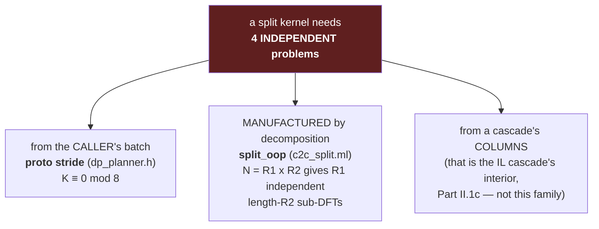

🔴 **"split" names three different things and they are not interchangeable.** *split_oop*
is the caller's re/im planes with the lane batch manufactured internally. *proto stride* is
the caller's planes with the lanes being the caller's own transforms. *zsplit* is the IL
cascade's interior scratch — Part II, not here. **Never say "K=1 split engine"** — say
split_oop, and say which planner.

## III.1 — 1D c2c, split

### III.1a — in-place: the proto-stride nest

**One nested tournament, not four independent ones.** This is easy to get wrong because the
banked record has three tokens (`chain=`, `vars=`, `dif=`) that look like three verdicts.
They are three coordinates of a single winner.

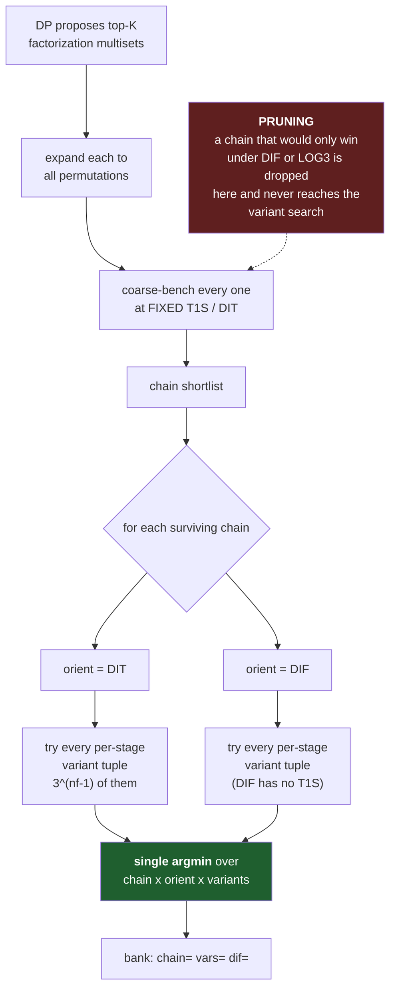

**DP proposal** — an estimate-driven shortlist, not a measurement. It exists to keep the
measured search tractable: factorizations × permutations × variants is far too large to
time exhaustively.

**multiset vs permutation** — `{4,4,8,8}` is a multiset; `4·4·8·8`, `4·8·4·8`, `8·8·4·4` …
are its permutations. Both matter: which radices, *and* in what order.

**DIT / DIF** — *decimation in time* / *in frequency*: two arrangements of the same
computation. They differ in where the twiddles sit and which stage has none — DIT's
**first** stage is twiddle-free, DIF's **last** stage is.

**per-stage twiddle variant** — how each stage obtains its twiddle factors:

- **FLAT** — read every twiddle from a fully precomputed table. Most loads, no arithmetic.
- **LOG3** — load only the power-of-two legs and derive the rest in-register
  (`w^j = w^p · w^(j−p)`). At radix 8 this loads 3 records instead of 7: fewer loads, more
  FMAs. The derivation is loop-invariant per column group, so it stays off the critical
  path.
- **T1S** — one broadcast ("splat") value per group, usable when the whole group shares a
  twiddle.

They trade memory bandwidth against arithmetic ports. Which wins depends on radix, cache
residency and the machine's load/FMA balance — hence measured, not ruled.

**cartesian / 3^(nf−1)** — every combination of per-stage choices. The twiddle-free stage
has nothing to choose, so an nf-stage chain has nf−1 choosing stages: **9** combinations at
3 stages, **27** at 4, **81** at 5 — per chain, per orientation.

**argmin** — the single minimum over the whole space. There is **no separate DIT-vs-DIF
race**; the orientation is a coordinate of the overall winner. For refactoring: there is no
"orientation race" call site to preserve, and if the argmin breaks the orientation silently
pins.

**The pruning caveat.** Pass 1 shortlists chains with variant and orientation held *fixed*
at T1S/DIT. A chain mediocre under T1S/DIT but which would have won under DIF or LOG3 is
eliminated before the variant search sees it. The search is exhaustive over variants
**given** a shortlist chosen at one fixed variant — not exhaustive overall.

**`pad_me` — the one genuinely independent race here.** Batching K transforms, the SIMD
lanes process 8 at a time; if K is not a multiple of 8 there is a ragged tail. **TIGHT**
runs the exact (N,K) and handles the tail with narrow SSE2/scalar code; **PADDED** rounds K
up to `roundup(K,8)` and computes wasted lanes to keep every iteration wide. Padding does
arithmetic it discards; tight pays for a narrow tail loop. Which wins depends on how big
the tail is relative to the body.

**`rigor=EXHAUSTIVE`** replaces the shortlist with a full sweep: every multiset, every
permutation, a T1S pre-screen, then the complete cartesian.

### III.1b — out-of-place

#### K=1 — the split route search

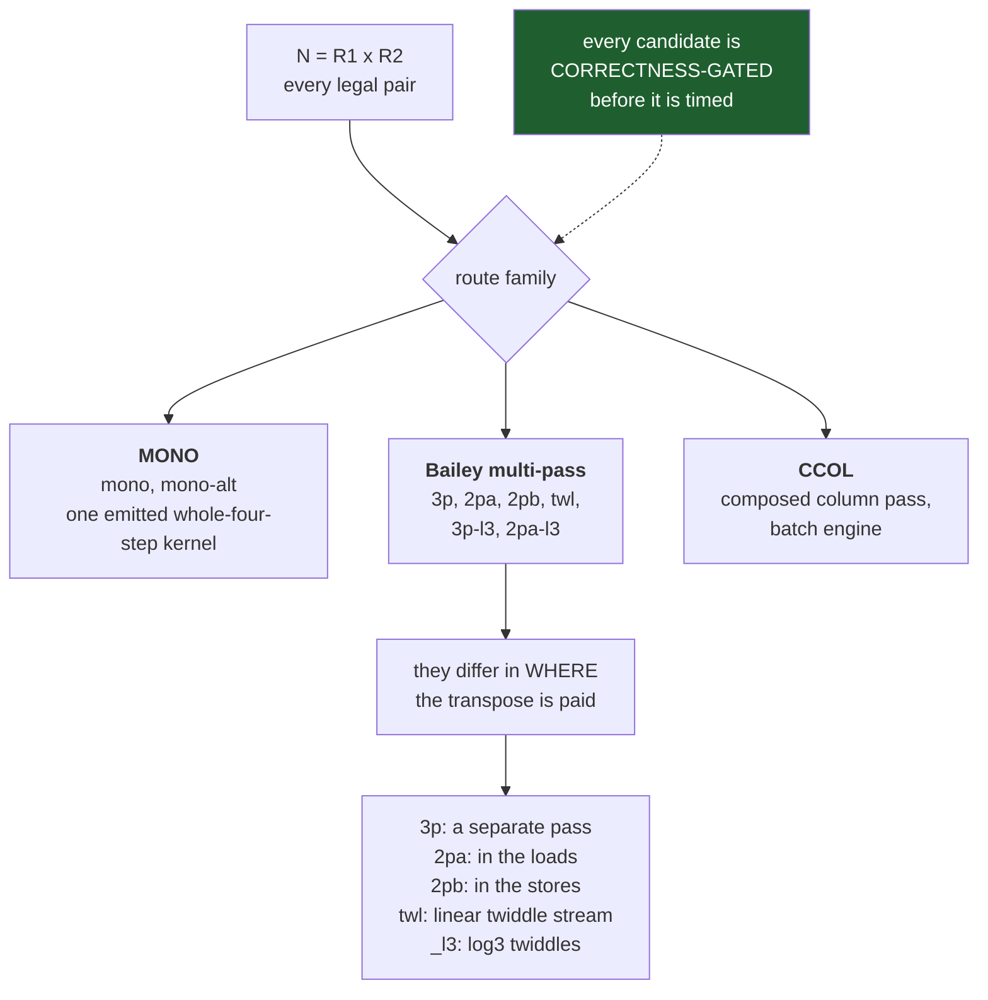

**Why a transpose is involved.** A four-step FFT computes N = R1·R2 by treating the data as
an R1×R2 matrix: transform the columns, twiddle, transform the rows. Reading columns of a
row-major matrix is strided and slow, so a transpose must happen somewhere. The route arms
are *different places to pay for it*.

**Why CCOL exists.** At large N there may be no legal classic pair: both R1 and R2 would
exceed 128, and no kernel that big exists. CCOL composes a column pass from the batch
engine instead, and is the **only** K=1 split route above N=16384.

**Offline only.** `vfft.c` never calls this planner; the only caller is
`build_tuned/benches/calibrate_k1.c`. At create the verdict is replayed or the feature
falls back.

Measured: `1d.sp.oop.c2c.256` → `sp=2` (2PB, transpose in the stores);
`1d.il.oop.c2c.64` → `sp=4` (MONO) — note *both layouts* read this record, per the `lay=`
trap in §6.

#### K>1 — the classic OOP path

**The pair tuner** — the direct LEAF codelet (N ≤ 128) versus every (R1,R2) BAILEY2 pair,
each at both twiddle variants (`flat` = FMA-leaner, `log3` = port-rebalanced). Up to 34
candidates, `__rdtsc`, 15 rounds. Requires `K % 8 == 0`.

**native vs MODEB** — the pair tuner's champion against the DP planner's MODEB
decomposition, `__rdtsc` min-of-9 on the same buffers.

🔴 **Both are measured and banked — but the order overrides the clock:**

```c
if      (ord == NATURAL)   { op = nat; }   /* clock ignored */
else if (ord == SCRAMBLED) { op = mb;  }   /* clock ignored */
else                       { op = (nns <= mns) ? nat : mb; }
```

Only `DEFAULT` consults the measurement. The race still runs and still banks — so a later
DEFAULT request at the same cell replays both — but for two of three orders the tournament
decides nothing.

### III.1c — natural order

**The reorder mode race.** Natural output is reachable three ways, and they compete:

- **PURE_CYCLE (`pcyc`)** — apply the permutation as disjoint cycles; walking each cycle
  moves every element into place with one temporary.
- **PSWAP (`pswap`)** — when the permutation is an *involution* (applying it twice is the
  identity), every cycle has length 2, so the reorder is a list of pairwise swaps — cheaper
  and trivially parallel.
- **SCR** — a different chain producing natural order more directly.

The floor is the deployed chain plus its cycle tape; challengers are up to 5 injected
"palindrome" chains with paired tapes.

**This is the flapping cell.** At N=256, split, in-place, natural: `nat=5 natcyc=96` in 8
runs of 10, `nat=4 natcyc=34` in the other 2, because it is unbanked there and re-races each
process. **Both are correct** — 3.0e-16 and 3.1e-16 against a naive long-double DFT.

## III.2 — 1D real, split

🔴 **The axis is K, not N.**

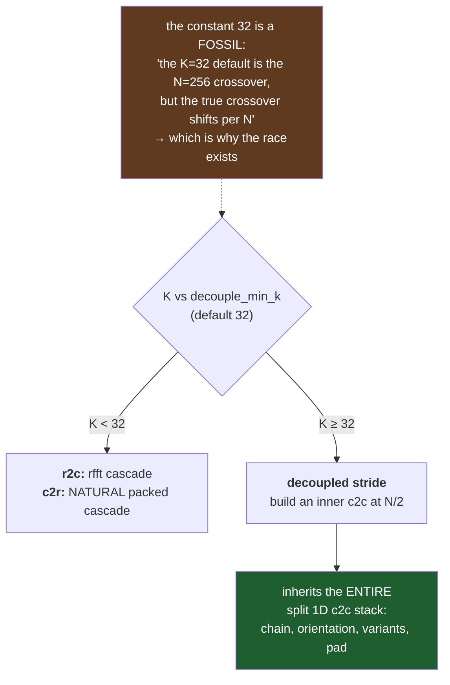

**Why real transforms have a crossover.** A real-input FFT exploits conjugate symmetry two
ways. The *packed* (rfft) approach uses dedicated real kernels that never materialise the
redundant half. The *decoupled* approach reinterprets N reals as N/2 complex values, runs an
ordinary complex FFT, and fixes up the result. Packed wins when there is little batching to
amortize its specialised kernels; decoupled wins at high K because it gets the whole c2c
machinery, which is far more heavily tuned.

**The structural consequence:** above the crossover there is **no real-specific tournament
at all** — the plan is a c2c plan plus fold/unfold. This is why real single-threaded
performance "loses by design" at high K: there is no real-specific structure left to win
with.

`c2r` uses the *same* constant, choosing NATURAL packed below and SPLIT decoupled above.

**Below the crossover**, the rfft chain × per-stage variant search runs: multisets of ≤5
stages, radix ≤16, crossed with the full FLAT/LOG3/T1S cartesian.

**In-place split real is refused** — 1D interleaved is the only in-place real path.

## III.3 — 2D c2c, split

**2D split is not 1D machinery applied twice.** It uses a separately generated codelet
family — `strided`, with a *uniform 6-arg in-place 2D ABI where direction selects the
slot*. These kernels take row and column strides directly, so a column pass does not need
the data transposed first.

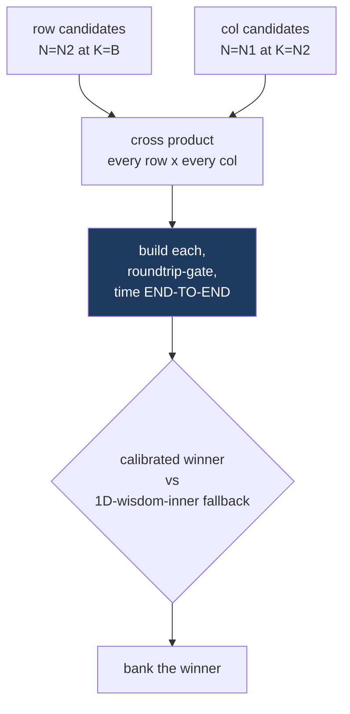

**Why end-to-end, not per-pass.** The row and column plans interact through cache state: a
row plan fast in isolation can leave the data in a layout that makes the column pass slow.
Timing the cross product end-to-end measures the interaction; timing each pass separately
would not.

**The fallback arm** is "just use the 1D wisdom for each axis independently" — the honest
incumbent the calibrated 2D plan must beat.

**Natural order** adds the `J_nat` sweep: a pool of (chain, reorder-tape) pairs each scored
on the *full* natural cost — the 2D scrambled forward plus the dimension-1 whole-row
reorder — because a chain fast when scrambled may need an expensive reorder.

⚪ **Threading here is structural, not raced**: the split 2D veneer threads unconditionally
with structural floors, and has no fingerprint field at all.

## III.4 — 2D real, split

The same calibrated-versus-fallback shape as III.3, per direction: a row r2c at (N2,B)
crossed with a column c2c at (N1,K_pad), timed end-to-end, then the calibrated winner
against the 1D-wisdom-inner fallback.

**In-place is refused** for 2D real in both layouts.

---

# PART IV — WHERE THE TWO FAMILIES MEET

Exactly one bridge exists, and it is a **race between the families**.

In the 2D interleaved REAL tier (II.4), the `rw` row-route race has two arms built by
recursive `vfft_create` calls with *different layouts*:

```c
/* arm 0 — the per-row TC door */        /* arm 1 — ROWSPLIT at width W */
rc.transform = VFFT_C2C;                 sc.transform = cfg->transform;   /* r2c / c2r */
rc.placement = VFFT_INPLACE;             sc.placement = VFFT_OUTOFPLACE;
rc.layout    = VFFT_LAYOUT_INTERLEAVED;  sc.layout    = VFFT_LAYOUT_SPLIT;
rc.order     = VFFT_ORDER_NATURAL;       sc.howmany   = Wb;
rc.n[0] = N2;  rc.howmany = 1;           sc.n[0] = N2;
```

So the question `rw` answers is literally: **for the row pass, stay interleaved, or hand
the rows to a split child?**

Consequences worth knowing:

- A 2D interleaved real plan can contain a **complete split sub-plan**, with all of Part
  III's tournaments underneath it — which is why rfft factorization and inner-c2c axes
  appear under a 2D *interleaved* heading.
- Those sub-verdicts bank into the split family's shards under their own keys, and are
  reusable by ordinary split callers.
- The rfft factorization for the ROWSPLIT arm banks **even when the arm loses**, because
  the sub-problem's verdict is valid regardless of the outer race.

Everywhere else, the families are disjoint. In particular the IL cascade's *split interior*
(II.1c) is **not** this bridge: it is an internal scratch representation of an
interleaved-family engine, sharing no code with Part III.

---

# PART V — CROSS-CUTTING, NON-MEASUREMENTS, GAPS

## 14. Batching and threading

**Transform-contiguous batch (`tcb`)** — when K transforms lie one after another, a batch
handle processes them with block strides derived arithmetically from (transform,
placement). The clone count is whatever passed an equivalence check, not a raced value.

**Plane queue (`pq`)** — for 2D with `howmany > 1`: either loop the single plan over the
planes sequentially (each keeping its own intra-transform MT verdicts), or hand planes to
worker clones from a queue. Raced at create and banked (2026-09-02) on the primary plane's
own row as `pq=`/`pqn=`/`pqt=`, valid for the plane count and worker count it was raced at.

**`mtunsafe`** — not a timing race at all. A *correctness* self-check: the whole-batch
reference output versus a sequential replay of every slab size threading might pick. It
catches lane-drop bugs; it does not choose a faster arm.

## 15. What is *not* a measurement

Roughly one entry in six on the axis list is not a tournament. Mixing these up is the
easiest mistake here, so they are named:

| kind | meaning | examples |
|---|---|---|
| **DERIVED** | computed from another verdict; no arms | `cut` (from `wl`), `tf` (slaved to `wl`), `tcbsn`/`tcbdn` |
| **ENV** | an A/B knob only; env pins **never** bank | `wc`, `norowz`, `thonest` |
| **STRUCTURAL** | fixed by construction or refusal | `oddn2`, natural n1 (M4-lite), 2D reorder tapes, Bluestein's M |
| **SELF-CHECK** | a correctness gate, not a speed choice | `mtunsafe` |
| **BANKS WITHOUT MEASURING** | writes a verdict with no clock | nat-tape opportunistic PSWAP |

**Why env pins never bank (the tcut law).** An environment override is an experiment. If
experiments wrote to the store, one debugging session would poison the shipped verdicts for
every later run.

## 16. Known gaps

**MT verdicts are not banked in the shipped store.** All 539 records carry no
thread-related field. `zt_mt`, `pq_mt`, the odd-real bridge pick and the prime method
re-race on **every create, in every process**. This is a TODO owned by the wisdom wave —
pending the wisdom2 1D cell convention — and explicitly *not* a policy. The design is
settled and already demonstrated by `cmt`/`cmtt`: bank with validity keys, re-race on a
mismatch. Two costs of leaving it: roughly 6 executes per threaded create, and
non-determinism — an unbanked race can pick different winners across creates *within one
process*, which makes clone-equivalence refuse the batch and MT decline.

**The create-race counter is blind to MT.** None of the four MT racers increments it, so
`races=0` on a threaded plan is a false zero.

**Layout collision.** Only 27 of 539 records carry `lay=`, so interleaved and split
verdicts at the same (t, n, q, ord, place) can collide on one key.

**Kernel forms are invisible to the fingerprint.** `il_kv` and `il_bkv` have no fingerprint
field, so form changes cannot be detected by the migration harness.

**`il_bkv == 0` is ambiguous** — both a valid verdict ("the defaults won") and the
not-raced sentinel, so that outcome is silently dropped.

**Unverified.** The odd/prime axes — the ilprime method race, the 2D column-axis Bluestein
arms, and the Bluestein (M,B) sweeps — lost their adversarial verification three times to
rate limits. Treat them as unchecked rather than confirmed.
