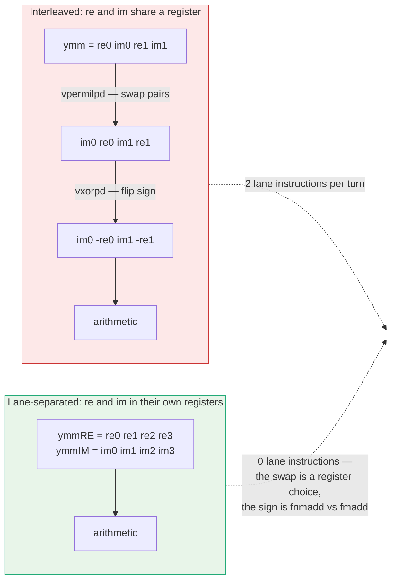
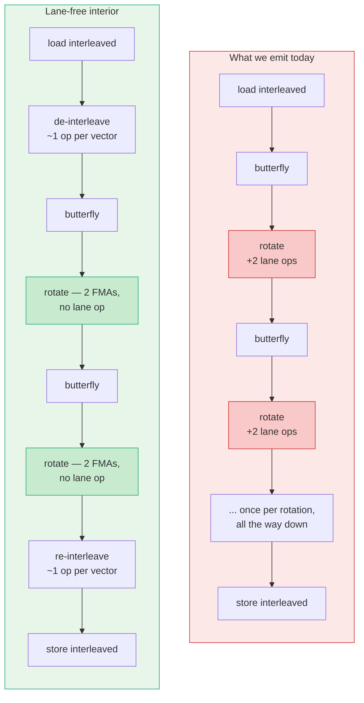
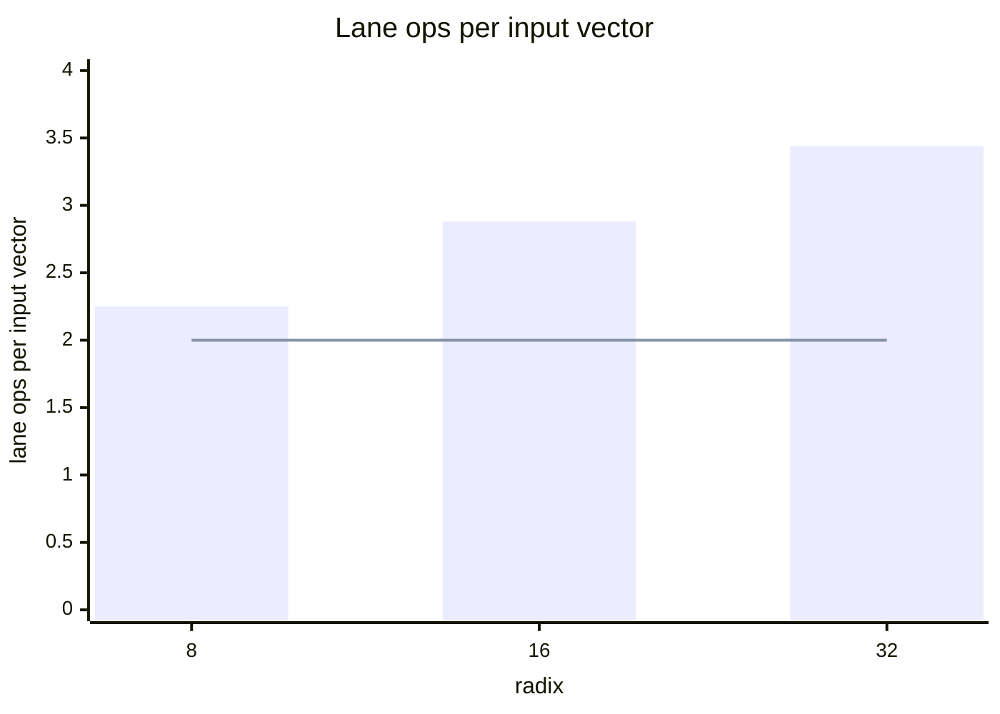
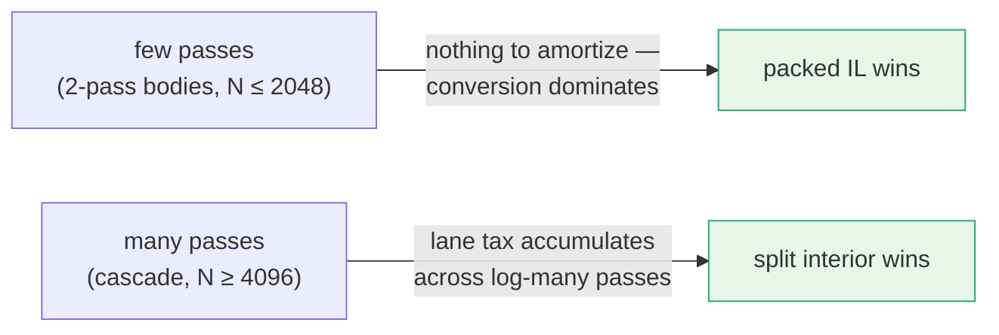

# The lane tax in interleaved-complex codelets

Our pure-IL codelets carry a cost that is invisible in an operation count and
absent from any FLOP model: **lane work**. Roughly a third of every IL kernel's
vector instructions do no arithmetic at all. They move doubles between positions
inside a register so that the arithmetic which follows lines up.

This note explains where that work comes from, why it grows with radix, and what
shape of kernel would not pay it.

## 1. The layout, and what it costs

An IL codelet holds **two complex numbers per 256-bit register**, interleaved:

```text
ymm  =  [ re0 | im0 | re1 | im1 ]
           \_____/     \_____/
           complex 0   complex 1
```

Addition and subtraction are free of lane work in this layout — they are
elementwise, and a butterfly's `a+b` / `a−b` never cares which slot holds what.

**Rotation is where it stops being free.** A complex multiply mixes the real and
imaginary parts of the *same* number, so it must reach across positions inside the
register.

The quarter turn is the clearest case. Multiplying by `−i` maps
`(re + i·im) → (im − i·re)`, which in this layout is a swap of each adjacent pair
plus a sign flip on the second element. That is exactly what our codelets emit:

```c
_mm256_xor_pd(_mm256_permute_pd(z, 0x5), _M_IM)
/*             \_______________/  \_____/
                swap within pair   negate the imaginary lanes            */
```

**Two instructions, zero arithmetic.** Every `±i` turn in every radix pays them.

A general rotation by `(c, s)` pays a swap too. The sign is folded into the twiddle
record ahead of time (`[c,c,c,c][−s,+s,−s,+s]`), so the sign flip disappears, but the
swap does not:

```c
fmadd(c, x, mul(s, cflip x))   /* cflip = the same permute */
```

And because butterfly partners are frequently in *different halves* of a register,
a third instruction class appears — `vperm2f128`, crossing the 128-bit lane
boundary — to bring partners together before the arithmetic.



In a lane-separated form the quarter turn costs **nothing at all**. Swapping real
and imaginary is choosing a different register name, and the sign is absorbed by
selecting `fnmadd` instead of `fmadd`. There is no instruction to issue.

## 2. How much of our kernels this is

Counted from the shipped sources — permutes, lane crossings and sign flips, against
all vector instructions that are not loads or stores:

| codelet | `permute_pd` | `perm2f128` | `xor_pd` | **lane ops** | vector insns | **lane share** |
|---|--:|--:|--:|--:|--:|--:|
| `radix8_z_n1t` | 5 | 8 | 5 | **18** | 44 | **40%** |
| `radix16_z_n1t` | 17 | 16 | 13 | **46** | 124 | **37%** |
| `radix32_z_n1tb48` | 49 | 32 | 29 | **110** | 318 | **34%** |
| `radix16_z_t2tan` | 29 | 0 | 7 | **36** | 138 | **26%** |
| `radix32_z_t2btan216` | 74 | 0 | 15 | **89** | 341 | **26%** |

Between a quarter and two fifths of every IL kernel is data movement inside
registers. None of it computes anything.

## 3. Why it gets worse as radix grows

The share above looks flat, which understates the problem. The right denominator is
not "instructions" but **the boundary** — how many vectors the kernel actually loads.
Lane work in the interior scales with the number of *rotations*, which for a radix-R
body grows like `R·log R`, while the boundary grows like `R`. The ratio therefore
grows like `log R`:

| radix | input vectors | lane ops | **lane ops per input vector** |
|---|--:|--:|--:|
| 8 | 8 | 18 | **2.25** |
| 16 | 16 | 46 | **2.88** |
| 32 | 32 | 110 | **3.44** |

*(R32 is the blocked form; its 64 source loads are 32 real inputs plus 32 replays
from the intermediate plane, so the boundary is 32.)*

Each step up in radix adds roughly another 0.6 lane instructions per vector of data
touched. That is the tax growing, and it is why the highest-radix bodies feel it
most — they are also the bodies whose register pressure is already tightest, so the
extra instructions land where there is least room for them.

## 4. The shape that would not pay it

Convert **once at the boundary** instead of continuously in the interior:
de-interleave on ingest, run the whole body lane-separated, re-interleave on egress.



The conversion costs about **2 lane ops per input vector** — one in, one out — and
it is *flat*: it does not care how many rotations the interior performs. Set that
against the measured column above:



| radix | today | boundary conversion | **lane work removed** |
|---|--:|--:|--:|
| 8 | 2.25 | 2.0 | **11%** |
| 16 | 2.88 | 2.0 | **31%** |
| 32 | 3.44 | 2.0 | **42%** |

The two lines cross just below radix 8.

### …and it has been measured, and it loses

That table is an instruction-count argument, and on this hardware instruction
counts have repeatedly failed to predict time. **This one was tested, and the
boundary-conversion form lost decisively.**

Head-to-head at the untwiddled leaf, converting form vs the full-IL form we ship,
ratio = IL / converting, **below 1 means full IL is faster**:

| radix | monolithic | blocked |
|---|--:|--:|
| 16 | 0.750 | 0.657 |
| **32** | **0.787** | **0.658** |

**Full IL is 34% faster at radix 32** in the blocked leaf — the exact slot the
census above says has the most lane work to save. Saving 42% of the lane
instructions does not come close to paying for the conversion.

**Why**: the conversion is paid **per pass**, while the lane tax accrues **per
rotation within a pass**. A two-pass body converts twice and has only one body's
worth of rotations to save on. Only when a route runs many passes does the interior
saving accumulate enough to outrun a conversion that is paid once at the boundary
and then amortized. That is the whole story of our tiering:



So the lane tax is **real, measured, and already correctly priced** by the shipped
tier rule — packed IL below, split interiors above. This note explains *why* that
rule is where it is. It does not license a converting codelet inside the IL tier.

## 5. Relationship to the tangent family

This is the natural home for the tangent-scaled butterflies
([`tangent_scaled_butterflies.md`](tangent_scaled_butterflies.md)). That
construction turns naked adds into FMAs, which is a *port-mix* win; it does nothing
about lane work, because the shear still has to reach across real and imaginary.

Lane-separated, the two compose: a tangent rotation becomes exactly two FMAs and
nothing else — no multiply, no permute, no sign flip. It also explains an
otherwise-odd measurement in that family: our radix-32 tangent kernel reaches a
*better* port mix than the radix-16 one (39% naked adds against 47%) and still
returns only −3.2% where radix 16 returns −25%. The construction was right; it was
applied inside an encoding that charges rent on every rotation.

The kernel's **signature is unchanged** — interleaved complex in, interleaved
complex out, identical contract. The separated form exists only between the ingest
and egress conversions, where no caller can observe it.

## 6. Status

**Measured:** everything in §1–§3 — the idiom, the counts, the per-radix scaling.

**Not measured:** that removing the lane work makes the kernel faster. Instruction
count is not time. On this hardware, static census has repeatedly predicted the
wrong direction, so the boundary-conversion form is gated behind a hand-edited
proxy race before any emitter work happens. Plan and kill criteria:
[`docs/roadmap/lane_free_interior_plan.md`](../roadmap/lane_free_interior_plan.md).

One expectation worth stating in advance so it is not mistaken for a regression:
the separated form holds more values live and will likely **spill more**, not less.
Spill traffic is not the quantity being optimized here, and an out-of-order core
absorbs a good deal of it. The quantity is instructions that do no arithmetic.
