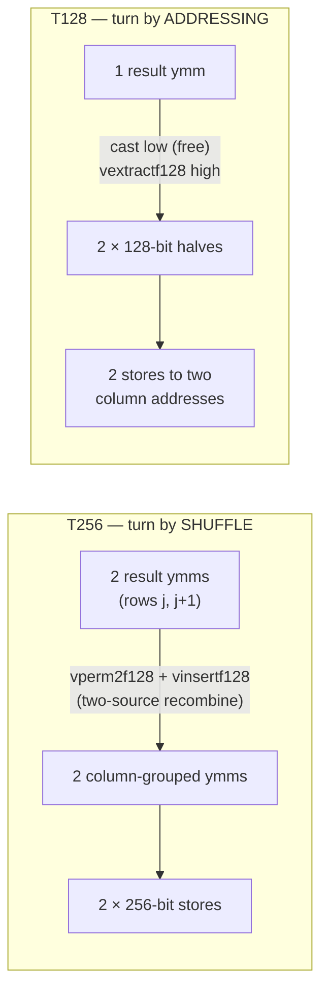

# The store-edge taxonomy: T and M

Every IL codelet ends the same way: results leave the register file for memory.
That last hop — the **store edge** — is independent of the interior arithmetic,
and it is a raced plan axis in the Bailey tier (128–1024), the same way tiling
is the raced axis of the cascade tier. This note defines the naming and lists
the complete set.

**Scope: the axis exists on the TANGENT family only.** Edge variants are
emitted by the tangent/wing generator knobs, so only tangent-interior codelets
come in multiple edges. Classic codelets predate the axis and are wide-store
by construction — a plan that resolves a classic form has no edge choice to
race.

## The two letters

**T — Turned** edges belong to the **leaf**. A Bailey leaf carries the
four-step transpose fused into its stores (the "corner turn"): output row
index becomes the fast memory axis, so each result register holds values bound
for *different columns*, and the edge must reconcile vector lanes with
addresses. The number after T is the **store width in bits** — which is really
a choice of *how* the turn is realized:



The trade: T256 pays two-source shuffle joins (both rows must finish before
either store) and buys wide stores; T128 pays double the store uops and buys
single-source dependence — half the data can escape the moment it exists.

**M — Mid** edges belong to the **mid**. A mid has no turn — its stores are
contiguous leg-major — so the only choice is store granularity of the same
data:

- **M-wide** (the default, implicit): one 256-bit store per output.
- **M-128**: the same store split into two adjacent 128-bit halves
  (`cast` low + `vextractf128` high, addr and addr+16). A 16-byte store at
  complex granularity can never straddle a cache line, so this deletes split
  stores by construction, at +1 extract +1 store uop per output.

## The full set

| tag | slot | mechanism | status |
|---|---|---|---|
| **T256** | leaf | paired-permute recombine → wide stores | **wins 128 and 512 on the i9** (kv 64 / kv 67); leaf variant 4 |
| **T128** | leaf | split-half, turn by addressing | pool inventory — superseded by T256 here (~1% at rigor 1); leaf variant 3's R32 form |
| **T64** | leaf | sub-complex 64-bit stores | **excluded for c2c** — 16 bytes is the complex-granularity floor, already alignment-safe; the slot exists only for families where sub-complex granularity is real (r2c packing seams, strided odd-K tails) |
| **T512** | leaf | full-width on AVX-512 | reserved — no AVX-512 on the calibration host; becomes a live member on wider hardware |
| **M-wide** | mid | one 256-bit store per output | the default everywhere; wins every cell on the i9 |
| **M-128** | mid | adjacent half stores | pool inventory — loses every cell on the i9 (the splits it deletes are cosmetic: `bound-on-stores` ≤ 0.04/cycle) |

Classic (non-tangent) forms predate the axis and are wide-store by
construction; their edge is not separately raced.

## The winners on the calibration host (i9-14900KF, 2026-08-16)

The K=1 natural grid these verdicts produced
(from [v1_0_results.md](v1_0_results.md)):

```text
  N       NATURAL in-place   NATURAL OOP     SCRAMBLED in-place
  128        0.91 †‡           1.05 ★★         (= NAT bits)
  256       0.85–0.86 ▲◆‡      1.00 ★★         (= NAT bits)
  512       0.78–0.80 ▲‡     0.98–1.00 ★★      (= NAT bits)
  1024      0.91–0.95 ▲     ~0.95–parity ✦     (= NAT bits)
```

The codelets behind the ★★/✦ column, with each one's store edge:

| N | pair · kv | mid (edge) | leaf (edge) |
|---|---|---|---|
| 128 | 4×32 · kv 64 | `radix4_z_t2` — classic mono (wide, pre-axis) | `radix32_z_n1tbw32t256` — wing32 tangent, **T256** |
| 256 | 16×16 · kv 51 | `radix16_z_t2tan` — tangent (M-wide) | `radix16_z_n1ttan` — tangent; R16 has ONE form, its corner-turn is the paired-wide idiom (no raced edge at R16) |
| 512 | 16×32 · kv 67 | `radix16_z_t2tan` — tangent (M-wide) | `radix32_z_n1tbw32t256` — wing32 tangent, **T256** |
| 1024 | 32×32 · no kv | `radix32_z_t2b48` — classic blocked 4·8 (wide, pre-axis) | `radix32_z_n1tb48` — classic blocked 4·8 (wide paired-turn, pre-axis) |

Reading the column: the only cell where the edge *choice* decided anything is
the R32 leaf slot — T256 carries 128 and 512, T128 (`radix32_z_n1tbw32`) is
the ~1%-behind inventory form, and at 1024 the whole tangent family loses to
classic regardless of edge (memory-bound regime). M-128 appears in no winning
row; M-wide won the mid slot everywhere it was contested.

## Where the edge lives in a plan

The edge is not a separate wisdom field — it is folded into the `il_kv` form
variant, so one nibble per slot names interior *and* edge together:

| nibble | mid slot | leaf slot |
|---|---|---|
| 3 | tangent interior, M-wide | tangent/wing32 interior, **T128** |
| 4 | tangent interior, **M-128** | wing32 interior, **T256** |

Emitter knobs: `VFFT_CX_TURN128=1` selects T128 at the leaf (absent = T256);
`VFFT_CX_STORE128=1` selects M-128 at the mid (absent = M-wide). Both are
default-off; every classic emission is byte-identical without them.

## Why it is a raced axis, never a default

The same edge flips sign across one octave: T128's dependence-shape advantage
matters where the fight is ports (L1-resident cells), while its doubled store
count is the wrong trade where the fight is the memory pipeline (1024:
pending L1 misses ~19× the 512 level, store-latency bound). And the T256/T128
verdict on *this* machine came in at ~1% — a margin that other store-buffer
depths or port structures can plausibly invert, which is why losing edges stay
in the pool as inventory rather than being deleted: the plan search races the
full set per cell and banks the verdict, and another platform re-races locally
against the same arsenal.

Related: [`tangent_scaled_butterflies.md`](tangent_scaled_butterflies.md) (the
interior the edges attach to) · `codelets/zil/avx2/pure_il/tangent/README.md`
(per-file provenance and race records).
