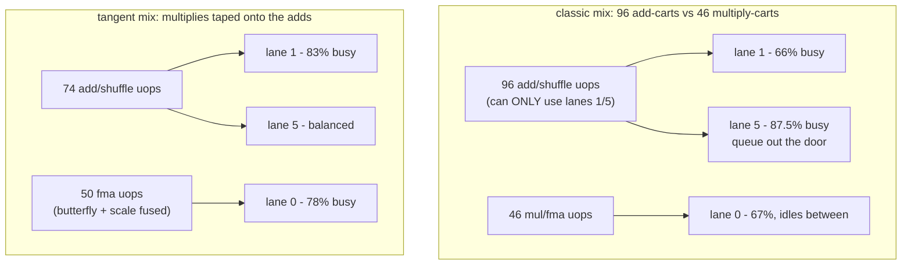
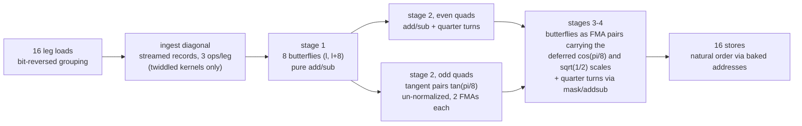
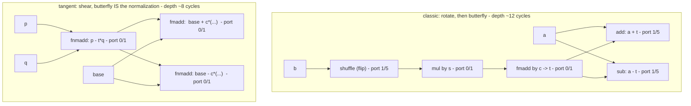
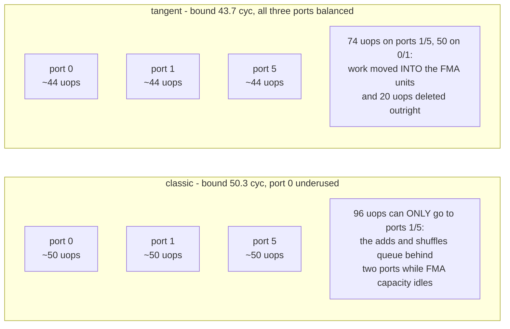
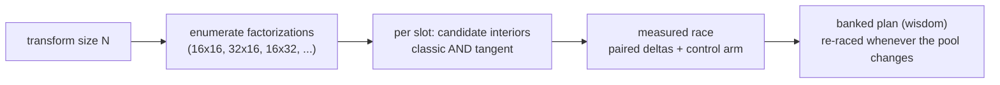

# Tangent-Scaled Butterflies: a low-multiply DFT-16 interior

A construction for the radix-16 codelet interior (leaf and twiddled mid alike)
that removes ~13% of the FP work and rebalances the rest across the FP
execution ports. Measured on the i9-14900KF (AVX2): **−25% on the twiddled
radix-16 mid kernel** standalone, **−13.5% on a composed 16×16 N=256
two-pass transform**, both at paired-delta resolution with clean controls.

The whole interior uses **three scalar constants** — `tan(π/8)`, `cos(π/8)`,
`√½` — plus one sign mask. No sine table, no per-stage twiddle constants, and
the streamed per-column diagonal (the VTW2 record format) is unchanged.

---

## The three ideas

### 1. Rotations as un-normalized tangent pairs

A rotation by angle θ is factored through the tangent:

```text
e^(-iθ) = cos θ · (1 − i·tan θ)
```

The `(1 − i·tan θ)` part is a *Givens shear*: on a value pair `(p, q)` it is

```text
p' = p − t·q        (one FMA)
q' = q + t·p        (one FMA)
```

Two independent FMAs, depth one FMA each — compared with the classic complex
rotation idiom (`flip → mul → fmadd`, a serial chain of 9 cycles) this is
**half the depth and no standalone multiply**. The catch: the result is too
long by a factor `1/cos θ`. The construction does not fix that here — see
idea 2.

For θ = π/4 the tangent is 1, so the "rotation" degenerates to a plain
add/sub pair — **zero multiplies** — leaving only a deferred `√½` scale.

### 2. Deferred normalization, fused into downstream butterflies

Every butterfly the un-normalized value feeds is of the form `out = a ± w·b`.
Since a scale factor commutes through it, the missing `cos θ` is applied
*there*, by upgrading the butterfly's add/sub into an FMA pair:

```text
out_lo = fmadd (c, b', a)      // a + c·b'   — butterfly add AND normalization
out_hi = fnmadd(c, b', a)      // a − c·b'
```

One instruction performs both the scale and the butterfly. The add that had
to happen anyway simply becomes an FMA — **the normalization costs zero extra
operations and zero extra depth**.

The fusion direction is the load-bearing design rule:

- Fusing a **rotation into a butterfly** (accumulating `a ± c·x` through
  chained FMAs) *deepens* the dependency chain and measures **slower**.
- Fusing a **normalization forward into an existing add** deletes an
  operation and adds **no** depth. Only this direction wins.

### The load-bearing detail: naked adds and pending multiplies

Why can the tangent form fuse where the classic form cannot? An FMA computes
`a + c·b` — an add and a multiply in **one** instruction — and it dispatches
to the FMA ports (0/1). But a butterfly can only be written as an FMA **if
there is a multiplication available to attach to it**.

The classic form has none. By the time the butterfly `a ± t` executes, the
rotation is already finished — `t` is a completed value, and the add is
**naked**. A naked add can only dispatch to the add ports (1/5). No compiler
and no scheduler can change that: the multiply it would need to fuse with
was spent one instruction earlier.

The tangent factoring `e^(-iθ) = cos θ·(1 − i·tan θ)` **deliberately leaves
cos θ un-applied at rotation time**. The shear runs un-normalized, and when
the butterfly arrives there is a pending scalar multiply sitting right there
to fuse: `out = a ± cos θ·(shear)` — one `fmadd`/`fnmadd`. The add just got
promoted from the congested 1/5 pool to the half-idle 0/1 pool. And the
standalone rotation multiplies disappear entirely — that is where the 20
deleted uops come from.

Same groceries, repackaged carts: lane 5 only takes add-carts, lanes 0/1
only multiply-carts (lane 1 takes both). The classic mix shows up with 96
add-carts and 46 multiply-carts — the add lanes queue out the door while
lane 0 idles. Measured on hardware counters: **port 5 at 87.5% occupancy
against port 0 at 67%**. The tangent rewrite tapes a multiply onto most of
the add-carts so the multiply lanes can take them: 74 in the add pool, 50
in the FMA pool, all three lanes roughly equally busy.



There is a second-order effect on top: with 96 uops all waiting on the same
two ports, the out-of-order scheduler's queue fills with same-destination
waiters, and whole dispatch cycles go by half-empty — the classic arm spends
**21% of its cycles issuing ≤2 uops**. Balance the destinations and the
queue drains evenly: the tangent arm issues **3+ uops on 92.8% of cycles**.
That is the IPC jump, mechanically.

One sentence for the whole section: *the classic FFT minimizes
multiplications; this machine wants you to minimize naked adds.*

### 3. Free quarter turns and address-baked reordering

Angles that are multiples of π/2 never touch a multiplier:

```text
±i·z  =  shuffle(z)  then  xor with sign mask [−0, 0]     (or one addsubpd)
```

All 16th-root angles reduce to {π/8, π/4} modulo quarter turns and
conjugation — which is exactly why three constants cover the whole interior.

Loads arrive in bit-reversed grouping and stores scatter through
pre-computed addresses, so **input/output reordering costs zero dataflow
instructions** — it lives entirely in the addressing.

---

## Dataflow



## Classic idiom vs tangent idiom, one twiddled butterfly



The classic form spends three of its five operations on ports 1/5 (shuffle,
add, sub) and serializes flip→mul→fmadd before the butterfly can start. The
tangent form spends its operations on ports 0/1 — where the FMA units are —
and reaches the butterfly outputs in two FMA hops.

---

## Why it helps: the port arithmetic

Per iteration (2 columns × 16 points), emitted and counted from the
compiled bodies:

| | classic interior (t2b44) | tangent interior (w16tg) |
|---|--:|--:|
| FP execution uops | 151 | **131** |
| fma + mul (ports 0/1 only) | 46 | 50 |
| add + addsub + shuffle (ports 1/5 only) | **96** | **74** |
| flexible logic (xor) | 9 | 7 |
| LP port bound (3 FP ports) | 50.3 cyc | **43.7 cyc** |
| latency critical path | 79 cyc | 63–69 cyc |
| measured | ~69 cyc/iter | **~51.5 cyc/iter** |



Two effects compound:

1. **Deletion.** Twenty FP uops disappear — every standalone rotation
   multiply and a third of the butterfly adds are absorbed into FMAs that
   were going to execute anyway. On three FP ports, 20 fewer uops is a
   6.6-cycle lower bound reduction by itself.
2. **Balance.** What remains splits ~50/74 between the FMA-only and
   add/shuffle-only port pools instead of 46/96. The measured kernels run
   ~7–8 cycles above their LP bound in both forms — so the bound reduction
   translates ~1:1 into time.

A pure mix-shuffle **without** deletion cannot achieve this: with port 1
shared between both pools, the LP bound depends only on the total FP uop
count. Moving work between pools at constant total moves nothing. The
tangent construction wins because it *deletes* operations — the balance is
a side effect of where the survivors land.

Chain depth also improves (79 → 63–69 cycles per iteration): shears are
parallel single-FMA hops where the classic rotation is a serial
flip→mul→fmadd, and deferred normalizations add no hops at all.

### Confirmed on hardware counters

Both interiors were held hot for 12 s (single P-core, 5.7 GHz steady,
E-cores silent) under µarch event sampling. Every prediction of the static
model appears in the counters:

| metric | classic interior | tangent interior |
|---|--:|--:|
| IPC | 3.01 | **3.86** (+28%) |
| instructions / transform | baseline | −5% |
| Retiring (pipeline slots) | 49.9% | **64.2%** |
| Back-End Bound | 48.9% | 34.7% |
| — of which Core Bound | 47.6% | 34.0% |
| — of which Memory Bound | 1.2% | 0.7% |
| cycles issuing 3+ uops | 76.4% | **92.8%** |
| cycles limping at ≤2 uops | 21.1% | 4.8% |
| Front-End Bound / Bad Spec | ~1% / ~0% | ~1% / ~0% |

Per-port dispatch counts for the classic arm (uops per iteration, against
the static prediction): port 0 = 46.4 (predicted 46), port 1 = 45.8,
port 5 = 60.8 — **port 5 at 87.5% occupancy while port 0 sits at 67%**
executing exactly its fma/mul quota and structurally unable to help. In the
tangent arm ports 0 and 1 rise to 78% and 83%: the FMA pool becomes the
workhorse and no single port gates the machine.

Note what is absent: both arms are ~1% front-end bound, ~0% bad
speculation, and ~1% memory bound. The entire contest is fought in the
execution ports — which is exactly why rewriting the *arithmetic* (and
nothing else) moved the result by 25%.

---

## Cost accounting per angle class

| angle class | classic cost | tangent cost |
|---|---|---|
| θ = 0 | free | free |
| θ = π/2 multiples | shuffle + xor (+ add/sub) | same — shuffle + mask or addsubpd |
| θ = π/4 class | shuffle + mul + fmadd + add + sub | add/sub pair + deferred √½ riding a downstream FMA |
| θ = π/8 class | shuffle + mul + fmadd + add + sub | 2-FMA shear + deferred cos(π/8) riding a downstream FMA |

---

## Why plans mix both interiors — the planner decides, never a default

The tangent interior does not replace the classic one by fiat. Both stay in
the codelet pool, and the plan search races **interior choice × factorization
× slot** per transform size, banking the measured winner. This is not
caution — mixed plans measurably win. At N=512 (leaf × mid two-pass, four
routes from the same pool, same harness, paired deltas, 5/5 runs):

| route | leaf | mid | vs production baseline |
|---|---|---|--:|
| production | classic-16 | classic-32 | baseline (~359 ns) |
| mixed | classic-32 | **tangent-16** | **−8.4…−9.2%** |
| flipped, all classic | classic-32 | classic-16 | +4.4…+5.2% (loses) |
| mixed, other way | **tangent-16** | classic-32 | −6.7…−9.5% |

One reading trap to close immediately: this table does **not** say mixed
beats pure-tangent. A pure tangent×tangent route at N=512 requires a
radix-32 tangent kernel, which does not exist in the pool yet — the two
mixed routes are mixed *by necessity*, and what they beat is pure-classic.
At N=256, where both tangent kernels exist, **pure tangent wins every
combination** (−20…−24% vs pure classic; on the same tangent leaf, the
tangent mid beats the classic mid by −13.5%). The expectation once a
radix-32 tangent kernel lands is that pure tangent stacks both slot wins
at 512 as well — that is a prediction for the race, not a result.

Two structural lessons fall out of that table:

1. **Kernel choice and factorization interact.** The (32,16) factorization
   *loses* by ~5% with a classic mid and *wins* by ~9% with a tangent mid —
   same shape, same leaf, one kernel swapped. Which factorization is best is
   not a property of the transform size; it is a property of the kernel pool
   available to fill its slots. Every banked route verdict is therefore
   pool-relative, and the plan search must re-race whenever the pool gains a
   member.

2. **A mixed route can be the best available plan.** Wherever a slot has no
   tangent variant (today: radix-32 and above, odd radices, the batched-K
   axis), the optimum is mixed by construction. And even at full coverage,
   per-slot preference can flip for secondary reasons: the tangent interior
   trades naked adds for FMAs, which pays off exactly where execution-port
   pressure binds — in store-bound or bandwidth-bound slots and regimes the
   two interiors converge (measured: under a degraded, store-limited machine
   state both arms tie), and properties like register pressure at high radix
   or chain depth against the surrounding pass structure decide instead.



The planning principle in one line: the pool proposes, the race disposes —
an interior that wins standalone still has to win *in its slot, in its
factorization, at its size* before a plan ships it.

## Scope and generalization

- **Leaf and mid share the interior.** The untwiddled leaf is the same tree
  with the ingest diagonal stripped; the twiddled mid keeps the streamed
  per-column diagonal records at ingest (3 ops per leg, memory-operand
  multiplies, zero table-side work) — the record format is unchanged.
- **Radix-32** follows the same recipe one octave down: angles reduce to
  {π/16, π/8, 3π/16, π/4} modulo quarter turns, i.e. a tan/cos ladder of
  three more constant pairs plus `√½`. Same deletion mechanism, more sites.
- **Backward direction** is the usual conjugation: sign flips on the folded
  constants and the mask; no structural change.
- **Register budget.** The monolithic radix-16 interior holds at most 16
  live values plus 3 constants and the mask — it fits the 16 AVX2 registers
  with single-digit spills, and remains compatible with the blocked
  two-pass (scratch-plane) shapes used at larger radices.

## Implementation notes

- Constants are stored **sign-folded** (`−tan(π/8)`, `−√½`, `−cos(π/8)`) so
  every use is a plain `fmadd`/`fnmadd` with no negation instructions.
- One 256-bit sign mask (`[−0, 0, −0, 0]`, broadcast once) serves every
  quarter turn; half of them use `addsubpd` instead and need no mask.
- The kernel is emitted in SSA form (every value single-assignment) and the
  compiler preserves the construction exactly: the emitted body's class
  histogram matches the design counts above 1:1.
