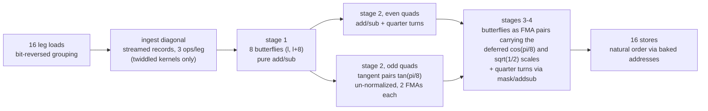
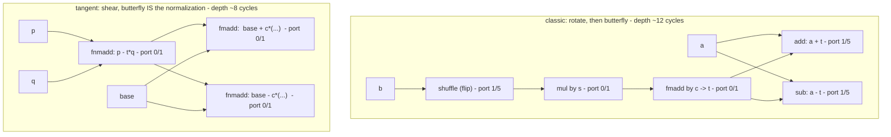
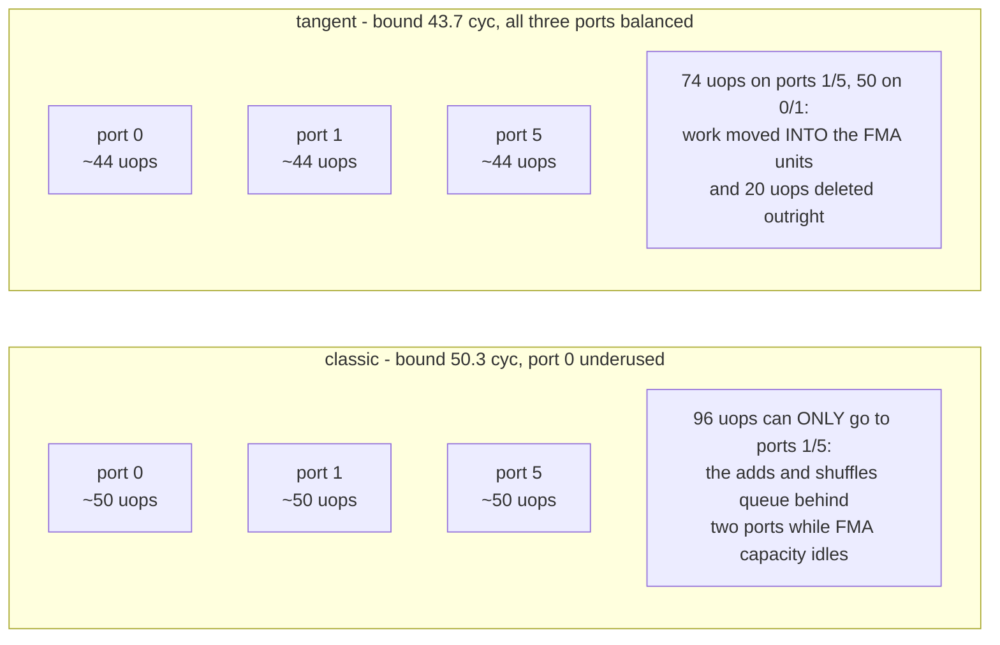

# Tangent-Scaled Butterflies: a low-multiply DFT-16 interior

A construction for the radix-16 codelet interior (leaf and twiddled mid alike)
that removes ~13% of the FP work and rebalances the rest across the FP
execution ports. Measured on the i9-14900KF (AVX2): **−25% on the twiddled
radix-16 mid kernel** standalone, **−13.5% on a composed 16×16 N=256
two-pass transform**, both at paired-delta resolution with clean controls.

The whole interior uses **three scalar constants** — `tan(π/8)`, `cos(π/8)`,
`√½` — plus one sign mask. No sine table, no per-stage twiddle constants, and
the streamed per-column diagonal (the VTW2 record format) is unchanged.

---

## The three ideas

### 1. Rotations as un-normalized tangent pairs

A rotation by angle θ is factored through the tangent:

```
e^(-iθ) = cos θ · (1 − i·tan θ)
```

The `(1 − i·tan θ)` part is a *Givens shear*: on a value pair `(p, q)` it is

```
p' = p − t·q        (one FMA)
q' = q + t·p        (one FMA)
```

Two independent FMAs, depth one FMA each — compared with the classic complex
rotation idiom (`flip → mul → fmadd`, a serial chain of 9 cycles) this is
**half the depth and no standalone multiply**. The catch: the result is too
long by a factor `1/cos θ`. The construction does not fix that here — see
idea 2.

For θ = π/4 the tangent is 1, so the "rotation" degenerates to a plain
add/sub pair — **zero multiplies** — leaving only a deferred `√½` scale.

### 2. Deferred normalization, fused into downstream butterflies

Every butterfly the un-normalized value feeds is of the form `out = a ± w·b`.
Since a scale factor commutes through it, the missing `cos θ` is applied
*there*, by upgrading the butterfly's add/sub into an FMA pair:

```
out_lo = fmadd (c, b', a)      // a + c·b'   — butterfly add AND normalization
out_hi = fnmadd(c, b', a)      // a − c·b'
```

One instruction performs both the scale and the butterfly. The add that had
to happen anyway simply becomes an FMA — **the normalization costs zero extra
operations and zero extra depth**.

The fusion direction is the load-bearing design rule:

- Fusing a **rotation into a butterfly** (accumulating `a ± c·x` through
  chained FMAs) *deepens* the dependency chain and measures **slower**.
- Fusing a **normalization forward into an existing add** deletes an
  operation and adds **no** depth. Only this direction wins.

### 3. Free quarter turns and address-baked reordering

Angles that are multiples of π/2 never touch a multiplier:

```
±i·z  =  shuffle(z)  then  xor with sign mask [−0, 0]     (or one addsubpd)
```

All 16th-root angles reduce to {π/8, π/4} modulo quarter turns and
conjugation — which is exactly why three constants cover the whole interior.

Loads arrive in bit-reversed grouping and stores scatter through
pre-computed addresses, so **input/output reordering costs zero dataflow
instructions** — it lives entirely in the addressing.

---

## Dataflow



## Classic idiom vs tangent idiom, one twiddled butterfly



The classic form spends three of its five operations on ports 1/5 (shuffle,
add, sub) and serializes flip→mul→fmadd before the butterfly can start. The
tangent form spends its operations on ports 0/1 — where the FMA units are —
and reaches the butterfly outputs in two FMA hops.

---

## Why it helps: the port arithmetic

Per iteration (2 columns × 16 points), emitted and counted from the
compiled bodies:

| | classic interior (t2b44) | tangent interior (w16tg) |
|---|--:|--:|
| FP execution uops | 151 | **131** |
| fma + mul (ports 0/1 only) | 46 | 50 |
| add + addsub + shuffle (ports 1/5 only) | **96** | **74** |
| flexible logic (xor) | 9 | 7 |
| LP port bound (3 FP ports) | 50.3 cyc | **43.7 cyc** |
| latency critical path | 79 cyc | 63–69 cyc |
| measured | ~69 cyc/iter | **~51.5 cyc/iter** |



Two effects compound:

1. **Deletion.** Twenty FP uops disappear — every standalone rotation
   multiply and a third of the butterfly adds are absorbed into FMAs that
   were going to execute anyway. On three FP ports, 20 fewer uops is a
   6.6-cycle lower bound reduction by itself.
2. **Balance.** What remains splits ~50/74 between the FMA-only and
   add/shuffle-only port pools instead of 46/96. The measured kernels run
   ~7–8 cycles above their LP bound in both forms — so the bound reduction
   translates ~1:1 into time.

A pure mix-shuffle **without** deletion cannot achieve this: with port 1
shared between both pools, the LP bound depends only on the total FP uop
count. Moving work between pools at constant total moves nothing. The
tangent construction wins because it *deletes* operations — the balance is
a side effect of where the survivors land.

Chain depth also improves (79 → 63–69 cycles per iteration): shears are
parallel single-FMA hops where the classic rotation is a serial
flip→mul→fmadd, and deferred normalizations add no hops at all.

---

## Cost accounting per angle class

| angle class | classic cost | tangent cost |
|---|---|---|
| θ = 0 | free | free |
| θ = π/2 multiples | shuffle + xor (+ add/sub) | same — shuffle + mask or addsubpd |
| θ = π/4 class | shuffle + mul + fmadd + add + sub | add/sub pair + deferred √½ riding a downstream FMA |
| θ = π/8 class | shuffle + mul + fmadd + add + sub | 2-FMA shear + deferred cos(π/8) riding a downstream FMA |

---

## Scope and generalization

- **Leaf and mid share the interior.** The untwiddled leaf is the same tree
  with the ingest diagonal stripped; the twiddled mid keeps the streamed
  per-column diagonal records at ingest (3 ops per leg, memory-operand
  multiplies, zero table-side work) — the record format is unchanged.
- **Radix-32** follows the same recipe one octave down: angles reduce to
  {π/16, π/8, 3π/16, π/4} modulo quarter turns, i.e. a tan/cos ladder of
  three more constant pairs plus `√½`. Same deletion mechanism, more sites.
- **Backward direction** is the usual conjugation: sign flips on the folded
  constants and the mask; no structural change.
- **Register budget.** The monolithic radix-16 interior holds at most 16
  live values plus 3 constants and the mask — it fits the 16 AVX2 registers
  with single-digit spills, and remains compatible with the blocked
  two-pass (scratch-plane) shapes used at larger radices.

## Implementation notes

- Constants are stored **sign-folded** (`−tan(π/8)`, `−√½`, `−cos(π/8)`) so
  every use is a plain `fmadd`/`fnmadd` with no negation instructions.
- One 256-bit sign mask (`[−0, 0, −0, 0]`, broadcast once) serves every
  quarter turn; half of them use `addsubpd` instead and need no mask.
- The kernel is emitted in SSA form (every value single-assignment) and the
  compiler preserves the construction exactly: the emitted body's class
  histogram matches the design counts above 1:1.
