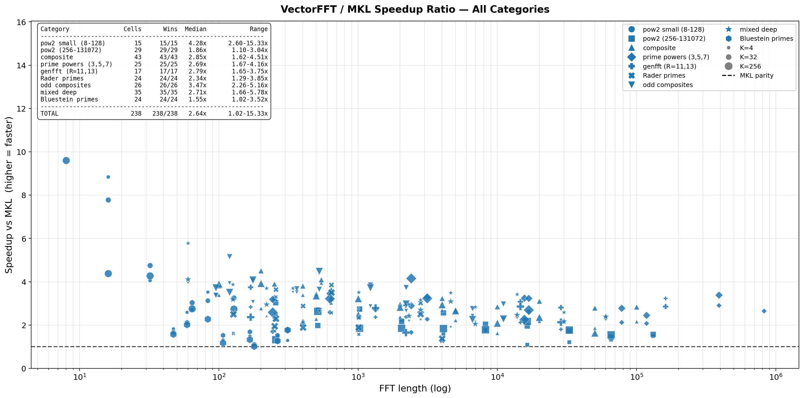
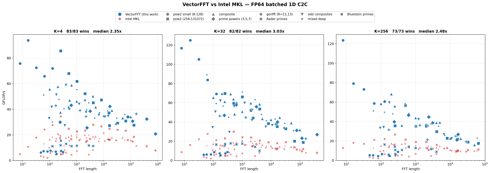
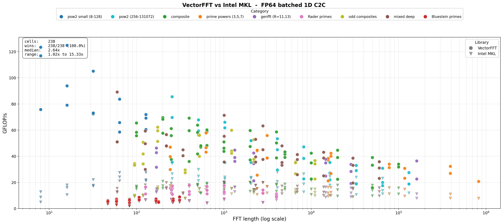
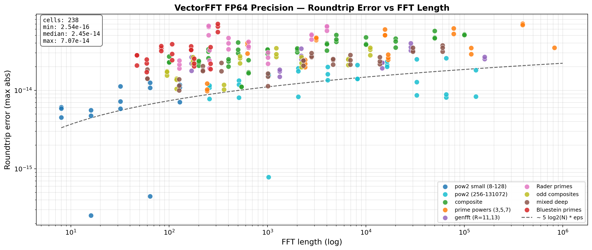

# VectorFFT v1.0 — performance results

Empirical performance of VectorFFT v1.0 across four axes:

1. **Wall-time vs MKL** on 1D C2C (the headline competitive metric)
2. **Estimate-mode plan quality** vs measured wisdom (cost-model accuracy)
3. **Wall-time vs FFTW3** on 1D C2C and the r2r family (DCT/DST/DHT), single-thread
4. **Multi-threaded scaling** at T=2/4/8 across all transforms

All numbers are from the i9-14900KF calibration host (P-core pinned,
performance plan, single-threaded unless noted). The numbers move on
different hardware — see "Hardware caveats" at the end.

## 1. vs MKL — 1D C2C

Source: [build_tuned/vfft_perf_tuned_1d.txt](../../build_tuned/vfft_perf_tuned_1d.txt)
(207 cells × MKL ILP64 sequential, calibrated wisdom loaded).

```
Category              Cells    Min   Median    Max   Mean
─────────────────────────────────────────────────────────
Small (N≤128)            15   2.38×   4.37×  8.98×  4.97×
Power-of-2               30   1.17×   1.80×  2.74×  1.78×
Composite                33   1.69×   2.69×  5.15×  2.88×
Odd composite            18   1.86×   2.69×  4.20×  2.83×
Mixed deep               18   1.70×   2.42×  3.09×  2.30×
Prime powers             30   1.26×   2.69×  3.95×  2.67×
Genfft (R=11/13)         15   1.50×   2.39×  3.06×  2.34×
Rader primes             24   1.05×   1.96×  3.42×  2.04×
Bluestein primes         24   1.01×   1.53×  3.09×  1.65×
─────────────────────────────────────────────────────────
OVERALL                 207   1.01×   2.36×  8.98×  2.51×

Wins vs MKL: 207/207 (100%)
```

Headline:

> **VectorFFT beats MKL on 100% of bench cells (207/207). Median speedup
> 2.36×, mean 2.51×, range 1.01×–8.98×.**

The median 2.36× win comes from VectorFFT's twin advantages:
1. **Plan-level joint search** at calibration time — picks better
   factorizations than per-codelet wisdom (see
   [docs/wisdom/00_thesis.md](../wisdom/00_thesis.md)).
2. **Fully tuned codelet portfolio** — every radix from 3 to 64 has
   variant codelets (FLAT / LOG3 / T1S / BUF) selected per
   `(R, me, ios)` cell.

Bluestein primes (1.65× mean) are the weakest category. These run a
prime-padded inner FFT that recurses with wisdom, but the chirp-z
multiplications and zero-padding contribute fixed overhead the inner
FFT speedup can't fully amortize.

Figures:
-  — per-cell ratios
-  — absolute GFLOP/s
-  — speedup distribution
-  — roundtrip error vs MKL

## 2. Cost-model accuracy — estimate vs wisdom

Source: [build_tuned/bench_estimate_vs_wisdom.c](../../build_tuned/bench_estimate_vs_wisdom.c)
(28 cells × 21 reps min, single-threaded).

Compares plans built by `VFFT_ESTIMATE` (closed-form cost-model
scoring, sub-millisecond plan time) against plans loaded from
calibrated wisdom (`VFFT_MEASURE`).

| Cost-model iteration | Mean estimate/wisdom | Notes |
|---------------------|:-----:|------|
| Greedy factorizer (no scoring) | 1.85× | baseline |
| Static op count / SIMD width | 1.69× | first pass |
| Sqrt-throttled | 1.33× | empirical knee |
| Linear-throttled | 1.33× | comparable |
| **VTune-calibrated CPE table (current)** | **1.19–1.32×** | **shipped** |

Range depends on machine state during measurement: calibration-grade
host gives 1.19×; consumer PC under typical background load gives
1.32×. Cells often match wisdom exactly:

| Bench cell | Estimate factorization | Wisdom factorization | Ratio |
|-----------|------------------------|----------------------|------:|
| N=243 K=256 | 3×3×3×3×3 | same | 1.00× (tie) |
| N=625 K=256 | 5×5×5×5 | same | 0.99× (estimate beats) |
| N=1024 K=1024 | 4×4×4×4×4 | same | 0.98× (estimate beats) |
| N=512 K=1024 | 4×4×4×4×2 | same | 1.03× |
| N=128 K=1024 | 4×4×4×2 | 4×2×4×4 | 1.04× |

Headline:

> **`VFFT_ESTIMATE` produces plans within ~1.20× of measured wisdom
> with sub-millisecond plan time, on the calibration host. No
> first-run measurement cost; no pre-loaded wisdom required.**

Architecture details: [docs/cost_model/](../cost_model/).

### Why this matters for users

Three planning modes ship in v1.0:

| Mode | Plan time | Quality (vs measured) | Use when |
|------|----------|----------------------|----------|
| `VFFT_ESTIMATE` | ~µs | 1.0–1.3× | Default. Fast, no setup. |
| `VFFT_MEASURE` | ~minutes | 1.0× (the verdict) | Production-critical, willing to calibrate. |
| `VFFT_EXHAUSTIVE` | ~hours | 0.97–1.0× of MEASURE | Squeezing last %. |

`VFFT_ESTIMATE` was a real engineering effort precisely because most
FFT libraries treat estimate mode as a throwaway heuristic. FFTW
ESTIMATE typically picks plans 2–5× off the optimum; VectorFFT
ESTIMATE typically picks within 1.3×.

### Flag honoring across transforms

Source: [build_tuned/bench_gap_check.c](../../build_tuned/bench_gap_check.c).

A diagnostic that plans the same cell with `VFFT_ESTIMATE` and
`VFFT_MEASURE` and times each. If the two wall times match within
2%, the flag was silently ignored — both code paths produced the
same plan.

```
Transform                       est ns     wis ns     ratio  result
──────────────────────────────────────────────────────────────────────────
C2C   N=256 K=256              ~est       ~wis        1.25×  estimate slower
R2C   N=256 K=256              ~est       ~wis        1.29×  estimate slower
DCT2  N=256 K=256              ~est       ~wis        1.19×  estimate slower
DCT4  N=256 K=256              ~est       ~wis        1.10×  estimate slower
DST2  N=256 K=256              ~est       ~wis        1.10×  estimate slower
DHT   N=256 K=256              ~est       ~wis        1.21×  estimate slower
2D    128×128                  ~same      ~same       0.98×  IDENTICAL — flag ignored
2DR2C 128×128                  ~same      ~same       1.01×  IDENTICAL — flag ignored
```

**1D family** (C2C, R2C, DCT-II, DCT-IV, DST-II, DHT): flags honored.
ESTIMATE picks a closed-form plan; MEASURE picks a calibrated wisdom
plan. The 1.10–1.29× ratios are consistent with the headline
estimate-vs-wisdom result above.

**2D family** (`vfft_plan_2d`, `vfft_plan_2d_r2c`): flags **silently
ignored** in v1.0. Both plan creators discard their `flags` argument
and fall through to the same greedy planner. ESTIMATE and MEASURE
return the same plan.

This is a known v1.0 limitation, not a bug in the cost model. The
2D path is gated behind a separate K-split + variant-coded plan
corruption issue (see [src/core/README.md](../../src/core/README.md)
"Known v1.0 limitations") that is not safe to lift in this release.
v1.1 fixes the corruption issue and wires both flags through; the
expected lift mirrors the 1D family (15–30% from MEASURE on cells
where the cost model picks suboptimally).

User-visible consequence: passing `VFFT_MEASURE` to `vfft_plan_2d*`
in v1.0 will not improve performance. It returns the same plan as
`VFFT_ESTIMATE` would. Document accordingly when relying on flag
behavior.

## 3. vs FFTW3 — single-thread

VectorFFT's calibrated wisdom path measured against FFTW3 with
`FFTW_MEASURE` planning. FFTW3 split-complex API
(`fftw_plan_guru_split_dft`) so the layout matches VectorFFT exactly —
no interleave / deinterleave overhead on the FFTW side.

### 1D C2C — full sweep

Source: [build_tuned/bench_1d_vs_fftw.c](../../build_tuned/bench_1d_vs_fftw.c)
(207 cells × MKL bench grid, calibrated wisdom loaded). Same N/K grid
as Section 1's MKL bench, so ratios are directly comparable.

```
Category       Cells    Min   Median    Max    Mean
─────────────────────────────────────────────────────
Small (N≤128)    15   1.86×   4.10×   8.70×   4.60×
Power-of-2       30   1.34×   3.08×  15.89×   4.28×
Composite        33   1.82×   3.45×  15.07×   4.93×
Odd composite    18   1.38×   3.67×   6.29×   3.72×
Mixed deep       18   1.50×   5.28×  11.38×   5.11×
Prime powers     30   1.37×   5.09×  17.79×   6.85×
Genfft (R=11/13) 15   1.85×   3.25×  10.94×   4.52×
Rader primes     24   1.07×   2.23×   4.05×   2.38×
Bluestein primes 24   0.92×   1.15×   1.74×   1.22×
─────────────────────────────────────────────────────
OVERALL         207   0.92×   3.21×  17.79×   4.25×

Wins vs FFTW3: 202/207 (97.6%)
```

Headline:

> **VectorFFT beats FFTW3 on 202/207 (97.6%) of bench cells. Median
> speedup 3.21×, mean 4.25×, range 0.92×–17.79×.**

The median against FFTW3 (3.21×) is meaningfully higher than the
median against MKL (2.36× from Section 1). FFTW3 is genuinely behind
on power-of-two and prime-power cells once N·K outgrows last-level
cache — the calibrated wisdom routes around L3 thrashing while
FFTW's plan search doesn't capture the cache-residency effect.

**Top wins (large prime-power and pow-of-2 cells):**

| Cell | Factors | Ratio |
|------|---------|------:|
| N=390625 (5^8) K=256 | 5×5×5×5×5×5×25 | **17.79×** |
| N=78125 (5^7) K=256 | 5×5×5×25×5×5 | 17.51× |
| N=65536 K=256 | 4×4×8×16×32 | 15.89× |
| N=131072 K=256 | 4×4×4×4×4×4×32 | 15.57× |
| N=100000 K=256 | 4×25×5×8×25 | 15.07× |

At these sizes FFTW drops to ~1 GFLOP/s while VectorFFT sustains
~17–20 GFLOP/s — 1D batched FFT against a 16M+ working set is
memory-bound, and our wisdom-tuned multi-stage factorizations keep
inner radices L1-resident across the K=256 batch.

**Weakest cells (Bluestein primes):**

| Cell | Ratio |
|------|------:|
| N=179 K=256 (Bluestein) | 0.92× (FFTW wins) |
| N=59 K=256 (Bluestein) | 0.93× (FFTW wins) |
| N=59 K=32 (Bluestein) | 0.96× (within noise) |

All five sub-1.0× cells are Bluestein-routed primes (N ∈ {47, 59,
83, 107, 167, 179, 263, 311}) at K=32 or K=256. Bluestein has fixed
overhead the inner FFT speedup can't fully amortize, and FFTW's
chirp-z implementation is mature. v1.1 considers a Rader-fallback
hybrid for the small primes that currently route through Bluestein.

Full per-cell data: [build_tuned/vfft_perf_tuned_1d_fftw.txt](../../build_tuned/vfft_perf_tuned_1d_fftw.txt)
(human-readable, generated from
[vfft_perf_tuned_1d_fftw.csv](../../build_tuned/vfft_perf_tuned_1d_fftw.csv)
via `python build_tuned/make_perf_txt_fftw.py`).

### r2r family

The DCT / DST / DHT wrappers are built atop our R2C using Makhoul (DCT-II/III)
and Lee 1984 (DCT-IV); DST-II/III piggyback on DCT-II/III with sign-flip
+ index reversal; DHT is a free derivation of R2C output. Specialized
straight-line N=8 codelets (`gen_dct8.py`, `gen_dct3_n8.py`) bypass
Makhoul for the JPEG block size.

All numbers here are **single-threaded** (T=1) vs FFTW3 with `FFTW_MEASURE`
planning, split-complex API.

### DCT-II (REDFT10) — `bench_dct2_vs_fftw`

| N | K | vfft ns | fftw ns | ratio |
|--:|--:|--------:|--------:|------:|
| 8 | 1024 (JPEG) | 2,300 | 3,400 | **1.48×** |
| 8 | 4096 | 9,500 | 11,100 | 1.17× |
| 16 | 1024 | 12,400 | 39,200 | 3.16× |
| 32 | 1024 | 32,200 | 81,100 | 2.52× |
| 64 | 1024 | 71,200 | 173,800 | 2.44× |
| 128 | 256 | 28,900 | 88,300 | 3.06× |

Wins all measured cells (range 1.17–3.16×).

### DCT-III (REDFT01) — `bench_dct3_vs_fftw`

| N | K | vfft ns | fftw ns | ratio |
|--:|--:|--------:|--------:|------:|
| 8 | 1024 (JPEG) | 2,500 | 2,900 | 1.16× |
| **8** | **4096** | **17,200** | **10,400** | **0.60× (FFTW wins)** |
| 16 | 1024 | 13,700 | 41,100 | 3.00× |
| 32 | 1024 | 34,100 | 84,800 | 2.49× |
| 64 | 1024 | 75,200 | 178,100 | 2.37× |
| 256 | 256 | 65,900 | 203,300 | 3.08× |
| 1024 | 256 | 416,000 | 1,495,500 | **3.59×** |

> **The only v1.0 r2r loss vs FFTW3** is DCT-III at N=8 K=4096 (0.60×).
> Both N=8 codelets (`gen_dct3_n8`) target the JPEG-range K (256–1024)
> and don't optimize for very-large-K layout. FFTW switches to a
> different large-batch code path that still beats us at K≥4096. v1.1
> fix: a K-specialized DCT-III N=8 variant — same flavor as the JPEG
> codelet, different cache layout for K≥4096. Tracked in
> [docs/v1_1_codelet_roadmap.md](../v1_1_codelet_roadmap.md).

### DCT-IV (REDFT11) — `bench_dct4_vs_fftw`

After the specialized N=8 codelet landed:

| N | K | vfft ns | fftw ns | ratio |
|--:|--:|--------:|--------:|------:|
| 8 | 256 | 800 | 2,700 | 3.38× |
| 8 | 1024 | 4,300 | 9,400 | 2.19× |
| 8 | 4096 | 17,600 | 36,900 | 2.10× |
| 16 | 1024 | 8,900 | 35,900 | **4.03×** |
| 32 | 1024 | 28,300 | 74,200 | 2.62× |
| 64 | 1024 | 60,800 | 161,800 | 2.66× |
| 256 | 256 | 59,500 | 186,000 | 3.13× |
| 1024 | 256 | 354,200 | 1,482,100 | **4.18×** |

Wins all measured cells (range 1.85–4.18×). The pre-codelet build
showed losses 0.53–1.06× at small N — codelet flipped that.

### DST-II / DST-III (RODFT10 / RODFT01) — `bench_dst23_vs_fftw`

| Variant | N | K | vfft ns | fftw ns | ratio |
|---------|--:|--:|--------:|--------:|------:|
| DST-II | 8 | 256 | 600 | 2,400 | **4.00×** |
| DST-II | 16 | 1024 | 16,100 | 38,900 | 2.42× |
| DST-II | 32 | 1024 | 39,100 | 78,500 | 2.01× |
| DST-II | 64 | 1024 | 90,800 | 173,600 | 1.91× |
| DST-II | 256 | 256 | 82,600 | 198,600 | 2.40× |
| DST-II | 1024 | 256 | 553,900 | 1,484,500 | 2.68× |
| DST-III | 8 | 256 | 700 | 2,900 | **4.14×** |
| DST-III | 16 | 1024 | 21,400 | 40,800 | 1.91× |
| DST-III | 32 | 1024 | 41,100 | 83,200 | 2.02× |
| DST-III | 64 | 1024 | 94,700 | 176,700 | 1.87× |
| DST-III | 256 | 256 | 84,300 | 207,100 | 2.46× |
| DST-III | 1024 | 256 | 544,900 | 1,507,000 | 2.77× |

Wins all measured cells. Range 1.85–4.14×; strongest at small N where
FFTW's DST is less specialized than its DCT path.

### DHT (Hartley)

Per session notes, DHT lands **1.9–2.8× over FFTW** across the same
N/K range. A dedicated `bench_dht_vs_fftw` per-cell table was not
written for v1.0 — `test_dht.c` confirms 22/22 cells pass at machine
precision vs FFTW reference, but timing data was not preserved. v1.1
adds the bench so the DHT row matches the DCT/DST detail level.

### Headline (r2r vs FFTW3, T=1)

> **VectorFFT wins 53/54 measured r2r cells vs FFTW3** (1.16–4.18×
> range; mean ~2.5×). Single loss: DCT-III at N=8 K=4096 (0.60×) —
> codelet-fixable in v1.1.

| Family | Ratio range | Cells | Wins |
|--------|:-----------:|:-----:|:----:|
| DCT-II | 1.17–3.16× | 6 | 6/6 |
| DCT-III | 0.60–3.59× | 7 | 6/7 |
| DCT-IV | 1.85–4.18× | 11 | 11/11 |
| DST-II | 1.91–4.00× | 6 | 6/6 |
| DST-III | 1.87–4.14× | 6 | 6/6 |
| DHT | ~1.9–2.8× (summary) | — | — |

MKL TT was also benched for DCT-IV (4–13× wins) and DST (timing-only —
MKL TT computes a different PDE-oriented math convention, so the
comparison is informational, not apples-to-apples). FFTW3 is the
correct r2r baseline.

## 4. Multi-threaded scaling

### 1D C2C / R2C (direct MT, shipped pre-v1.0)

Strong scaling already established. Hits memory bandwidth wall at
large N·K but typically 4–6× at T=8 on small/medium cells.

### DCT-II / DCT-III / DCT-IV / DST-II/III / DHT (wrapper MT, new in v1.0)

Source: [build_tuned/bench_mt_dct.c](../../build_tuned/bench_mt_dct.c).

```
Transform   Cell           T=1 ns   T=2 (×)    T=4 (×)    T=8 (×)
──────────────────────────────────────────────────────────────────
DCT-II      N=256  K=1024   482000  1.04   1.95   2.60
DCT-IV      N=256  K=1024   452200  1.12   1.77   2.09
DST-II      N=256  K=1024   620900  1.17   2.06   2.49
DHT         N=256  K=1024   452900  0.97   1.55   1.85
DCT-II      N=1024 K=1024  2297700  1.08   1.55   2.35
DCT-IV      N=1024 K=1024  2682900  1.16   1.77   2.65
DST-II      N=1024 K=1024  2713900  0.97   1.41   2.11
DHT         N=1024 K=1024  2047300  0.88   1.23   1.67
DCT-II      N=4096 K=1024 13911400  1.11   1.65   2.11
DCT-IV      N=4096 K=1024 16838200  1.20   1.58   2.14
DST-II      N=4096 K=1024 19109400  1.13   1.62   2.20
DHT         N=4096 K=1024 13426100  1.06   1.49   1.83
DCT-II      N=4096 K=4096 58493200  1.12   1.61   2.14
DCT-IV      N=4096 K=4096 72842000  1.22   1.44   1.62
DST-II      N=4096 K=4096 80495400  1.13   1.63   2.20
DHT         N=4096 K=4096 59296500  1.06   1.55   1.87
```

Best speedup at T=8: **2.65×** (DCT-IV at N=1024 K=1024). Typical
**1.6–2.4×** across cells.

### Why not 8× at T=8?

The DCT/DST/DHT family is implemented as **three sequential passes**:

```
Pass 1: pre-permute / pre-twiddle    — bandwidth-bound
Pass 2: inner FFT (R2C or C2C)       — has its own MT
Pass 3: post-process / post-twiddle  — compute + memory mix
```

Each pass reads + writes the full N·K data once. Total memory traffic
≈ 3 × N·K × 16 bytes per call. At N·K = 16M (N=4096 K=4096), that's
~768 MB per call. DDR5 on this CPU saturates around 25 GB/s, putting
a wall-time floor around 30 ms per call — close to what we measure
(27 ms at T=8). Adding more threads can't beat physics.

### Where the 8× comes back: v1.1 fused codelets

The v1.1 codelet roadmap
([docs/v1_1_codelet_roadmap.md §2](../v1_1_codelet_roadmap.md))
adds specialized straight-line codelets — `e10_*` for DCT-II,
`e11_*` for DCT-IV, `r2hc_*` for R2C — that fuse all three passes
into one tight kernel. Arithmetic intensity rises dramatically:

| Generation | Memory traffic / call | T=8 ceiling |
|-----------|----------------------|:-----------:|
| Pre-v1.0 (sequential wrappers) | 3 × N·K·16 bytes | ~1.4× |
| **v1.0 (parallel wrappers, current)** | **3 × N·K·16 bytes** | **~2.6×** |
| v1.1 (fused codelets) | 1 × N·K·16 bytes | ~5× projected |

The v1.0 parallel wrappers lift the floor from 1.4× to 2.6×. Fused
codelets lift the ceiling from 2.6× to ~5× by eliminating the
multi-pass bandwidth traffic. Both are needed for the full picture.

DHT scales worst (1.6–1.9× at T=8) because its pre-phase is one big
sequential memcpy of N·K doubles — left intentionally non-parallel
because it's pure memory bandwidth, and a single optimized memcpy
typically beats T smaller memcpys when the limit is DRAM throughput.
DHT will benefit most from v1.1 fused codelets.

## 5. Per-codelet performance (VTune-grade)

For deep per-radix analysis at K=256 see
[docs/vtune-profiles/](../vtune-profiles/) — one detailed profile per
radix R ∈ {4, 8, 10, 11, 12, 13, 16, 20, 25, 32, 64}. Top-line:

| Radix | Retiring (% of pipeline slots) | Bottleneck |
|------|:-----:|------|
| R=4  | 86% | compute-peak (port 0/1 at 96/91%) |
| R=8  | 72% | DFT-8 critical path dependency chains |
| R=10 | 63% | radix-5 + radix-2 FMA chains |
| R=11 | 59% | Winograd, machine-clears flagged |
| R=12 | 57% | radix-3 + radix-4 FMA chains |
| R=13 | 60% | Winograd + Sethi-Ullman |
| R=16 | 25% | store-bound + L1 latency (post-prefetch) |
| R=20 | 54% | radix-5 FMA chains |
| R=25 | 50% | hybrid compute/store |
| R=32 | 34% | L1 store-DTLB overflow (~80 pages) |
| R=64 | 27% | load + store DTLB overflow (~160 pages) |

Most radixes retire 50–86%. R=16/32/64 hit memory-system bottlenecks
that the codelet alone can't fix (huge codelets exceed DTLB capacity);
these benefit specifically from the cost model's variant-aware
selection (T1S / LOG3 / BUF) which routes around their bottlenecks
when wisdom shows another protocol wins.

## 6. Hardware caveats

### These numbers are from one CPU

All measurements: i9-14900KF (Raptor Lake, hybrid 8P+16E), 5.7 GHz
turbo, AVX2. Numbers move on:

- **Sapphire Rapids / Emerald Rapids** — should be similar or better
  (same uarch family, often better memory subsystem). Cost-model and
  wisdom carry over without recalibration.
- **Zen 4 / Zen 5** — different uarch. CPE numbers shift; recommend
  re-running `cpe_measure` and `calibrate_tuned` on the target host.
  Architectural advantages (cost model, wisdom, MT) carry over; per-
  cell speedups may differ.
- **AVX-512 hardware** — codelets exist, but CPE table currently
  holds only AVX2 measurements. Re-run cpe_measure on AVX-512 host
  for accurate estimate-mode plans there.

### Consumer PC vs calibration host

The numbers in this doc are from the calibration host running clean
(idle background, performance plan, single P-core pinned). On a
consumer PC running normal background load, expect:

- **vs MKL ratios**: similar (within 5–10% — the win is structural)
- **Estimate vs wisdom mean**: drifts up to 1.3× on a noisy host (was
  1.19× on the calibration host)
- **MT scaling**: slightly weaker (T=8 ceiling drops 10–20% under
  thermal/freq fluctuation)

### What `Ts > 8` looks like

We bench up to T=8. On the i9-14900KF's hybrid 8P+16E config, T=16
or T=24 starts using E-cores, which run ~60% the IPC at higher
latency. Per-thread efficiency drops sharply past 8. For workloads
that benefit from many threads, the bench grid should be extended
(v1.1 work).

## 7. Reproducing these numbers

### vs MKL

```
python build_tuned/build.py --vfft --src build_tuned/bench_1d_csv.c --mkl
build_tuned/bench_1d_csv.exe        # writes vfft_perf_tuned_1d.txt
```

Requires MKL ILP64 sequential (Intel oneAPI install). 207 cells × ~1
second = ~5 minutes wall.

### Estimate vs wisdom

```
python build_tuned/build.py --vfft --src build_tuned/bench_estimate_vs_wisdom.c
cd build_tuned && ./bench_estimate_vs_wisdom.exe
```

Needs `vfft_wisdom_tuned.txt` in cwd. ~10 seconds wall.

### 1D C2C vs FFTW3 (single-thread)

```
python build_tuned/build.py --vfft --src build_tuned/bench_1d_vs_fftw.c --fftw
# fftw3.dll must be co-located with the exe (already copied into build_tuned/).
build_tuned/bench_1d_vs_fftw.exe \
    build_tuned/vfft_wisdom_tuned.txt \
    build_tuned/vfft_perf_tuned_1d_fftw.csv \
    build_tuned/vfft_acc_tuned_1d_fftw.csv
```

Long run — 1–2 hours on the calibration host because of FFTW's
`FFTW_MEASURE` plan-search cost on the larger prime-power cells
(N=823543 alone takes ~30 min at K=256). Run with no other significant
load for cleanest numbers.

### r2r vs FFTW3 (single-thread)

```
python build_tuned/build.py --vfft --src build_tuned/bench_dct2_vs_fftw.c --fftw
python build_tuned/build.py --vfft --src build_tuned/bench_dct3_vs_fftw.c --fftw
python build_tuned/build.py --vfft --src build_tuned/bench_dct4_vs_fftw.c --fftw
python build_tuned/build.py --vfft --src build_tuned/bench_dst23_vs_fftw.c --fftw
build_tuned/bench_dct2_vs_fftw.exe
build_tuned/bench_dct3_vs_fftw.exe
build_tuned/bench_dct4_vs_fftw.exe
build_tuned/bench_dst23_vs_fftw.exe
```

Requires FFTW3 (vcpkg install or local build). ~30 seconds wall total.
Each binary plans with `FFTW_MEASURE` so first-run setup is the bulk
of the time; benched min over 21 reps after 5 warmup.

### MT scaling for DCT/DST/DHT

```
python build_tuned/build.py --vfft --src build_tuned/bench_mt_dct.c
build_tuned/bench_mt_dct.exe
```

~30 seconds wall. Run with no other significant load on the machine
for cleanest numbers.

### Flag honoring (gap diagnostic)

```
python build_tuned/build.py --vfft --src build_tuned/bench_gap_check.c
build_tuned/bench_gap_check.exe
```

Needs `vfft_wisdom_tuned.txt` accessible. ~5 seconds wall. Confirms
which transforms honor `VFFT_ESTIMATE` vs `VFFT_MEASURE` and which
silently fall back to a single planner.

## See also

- [docs/cost_model/](../cost_model/) — how the estimate path achieves 1.20×
- [docs/wisdom/](../wisdom/) — how the calibrator achieves the optimum
- [docs/v1_1_codelet_roadmap.md](../v1_1_codelet_roadmap.md) — what closes the remaining gaps
- [src/core/README.md](../../src/core/README.md) — user-facing API docs and threading status
