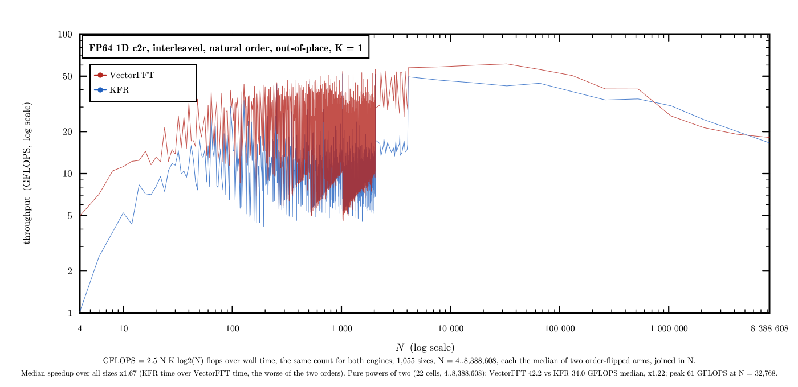
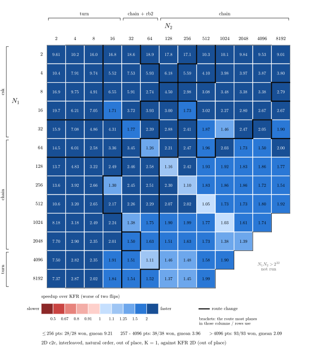

# VectorFFT vs KFR

VectorFFT against [KFR](https://www.kfr.dev/), transform by transform. Each section is one
contract: a throughput plot, a short reading of it, and the speedups by length band and
by family. Every run is a [gauntlet](../../gauntlet/) record
under [`gauntlet/results/`](../../gauntlet/results/) (csv, calibration log, the wisdom it
used). The 1D plots are drawn from those csv files by
[`src/tools/plots/gen_gflops.py`](../../src/tools/plots/gen_gflops.py), the 2D matrix from
the run's report by [`src/tools/plots/gen_2d_pow2.py`](../../src/tools/plots/gen_2d_pow2.py).

> **Platform:** Intel Core i9-14900KF (P-core, AVX2), DDR5, GCC 15.2, single thread  
> **Competitor:** KFR 7.1.0, its official Windows release through its C API (built by KFR, AVX2 dispatch)  
> **Method:** one process per cell (a length or a plane); both engines timed in two arms
> with the engine order flipped; a control cell re-timed every 100 cells; every speedup is KFR's
> time over VectorFFT's in the **worse** of the two arms

---

## 1D c2c, every N from 64 to 4,096

> **Contract:** complex-to-complex FP64, interleaved, natural order, out of place, K = 1  
> **Cells:** every length N from 64 to 4,096 — 4,033 transforms, no size skipped  
> **Record:** [`kfr_c2c_64_4096`](../../gauntlet/results/kfr_c2c_64_4096/) (2026-10-10)

One line per engine, one point per length (log scale: equal speed ratios are equal
vertical gaps). The split is by the largest prime factor of N. Lengths built from primes
up to 47 run 2.5x faster than KFR at the median and never below it; from 53 up the lead
narrows to about 1.06x and KFR is ahead at about one length in five, most often when N
carries a factor of 53, 59 or 61 (worst cell 2,135 = 5·7·61 at 0.51x); nearly every
length where KFR is ahead is served by VectorFFT's prime-size route. Every output agrees with KFR's to 3.8e-15; the
control length (N = 4,096) read 1.32-1.35x at every one of its 42 points.

| Lengths | Cells | Median speedup | At or above parity | Best |
|---|---|---|---|---|
| 64..256 | 193 | 2.17x | 91% | 6.03x (N=96) |
| 257..1,024 | 768 | 1.44x | 62% | 4.88x (N=384) |
| 1,025..2,048 | 1,024 | 1.04x | 92% | 4.04x (N=1312) |
| 2,049..4,096 | 2,048 | 1.08x | 90% | 4.48x (N=3072) |
| **all, 64..4,096** | **4,033** | **1.09x** | **86%** | 6.03x (N=96) |

| Family | Cells | Median speedup | At or above parity |
|---|---|---|---|
| Powers of two | 7 | 1.12x | 100% |
| Primes | 546 | 1.06x | 79% |
| Composites, largest prime factor ≤ 47 | 1,323 | 2.49x | 100% |
| Composites, largest prime factor ≥ 53 | 2,157 | 1.06x | 78% |

---

## 1D r2c, every even N from 64 to 4,096

> **Contract:** real-to-complex FP64, interleaved CCE output (N/2 + 1 bins), out of place, K = 1; KFR's real transform takes an even N only, so odd lengths are not compared  
> **Cells:** every even length N from 64 to 4,096 — 2,017 transforms  
> **Records:** [`kfr_r2c_even_64_2048`](../../gauntlet/results/kfr_r2c_even_64_2048/),
> [`kfr_r2c_even_2050_4096`](../../gauntlet/results/kfr_r2c_even_2050_4096/) (2026-10-10)

The same reading as c2c (GFLOPS here count 2.5 N log2 N per transform). Lengths whose
largest prime factor is at most 47 run 2.45x faster than KFR at the median, every one of
them ahead; with a factor of 53 or more the two are close, 1.02x at the median, KFR ahead
at about three lengths in ten. Every output agrees with KFR's to 3.2e-15; the control
length (N = 4,096) read 1.20-1.21x throughout.

| Lengths | Cells | Median speedup | At or above parity | Best |
|---|---|---|---|---|
| 64..256 | 97 | 1.83x | 98% | 4.17x (N=192) |
| 257..1,024 | 384 | 1.93x | 78% | 4.08x (N=608) |
| 1,025..2,048 | 512 | 1.31x | 59% | 3.93x (N=1376) |
| 2,049..4,096 | 1,024 | 1.04x | 93% | 3.74x (N=2368) |
| **all, 64..4,096** | **2,017** | **1.30x** | **82%** | 4.17x (N=192) |

| Family | Cells | Median speedup | At or above parity |
|---|---|---|---|
| Powers of two | 7 | 1.10x | 86% |
| Largest prime factor ≤ 47 | 838 | 2.45x | 100% |
| Largest prime factor ≥ 53 | 1,172 | 1.02x | 69% |

---

## 1D c2r, the even lengths with a c2r plan in wisdom (N from 4 to 8,388,608)

> **Contract:** complex-to-real FP64, interleaved CCE input (N/2 + 1 bins), N reals out, unnormalized, out of place, K = 1; even N only, as r2c  
> **Cells:** every even length that has a c2r plan in the shipped wisdom — 1,055 transforms: 30 below 64, 993 of the 993 even lengths from 64 to 2,048, 21 from 2,050 to 4,096, and the powers of two from 8,192 to 2^23  
> **Record:** [`kfr_c2r_even_banked`](../../gauntlet/results/kfr_c2r_even_banked/) (2026-10-10)

The two real directions read the same: on the even lengths from 64 to 4,096 that both
runs cover, c2r's median speedup is 1.70x and r2c's 1.66x. Lengths whose largest prime
factor is at most 47 run 2.44x faster than KFR at the median, every one of them ahead;
with a factor of 53 or more KFR is slightly ahead at the median (0.97x) and at more than
half of those lengths. Among the powers of two, VectorFFT leads from 8,192 to 2^19
(1.18-1.44x), the two are level at 256 and 512, and KFR leads at 2^20, 2^21 and 2^22
(0.84-0.95x). Every output agrees with N times the input to 5.8e-15, and KFR's own c2r
output was checked against it before each length was timed; the control length
(N = 4,096) read 1.15-1.16x throughout.

| Lengths | Cells | Median speedup | At or above parity | Best |
|---|---|---|---|---|
| 4..62 | 30 | 1.61x | 100% | 4.55x (N=48) |
| 64..256 | 97 | 1.79x | 99% | 4.16x (N=176) |
| 257..1,024 | 384 | 1.94x | 82% | 4.26x (N=352) |
| 1,025..2,048 | 512 | 1.34x | 58% | 4.09x (N=1536) |
| 2,050..4,096 | 21 | 1.89x | 100% | 3.95x (N=2304) |
| 8,192..8,388,608 | 11 | 1.20x | 73% | 1.44x (N=32768) |
| **all** | **1,055** | **1.67x** | **73%** | 4.55x (N=48) |

| Family | Cells | Median speedup | At or above parity |
|---|---|---|---|
| Powers of two | 22 | 1.22x | 77% |
| Largest prime factor ≤ 47 | 546 | 2.44x | 100% |
| Largest prime factor ≥ 53 | 487 | 0.97x | 42% |

---

## 2D c2c, every power-of-two plane up to 4M points

> **Contract:** 2D complex-to-complex FP64, interleaved, natural order, out of place, K = 1; KFR's 2D plan  
> **Cells:** every plane N1 x N2 with each side a power of two from 2 to 8,192 and at most 2^22 points — 159 planes  
> **Record:** [`kfr_2d_pow2`](../../gauntlet/results/kfr_2d_pow2/) (2026-10-10)

One cell per plane, the speedup over KFR in the worse of the two engine orders; a heavy
rule marks where the route changes, and the brackets name the route most planes in those
columns or rows use. VectorFFT is ahead at all 159 planes, median 2.49x. KFR comes
closest on the square planes from 128x128 to 1024x1024 (1.03-1.16x); the thin planes,
with a side of 2 to 8, run 3 to 19 times faster. Every output agrees with KFR's to 3.0e-15.

| Plane size | Cells | Median speedup | At or above parity | Best |
|---|---|---|---|---|
| up to 256 points | 28 | 9.68x | 100% | 19.73x (16x2) |
| 257..4,096 | 38 | 3.41x | 100% | 17.15x (2x256) |
| 4,097..65,536 | 48 | 2.42x | 100% | 9.53x (2x4096) |
| 65,537..4M | 45 | 1.73x | 100% | 2.67x (16x8192) |
| **all, 159 planes** | **159** | **2.49x** | **100%** | 19.73x (16x2) |
