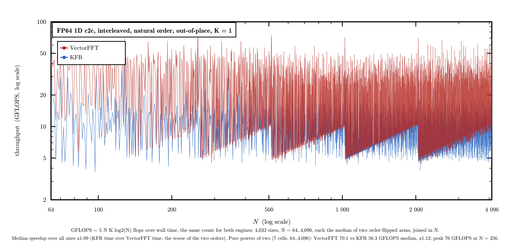
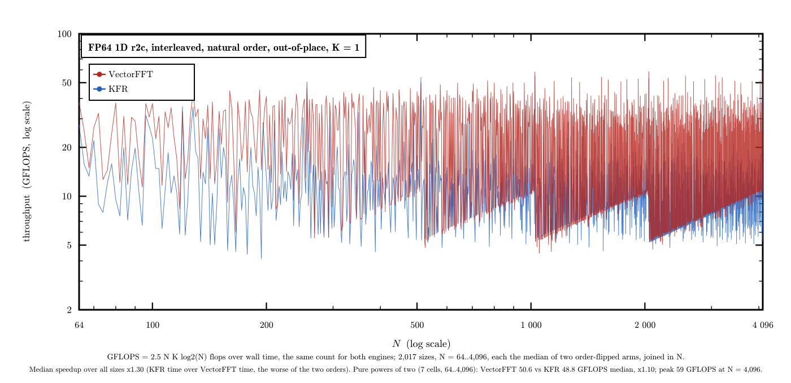

# VectorFFT vs KFR

VectorFFT against [KFR](https://www.kfr.dev/), transform by transform. Each section is one
contract: a throughput plot, a short reading of it, and the speedups by length band and
by family. Every run is a [gauntlet](../../gauntlet/) record
under [`gauntlet/results/`](../../gauntlet/results/) (csv, calibration log, the wisdom it
used), and the plots are drawn from those csv files by
[`src/tools/plots/gen_gflops.py`](../../src/tools/plots/gen_gflops.py).

> **Platform:** Intel Core i9-14900KF (P-core, AVX2), DDR5, GCC 15.2, single thread  
> **Competitor:** KFR 7.1.0, its official Windows release through its C API (built by KFR, AVX2 dispatch)  
> **Method:** one process per length; both engines timed in two arms with the engine
> order flipped; a control length re-timed every 100 lengths; every speedup is KFR's
> time over VectorFFT's in the **worse** of the two arms

---

## 1D c2c, every N from 64 to 4,096

> **Contract:** complex-to-complex FP64, interleaved, natural order, out of place, K = 1  
> **Cells:** every length N from 64 to 4,096 — 4,033 transforms, no size skipped  
> **Record:** [`kfr_c2c_64_4096`](../../gauntlet/results/kfr_c2c_64_4096/) (2026-10-10)

One line per engine, one point per length (log scale: equal speed ratios are equal
vertical gaps). The split is by the largest prime factor of N. Lengths built from primes
up to 47 run 2.5x faster than KFR at the median and never below it; from 53 up the lead
narrows to about 1.06x and KFR is ahead at about one length in five, most often when N
carries a factor of 53, 59 or 61 (worst cell 2,135 = 5·7·61 at 0.51x); nearly every
length where KFR is ahead is served by VectorFFT's prime-size route. Every output agrees with KFR's to 3.8e-15; the
control length (N = 4,096) read 1.32-1.35x at every one of its 42 points.

| Lengths | Cells | Median speedup | At or above parity | Best |
|---|---|---|---|---|
| 64..256 | 193 | 2.17x | 91% | 6.03x (N=96) |
| 257..1,024 | 768 | 1.44x | 62% | 4.88x (N=384) |
| 1,025..2,048 | 1,024 | 1.04x | 92% | 4.04x (N=1312) |
| 2,049..4,096 | 2,048 | 1.08x | 90% | 4.48x (N=3072) |
| **all, 64..4,096** | **4,033** | **1.09x** | **86%** | 6.03x (N=96) |

| Family | Cells | Median speedup | At or above parity |
|---|---|---|---|
| Powers of two | 7 | 1.12x | 100% |
| Primes | 546 | 1.06x | 79% |
| Composites, largest prime factor ≤ 47 | 1,323 | 2.49x | 100% |
| Composites, largest prime factor ≥ 53 | 2,157 | 1.06x | 78% |

---

## 1D r2c, every even N from 64 to 4,096

> **Contract:** real-to-complex FP64, interleaved CCE output (N/2 + 1 bins), out of place, K = 1; KFR's real transform takes an even N only, so odd lengths are not compared  
> **Cells:** every even length N from 64 to 4,096 — 2,017 transforms  
> **Records:** [`kfr_r2c_even_64_2048`](../../gauntlet/results/kfr_r2c_even_64_2048/),
> [`kfr_r2c_even_2050_4096`](../../gauntlet/results/kfr_r2c_even_2050_4096/) (2026-10-10)

The same reading as c2c (GFLOPS here count 2.5 N log2 N per transform). Lengths whose
largest prime factor is at most 47 run 2.45x faster than KFR at the median, every one of
them ahead; with a factor of 53 or more the two are close, 1.02x at the median, KFR ahead
at about three lengths in ten. Every output agrees with KFR's to 3.2e-15; the control
length (N = 4,096) read 1.20-1.21x throughout.

| Lengths | Cells | Median speedup | At or above parity | Best |
|---|---|---|---|---|
| 64..256 | 97 | 1.83x | 98% | 4.17x (N=192) |
| 257..1,024 | 384 | 1.93x | 78% | 4.08x (N=608) |
| 1,025..2,048 | 512 | 1.31x | 59% | 3.93x (N=1376) |
| 2,049..4,096 | 1,024 | 1.04x | 93% | 3.74x (N=2368) |
| **all, 64..4,096** | **2,017** | **1.30x** | **82%** | 4.17x (N=192) |

| Family | Cells | Median speedup | At or above parity |
|---|---|---|---|
| Powers of two | 7 | 1.10x | 86% |
| Largest prime factor ≤ 47 | 838 | 2.45x | 100% |
| Largest prime factor ≥ 53 | 1,172 | 1.02x | 69% |
