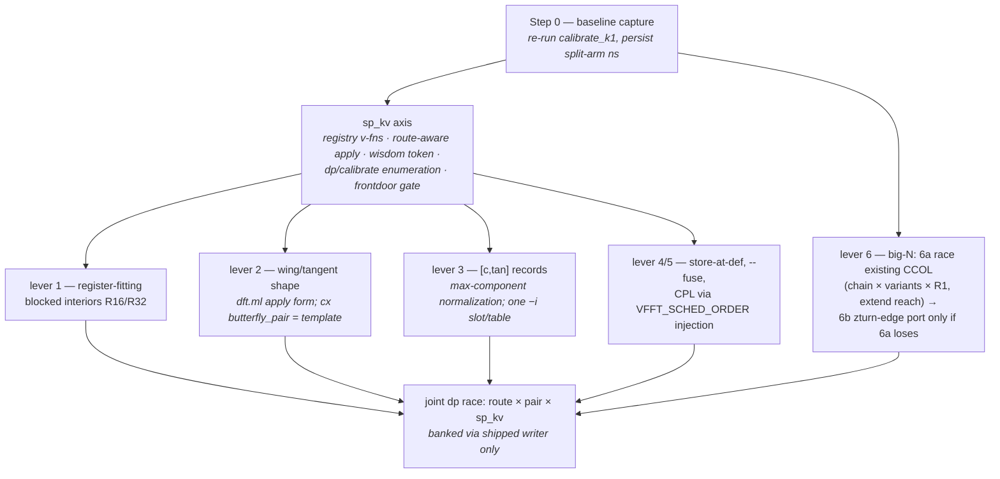
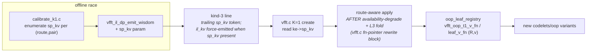

# Split-Bailey parity plan — closing the IL↔Split gap

**Status:** 🟡 **RESEARCH CLOSED 2026-08-18 — IMPLEMENTATION NOT STARTED.**
The gap is measured and itemized; the port plan below is chartered but no
code has landed. Scope set by owner: map the optimization-space and
planning-search-space differences between the IL and Split engines and port
what helps Split. **Out of scope by owner directive: re-racing existing
emitter knobs on split R16 — that sweep was already done and the emission
recipe is chosen.**

Related: `CODELET_SET.md` (repo root — the codelet-set reference),
`docs/roadmap/r32_tangent_parity_plan.md` (the IL-side precedent this plan
mirrors), `docs/performance/tangent_scaled_butterflies.md`.

---

## 1 · The finding, in one paragraph

In the K=1 Bailey band (kind-3, N=128–4096) the Split engine
(`codelets/oop`: `n1_oop` leaf + `t1_oop`/TWL/UL mids) trails the current IL
slot occupants by **12–24% instructions per complex point — but its FP
arithmetic is already at parity in every slot** (the interiors carry the
tangent-factored constant sets, including the full π/16 ladder at R32), and
Split **beats IL-monolithic at R32 in both slots**. The entire deficit is
memory traffic: the split "blocked two-pass" construction spills all 2R
vectors to stack between passes (2.7–4.3 stack ops/pt vs IL blocked forms'
0.5–1.8), plus scalar address reloads (0.83–1.40/pt; attacked via TWL-style
linear twiddle streams — measured sld 83→54 / 179→118 — and via fewer live
values from blocked interiors; `regalloc.ml` is dead by choice library-wide
and is NOT a lever). IL's lead therefore comes from its *substitute* forms (blocked,
wing, tangent) — which exist because `il_kv` gives them a raced slot — not
from being interleaved. Split's planner deficit reduces to exactly one
missing axis: a kernel-variant (`sp_kv`) analog of `il_kv`. Its route space
(10 arms) and pair space (%4 up to 128) are already richer than the IL DP's.

## 2 · Measured slot gap (static census, −O2, wide loop only)

| slot | Split today | IL classic | IL current best | Δ vs best | gap composition |
|---|---:|---:|---:|---:|---|
| leaf R16 | 6.23/pt | 5.78 (`n1t`) | 5.31 (`n1ttan`) | −15% | stack 2.66 vs 0.66/pt; FP tied 2.25 |
| mid R16 | 8.06/pt | 6.88 (`t2`) | 6.09 (`t2tan`) | −24% | stack 3.13 vs 0.66; FP tied 3.19 |
| leaf R32 | 8.05/pt | 9.44 mono · 7.30 `b48` | 7.09 (`n1tbw32t256`) | −12% | stack 3.57 vs 1.61; beats IL-mono |
| mid R32 | 10.34/pt | 10.44 mono · 8.67 `b48` | 8.44 (`t2bw32`) | −18% | stack 4.31 vs 1.84; beats IL-mono |
| leaf R64 | 10.05/pt | — | 12.57 (`n1t`, mono — no variants exist) | **+20%** | **INVERTS**: IL pays more stack (5.64 vs 4.20) + 1.98 shuf/pt |
| mid R64 | 11.77 flat · 12.76 `ul` | — | 13.84 (`t2`, mono) | **+8…+15%** | same — the IL variant pool stops at R32 |

⚠ R64 is where four of the six banked cells put their split kernels, so
slot rows ≠ cell outcomes (the arms run different pairs, e.g. 512 = IL
16×32 vs split 8×64). Consequence: the blocked-interior lever is open at
R64 for **both** families.

Split structural advantages (keep, never trade away): zero shuffle/xor tax
(IL pays 0.91–1.72/pt), half the twiddle bytes/pt (16 B vs VTW2's 32 B),
4 groups/iter (IL: 2 columns), backward = pointer swap (IL carries a full
bwd corpus), corner-turn already a raced 3-way route axis (3P/2PA/2PB).

## 3 · Optimization-space diff — verdict per mechanism

| mechanism | IL | Split | verdict |
|---|---|---|---|
| register-fitting blocked interiors (`n1tb/t2b/·48`) | kv 1/2 | absent — spill-all two-pass | **PORT, lever #1** (IL R32 evidence: stack 86+98→25+28) |
| tangent/wing butterfly *shape* (deferred-cos FMA, ROTFMA) | kv 3 | constants only; FMA share 36% vs 52% | **PORT, lever #2** (`dft.ml` apply-form change) |
| streamed/record twiddles (single cursor) | VTW2+BYTW2 | partial — TWL linear stream (banked winner 256/512) | **PORT the rest**: `[c,tan]` records, lever #3 |
| lazy load / store-at-def | LAZYLOAD/LAZYSTORE | `--oop-store-fused`/`--fuse` exist, _spec-only | **RACE**, lever #4 |
| scheduler alternatives (CPL/CPL2/asis) | `VFFT_CX_SCHED` | SU-subset only; `VFFT_SCHED_ORDER` injection already reaches the oop spill path | **RACE**, lever #5 |
| per-cell kernel-variant wisdom axis | `il_kv` (4–16 combos/pair) | none — one interior per radix | **BUILD `sp_kv`** — the enabler |
| calibrated big-N route | zturn owns all 8 kind-4 cells, all tiled, chain/width/t2q raced | split cascade EXISTS (proto engine composed via CCOL) but is fully unraced: hard-coded chain, T1S-default variants, reach ends at 65536, nothing above | **lever #6, two tracks** — 6a race what exists, 6b zturn-edge port (see §5a) |
| store-edge variants | kv 4 (T128/T256/M-128) | present as routes | no gap (different encoding) |
| sign-fold / xor-kill | needed it | split has no xors | no site — split ahead |
| tangent-factored internal constants | yes | yes (`const_cmul`) | parity — do not re-derive |

## 4 · Planning-space diff

| axis | IL (`dp_planner_il`) | Split (`calibrate_k1`) |
|---|---|---|
| route | 2 enumerated (mono, 2P_PURE); il3p/prime unplannable | 10 arms incl. TWL, log3 twins, mono-alt, CCOL |
| pair | pow2-only, R2∈{4…64} | R2 from min(N,128) down, %4, reach 128 |
| body form | `il_kv` mid×leaf nibbles | **none** |
| banked time | kind-3 `ns` = IL arm | **split arm's time never persisted** |

🔴 Consequence: there is **no baseline artifact** ranking Split vs IL per
cell. Step 0 of implementation is a calibrate_k1 run that captures the
split arms' times.

Today's banked kind-3 split routes put the hot split kernels at **R32/R64**
(mono at 128; TWL R1=4/8 + `n1_oop@64` at 256/512; 2PB 32×32/32×64 at
1024/2048; 2PA 64×64 at 4096). Base UG/UG `n1_oop` at R16 fires in **no**
banked plan — so new body variants must race **jointly with the pair axis**
(the IL lesson: 128's pair flipped when T256 entered the pool).

**Above the banked band** (`vfft.c:4289-4323`): 8192 falls to the
uncalibrated balanced-pair heuristic (2PB 64×128 — `t1@64` + `leaf@128`);
at ≥16384 the classic pair space is exhausted and **CCOL is the only split
K=1 route** — the proto/inplace stride engine run as a K=64 column batch
over `vfft_k1_cc_default_chain`, a permuted tiled transpose, then flat
`t1_oop@64`. Nothing up there is calibrated (calibrate_k1's default cells
stop at 4096; CCOL owns zero banked wins). The IL counterpart ≥8192 is the
zturn cascade — il2p two-pass honestly tops out at 4096.

🔴 **Where the split family actually competes.** The natural-order K=1
verdicts are IL-owned at every banked cell: `@nat` mode 7 (`VFFT_NAT_ILP`,
native il2p/il3p) at 128–1024 + 255, mode 6 (`VFFT_NAT_ZCASC`, zturn stfn
cascade) at ≥2048, and `@natoop` mode 6 at all five OOP-natural cells
(`wisdom_reader.h:55-75`; the `@nat` header comment's mode legend stops at 5
and is stale). The oop split family is never raced against those winners —
it serves only callers who commit `layout=SPLIT`, via the kind-3 `sp_*`
fields. **Split and IL are separate product lines serving different
callers — layout is a caller contract, and racing them against each other
is NOT this campaign's task.** The IL comparisons in §2–§4 are the
diagnostic instrument (how missing optimizations were found), never the
scoreboard. The only success metric is split-after vs split-before, per
cell.

## 5 · The plan

### sp_kv wiring (mirrors `il_kv`; every touch point)

Constraints carried from the IL precedent:

- **Emitter knobs default-off; every default-argv corpus row stays
  byte-identical.** Byte-changing knobs join `provenance_env_overrides` or
  the stamp lies "(none)".
- **`[c,tan]` records need FFTW-style max-component normalization** — the
  t1 diagonal's angle set has exactly one exact −i slot per banked table and
  max|tan| ≈ N/2π (652 at 4096). A naive `[c, s/c]` record is infeasible.
  Second apply site: the string-emitted post-tw postamble in `c2c_split.ml`.
- **Wisdom races only** — variants enter the pool and the dp race decides;
  losers are pool-sunset per policy.

### 5a · Lever #6 — the big-N split gap, two tracks

**Corrected 2026-08-18 after reading `oop_execute.h` + `oop_plan.h`: a
multi-stage split cascade ALREADY EXISTS.** The proto stride engine (the
`codelets/inplace` t1/t1s/n1 family) is a chained split-plane cascade,
OOP-capable via `oop_execute.h` (stage-0 fused OOP + in-place resume, JIT
inner, defined bwd semantics), gated only by its `K % 8` caller constraint.
CCOL (`oop_plan.h:497-625`) is the composition that manufactures K=R1=64
from the columns so that engine can run at K=1: a genuine chained column
plan (contiguous per-stage streams, **no leaf-radix ceiling**,
self-validating perm discovery) + permuted transpose + flat t1 combine.

The actual gap: **this machinery is completely unraced.**

- The column chain is hard-coded per R2 (`vfft_k1_cc_default_chain`,
  `oop_plan.h:450-463`, reproducing the 2026-07-23 spike winners) and the
  table stops at R2=1024 → split K=1 reach **ends at 65536; nothing serves
  N > 65536 at all**.
- The column plan's per-stage variant axis is passed NULL → T1S default —
  the FLAT/LOG3/T1S race the batched engine has everywhere else never runs
  here.
- `calibrate_k1` enumerates CCOL only at the default chain, and no cell
  ≥ 8192 was ever calibrated. The kind-3 `cc_chain` token already exists —
  the banking path needs zero format change.

**Track 6a (cheap, do first): race what exists.** Chain search ×
per-stage variants × R1 choice for CCOL at 8192–65536, vs the 64×128
heuristic pair at 8192; extend `cc_default_chain` past R2=1024 (mind the
`VFFT_K1_CC_MAX_NF` decode bound, `oop_plan.h:482-487`) to unlock
N > 65536. No new codelets; banked via the existing kind-3 CCOL line.

**Track 6b (deeper): split-native zturn-cascade edges.** The zturn
interior is already split arithmetic (block-split mids, shuffle-free
`E_planes` edge, `cascade_z.ml:55`); only ingest `s0t` and terminators
`stf`/`stfn` are interleaved-coupled, and split-plane twins are cheaper
(pure strided plane loads/stores — the deinterleave/REINT lattices vanish;
the frozen z11 ABI's dead `zin_unused`/`zout_unused` slots carry the im
plane). Wires as `sp_route = SP_ZCASC`, chain from the kind-4 line. But it
must beat a **calibrated** CCOL (track 6a), not the uncalibrated default —
and the deleted-IL-entry-points precedent (`oop_plan.h:853-857`, "two
passes cannot amortize a layout conversion") warns against any
convert-shaped shortcut version of it.

Open questions: bwd for 6b (pointer-swap through the block format vs the
cascade's `_bwd` twins); in-place split cascade (the shadow-plane story
was interleaved); whether zturn's tcut tiling advantage survives when the
competitor is CCOL's 3-sweep four-step rather than an untiled cascade —
measurement, not prior.

### 5b · Chartered discussion — tiling + natural order for the split cascade
(owner 2026-08-19: "CT cascade can use tiled methods like IL axis does")

**How IL's tcut tiling works (the mechanism to port):** copy-free — the
cascade's butterfly spans SHRINK stage by stage, so the LAST mids are
closed within a width-w window; the tiled tail (stages tcut+1..nf−2) runs
tile-at-a-time while the tile + its twiddle records stay L1-hot (working
set ≈ 2× tile). Operating rules from the tcut campaign: width is THE knob
(cut derived); occupancy = FILTER, clock = CHOOSER (passes-fused can beat
occupancy); the untiled arm always stays raced (2048 = real no-win);
banked width carries an L1 stamp + replay fence; explicit env beats
wisdom. Measured −16…−21% at ≥4096; flipped 8192/16384 vs MKL; all 8
kind-4 cells banked tiled.

**The old split NO-GO does not block this.** The killed buffered-tiling
executor (2026-06-18) COPIED K-tiles to scratch — copies never amortized
because mid-cascade DIT legs span all rows. tcut never copies; it uses
end-of-cascade natural locality. The verdict stands against the
copy-based mechanism only; the geometric precondition (monotone spans)
exists in the split cascade too.

**Two roads (compose, don't compete):**
- 6b road: split-plane zturn edges → tiling + natord + chains + t2q come
  free; K=1 only.
- Native road: teach the proto engine a tcut-style tail walker → benefits
  EVERY batched split cell at big N **and CCOL's own column pass**
  (a batched cascade at (R2≤8192, K=8..64)). Needs the span/divisibility
  analysis in the proto stage geometry + per-stage twiddle windows.
🔴 tcut lesson to carry in: every axis added there failed twice the same
way — "added to the mechanism but not to every writer and every log
line." Wisdom field, both writers, verbose log, replay diagnostic move
together on day one.

**Natural order — verified zero-tax on IL, and split's mirror status:**
IL folds the reorder permutation into a mandatory data pass at every band
(sub-2048: transpose fused into `n1t` stores — natural IS the native
order, the identity rule; ≥2048: one kernel swap `stf`→`stfn`, rho-table
digit reversal in the terminator's LOAD addressing, stores contiguous —
no reorder pass; natord pins tfuse=0 + t2q, both practical no-ops).
Split already mirrors it: split_oop is natural by construction (turn
fused in 2PA loads / 2PB stores; only the never-winning 3P pays a sweep),
and **CCOL's permuted transpose absorbs the column cascade's digit
reversal into the mandatory transpose pass — the stfn principle**. The
only real split natural tax is the BATCHED engine's @nat tape/cycle
machinery (K>1, outside this campaign). A 6b split `stfn` twin inherits
natord free and cheaper (plane stores, no REINT lattice).

### 5c · Phase D/E menu — codelet-level upgrades for split (the full list)

Ordered by expected value; every item enters the sp_kv (or route) pool
and races per cell — never replaces.

1. **Register-fitting blocked interiors** — `t1_oop@32`, `n1_oop_ugul@32`
   (the live R32 bodies; the measured 2.7–4.3 stack-ops/pt is the 12–24%
   gap) AND R64 (`t1_oop@64`/`n1_oop@64` — both families are monolithic
   there; 4 of 6 cells' hot radix). IL evidence: b48 forms cut R32 stack
   3×.
2. **Wing/tangent butterfly SHAPE** — deferred-cos FMA conversion on the
   already-tangent-factored constants (naked add+sub 1.63–1.88/pt → ~1.2,
   FMA share 36%→52%). `dft.ml` apply-form change; cx `butterfly_pair` is
   the template. L1-resident scope caveat travels with it.
3. **`[c,tan]` runtime-twiddle records** — kills the 30/62 bare muls/iter
   at t1 sites + converts downstream adds; split needs NO cflip shuffle
   (cheaper host than IL). Max-component normalization (one exact −i slot
   per table, max|t|≈N/2π); two apply sites (DAG render + the post-tw
   string postamble).
4. **Linear twiddle streams beyond TWL** — the single-cursor
   consumption-order trick (measured sld 83→54 / 179→118) extended to a
   flat `t1_twl` UG twin and to CCOL's combine mid. Plus the ulp-twin
   literal dedup (two tan(π/8) constants) as hygiene.
5. **Lazy-load discipline** — no `VFFT_CX_LAZYLOAD` analog on the oop
   path (bodies load all 2R lanes up front); emitter option, raced.
6. **Store-at-def + `--fuse` beyond the _spec bakes** — flags exist;
   make them raced arms for the live kernels.
7. **Scheduler alternatives** — CPL/CPL2 orders through the
   already-reachable `VFFT_SCHED_ORDER` injection on the oop spill path
   (external scheduler first; emitter knob if it wins).
8. **CCOL combine-mid selection** — race the UL/TWL/log3 twins for the
   combine pass (today: flat `t1_oop` only).
9. **Split-plane zturn edge kinds (6b)** — new ingest + `stf`/`stfn`
   terminator twins over `E_split_planes` (z11 dead slots carry the im
   plane); brings the tiled+natord interior wholesale.
10. **Odd/prime split kernels** — Winograd interiors (real-side hand
    `dft_winograd5/7` in `dft_recurse.ml` — verify whether the odd
    `n1_oop/t1_oop` radices already inherit them) + the chartered native
    split Rader/Bluestein routes (planner-header charter).

Adjacent (executor-level, not codelet bodies, listed for completeness):
the native tcut tail walker for the proto engine (§5b), and the sp_kv
axis itself (Phase C) that makes 1–3 raceable per cell.

### 5d · Chartered future — THROUGHPUT WISDOM (owner, 2026-08-19)

**Framing (owner):** the fundamental object is the WORKLOAD — "4 FFTs" —
and the engines are DELIVERY MECHANISMS for it: contiguous IL delivers it
sequentially (4 passes of one stream), lane-major split delivers it
spatially (4 streams through the SIMD lanes of one pass). Layout and K
are properties of the delivery, not the demand. CCOL is the same move
reversed — it manufactures a batch out of ONE transform's sub-problems —
so component planners answer "best way to run this arrangement" and
throughput wisdom answers "best arrangement for this demand."

A quantity-keyed table: cell = (N, HOWMANY transforms the caller wants
delivered); per cell the planner races every STRATEGY that can deliver
that quantity — split batched at native K, the IL single-transform engine
LOOPED howmany times, split_oop looped, hybrids — each timed END-TO-END
at the actual quantity (never quantity × a K=1 ns: loop-vs-batch cache
behavior is exactly what the race must measure; the OoO-context
principle). Existing cells become COMPONENTS: kind-3 lines describe loop
bodies, spike lines describe the batched strategy's internals; the
throughput verdict banks which strategy won + resolves internals from
each engine's own wisdom (one concern, one file). **Design question RESOLVED by owner (2026-08-19): layout is an OUTPUT of
planning.** Performance-first users will MOLD their structs to whatever
layout wins the cell — so the primary throughput race is CONVERSION-FREE:
every arm runs in its own native layout (no conversion tax on any arm,
because the user adopts the winner rather than converting into it). The
verdict doubles as design-time advice ("for (N, howmany): SPLIT, this
plan"). Surface implications: a layout=BEST-style create mode and/or an
advise query; `owned_buffers=1` = the runtime embodiment (library
allocates the winning shape). A conversion-PAYING race survives only as
the secondary mode for drop-in callers who cannot restructure.
**Foundations held NOW (owner, 2026-08-19 — throughput is later, the
key discipline is immediate):** (1) every cell key is
**(N, quantity, order)** — `10000 K=4`, `10000 K=8`, and `@nat 10000
K=8` are three distinct cells with independently raced plans (already
the spike/@nat convention: e.g. shipped `100 4 → 10×10` vs
`100 32 → 20×5`, and @nat rows coexist with scrambled rows at the same
(N,K)); (2) **layout is NEVER part of a cell key** — it is a strategy
property, an output; (3) order stays EXPLICIT in every new record
(@nat-style), never implied; (4) component planners remain callable
per-arm production entry points (vfft_sp_dp_plan_and_bank is the
pattern) so the future throughput racer drives them as strategies.
Throughput then adds only the strategy axis on top — no re-keying.
Sequenced AFTER sp_kv + the §5c menu — every component improvement
raises the arms this table will race.

## 6 · Hazards

- **JIT bypass:** `--jit` builds serve split routes from a baked kernel
  keyed (N,R1,R2,route) *before* fn-pointer dispatch — `sp_kv` must join the
  JIT key or force the bake off when kv≠0.
- **Wisdom strip cycle:** pre-sp_kv writers rewrite the whole file and strip
  the trailing token (the kind-5 `zr_kv` failure class). Rebuild every
  consumer exe; ship a frontdoor decode gate.
- **Duplicated emitter:** `c2c_split.ml`'s `emit_body_spill` is a ratified
  578-line duplicate of the engine spill emitter and `prepare_butterfly`
  mirrors gen_main's construction selector — a port touches both copies or
  does the designated `Dft.select_expansion` extraction first.
- **Lying provenance:** t1 spill codelets stamp "MONOLITHIC" while declaring
  `spill_re[32]` (the blocked test checks only the n1 clause). Census the
  body, not the header.
- **Static ≠ time:** the census picks arms; only the paired-race protocol
  produces verdicts.

## 7 · Execution checklist — go through slowly, one gate at a time

Every step has a done-criterion; nothing advances past a failed gate.
House rules apply to every measuring step: pinned core 2, alternating
same-run arms, control twin, wisdom SCRATCH copy (`$VFFT_WISDOM_DIR`),
rebuild every wisdom-writing consumer after any format/registry change.

### Phase A — baselines (no code changes)

- [x] A1. **DONE 2026-08-18.** 163 candidates, all gated. Baseline (best
      split arm per cell): 84.3 / 175.5 / 362.7 / 1043.7 / 3856.9 / 8121.7 ns
      at 128…4096. 🔴 Found: shipped `sp_*` routes STALE at 128/256/512 by
      20–33% under the current build (same-run margins; the IL arm reproduced
      its banked verdicts ≤1.5% at 4/6 cells, validating conditions). New
      winners: 2PB 4×32 · 2PB 8×32 · 2PA 64×8 · (1024 unchanged) ·
      2PA 64×32 · 2PA-L3 64×64. **PROMOTED same day (owner call)**: sp
      fields only at 128/256/512/4096, IL fields untouched, 2048 skipped
      (noise-sized), CRLF-safe edit, 4-line git diff verified, backup
      `oop_wisdom.txt.bak-20260818-a1`.
- [x] B2.1 **(found by the first band run, fixed 2026-08-18):** the shared
      kind-3 writer required a valid IL NATURAL candidate to emit the line
      at all — il2p tops out at 4096, so every split-only verdict ≥8192 was
      silently dropped (the "banked 1 line" was the kind-4 side-emit). Fix
      in `vfft_il_dp_emit_wisdom`: a valid split winner banks with
      `il_route = IL_NONE` + zeroed IL fields; `ns` carries the IL arm's
      cost, or the SPLIT winner's cost when the IL arm is absent (token
      count unchanged; `sp_route < 0` still refuses the whole line).
      First band results (rigor 1, all gated): 8192 → CCOL 8×1024 @19.9µs
      (beat the 64×128 pair arms); 16384 → CCOL 64×256 @51.0µs;
      32768 → CCOL 8×4096 @93.9µs; 65536 → CCOL 32×2048 @243.8µs. Three
      distinct winning R1 values; 32768/65536 reach past the old
      cc_default_chain ceiling via wisdom-driven chains.
- [x] A2. **PASS** — shipped wisdom sha256-verified byte-unchanged.
- [x] A3. Note in the log: calibrator = v2 four-axis, a NON-JIT binary — under
      `--jit` builds the front door serves a different executor than the one
      measured here (same fidelity class as the C5 hazard); `_spec`/JIT bakes
      are deliberately outside the raced space (`calibrate_k1.c:89-91`).

### Phase B — big-N split planning (the CCOL fix; owner-directed priority)

Principle (library invariant): planning races and banks; create resolves
wisdom into fn pointers/args on the handle; execute never reads wisdom.

- [x] B2.2 **(owner principle, 2026-08-18/19 — SUPERSEDES B1's spike
      composition): one engine, one wisdom file.** OOP verdicts never read
      the in-place spike file at create (the MODEB kind-2 precedent). The
      CCOL verdict is now SELF-CONTAINED in the kind-3 line: new `cc_vars`
      token (second CCOL token after `cc_chain`, before `ns`; one digit per
      stage, digit = variant+1; 0 = T1S defaults; reader tolerant of the
      short-lived pre-cc_vars form via the '.'-in-ns test). The split_oop
      planner has ZERO spike coupling — no reads, no writes, no DIF
      policy, no adoption logic; raced == served is structural (the banked
      line IS the raced build recipe). Codec `vfft_k1_cc_vars_encode/
      decode` beside the chain codec; emit/plan_and_bank grew `sp_cc_vars`;
      create decodes `cc_vars` with an nf-match refusal. Front-door gate
      ALL CORRECT. The B1 spike write policy is RETIRED (its shared-slot
      conflicts — DIF protection, adoption, servability — all vanish with
      the coupling).
- [ ] B2.3 **(chartered 2026-08-19, owner's OoO-context principle):
      isolated sub-plan timings must not make DECISIONS, only proposals.**
      Prepending a stage changes the program (L1/L3 residency, seam
      distances) — so the inner proto-DP is demoted fully to proposer:
      take its top-K (2–3) chains per R1, build each as a complete CCOL
      candidate, and let the END-TO-END race decide everything including
      the chain. Runs after B5; one final band pass with the wider pool.
- [x] B1. **DECIDED 2026-08-18 — spike composition, two-level.**
      **⚠ SUPERSEDED by B2.2 above** (owner: OOP cells must not read
      in-place wisdom; the DIF-slot conflict was the symptom). Kept for the
      record:
      **Outer** (R1 ∈ {8,16,32,64} × chain, whole-route): raced in
      calibrate_k1, banked kind-3 `sp_R1` + `cc_chain` (tokens exist; replay
      already wired, `vfft.c:4388-4397`). **Inner** (column-plan variants):
      raced by the EXISTING proto DP (`measure.h`) with **use_dif pinned 0**
      (the OOP boundary is DIT-only), banked as spike v8 lines keyed
      `(R2, K=R1)`; `create_k1_cc`'s `variants=NULL` arg is the plug point.
      **Read policy at create**: accept the spike line only if
      `use_dif==0` AND its factors equal the decoded `cc_chain` (variants
      are chain-shaped); else `variants=NULL` (today's T1S default).
      **Write policy** (shared-cell rule — the `(R2,64)` namespace is
      ALREADY populated: 2026-07-23 spike-era rows incl. duplicates and
      `ns=0.00` placeholders, plus genuine batched cells, and `(256,64)` is
      DIF-tuned): CCOL calibration never overwrites a DIF-tuned line — it
      writes only when the cell is absent or an existing DIT line is beaten.
      **Reach**: `VFFT_K1_CC_MAX_NF=7` already covers N ≤ 64·4⁷ — no
      constant change; the default-chain table becomes the calibrated-miss
      fallback only. B2 must also pin the reader's duplicate-line semantics
      (which of two same-key rows wins on load).
- [ ] B2. **Architecture rule (owner, 2026-08-18): calibrators hold NO
      planning logic — thin drivers only.** So B2 = a PRODUCTION planning
      entry point `vfft_sp_dp_plan_and_bank` (new `dp_planner_split_oop.h`,
      sibling of `dp_planner_il.h`) that owns the whole split axis:
      (a) the existing route × pair race MIGRATED out of calibrate_k1.c;
      (b) the CCOL axes — R1 ∈ {8,16,32,64} × chain, inner variants via the
      DIT-pinned proto DP, spike write policy per B1; (c) gate-before-time,
      pacing, winner selection, banking through the shipped writer.
      calibrate_k1.c shrinks to arg-parse + call + print. Cells extended to
      8192–65536 (+ reach cells).
      **CODE COMPLETE + GATED 2026-08-18**: `dp_planner_split_oop.h` shipped
      (charter incl. future odd/prime/Rader/Bluestein routes);
      `calibrate_k1.c` v3 = 80-line thin driver; `create_k1_cc_v` variants
      plug; `emit_wisdom`/`plan_and_bank` carry `sp_cc_chain`. Migration
      gate PASSED (36-candidate roster identical to A1 line-for-line; only
      additions = the new CCOL arms). Spike policy verified live: DIF-tuned
      `(32,8)` protected, absent `(16,16)` DIT line banked. ⚠ ORDER: run
      B4 (create-side spike-variants resolution) BEFORE promoting any
      banked CCOL winner — until then a replayed CCOL line would serve
      T1S-default variants, not the raced tuning. Extended-band run
      (8192–65536) pending.
- [ ] B3. Reach: wisdom-driven chains at create with `cc_default_chain` as
      the uncalibrated fallback; extend past R2=1024. 🔴 `VFFT_K1_CC_MAX_NF`
      array and decode-loop bound move together (`oop_plan.h:482-487`).
- [x] B4. **WIRED + GATED 2026-08-18.** The CCOL replay in `vfft.c` now
      resolves column variants from the spike line at `(R2, K=R1)` via the
      shipped `vfft_proto_wisdom_lookup` on the in-memory bundle (`W->c2c`),
      accepting only DIT lines whose factors equal the decoded `cc_chain`;
      else NULL → T1S default (pre-B4 behavior). First-match lookup is safe
      (the planner's spike write collapses duplicates). Front-door gate
      re-run: ALL CORRECT. Note: calibrated cells replay chains from
      wisdom, so the planner's reach past R2=1024 is automatic; the
      `cc_default_chain` table now only bounds UNCALIBRATED fallback (B3's
      residual scope).
- [x] B5. **DECODE GATE ALL PASS 2026-08-19** — `benches/
      sp_ccol_decode_gate.c` (thin driver) over the production comparator
      `vfft_sp_ccol_line_served` (dp_planner_split_oop.h): each banked
      CCOL line → real front door create (SPLIT/OOP/NATURAL, wisdom from
      the scratch dir) → served route+pair+chain assert → forward execute
      vs the scalar reference. 4/4 cells PASS at ≤7.7e-16 (8192 CCOL
      8×1024 · 16384 8×2048 · 32768 8×4096 · 65536 32×2048). Remaining
      B5 residue folds into B6: rebuild-all wisdom writers + the wisdom
      diff review at promotion.
- [x] B6. **PROMOTED 2026-08-19.** Four NEW kind-3 CCOL lines appended to
      the shipped oop_wisdom.txt (CRLF-safe; git diff = exactly 4
      insertions; backup `oop_wisdom.txt.bak-20260819-b6`): 8192 8×1024
      chain 334/133 @19.3µs · 16384 64×256 224/133 @52.2µs · 32768 8×4096
      3243/1333 @83.7µs · 65536 64×1024 2224/1333 @245.1µs. Decode gate
      re-run AGAINST THE SHIPPED FILE: 4/4 PASS (≤7.5e-16); no side-writes
      (git status clean modulo the 4 lines). 8192 beat every pair arm in
      all 3 rigor-1 runs; 8192/32768 winners stable ×3; 16384/65536 are
      close races between two CCOL arms (same-run winners banked; optional
      second-day confirm noted). B2.3 validated in the data: 16384's
      winning chain was the isolated proposer's LAST-ranked proposal.
      Writer-fleet rebuild (stale-binary rule; ~16 binaries) executed at
      promotion. **PHASE B COMPLETE.**

### Phase C — sp_kv axis (enabler for body variants)

- [ ] C1. Pure registry v-fns `vfft_oop_{t1,leaf}_v_fn(R,v)` (mirror il2p's;
      0 for unemitted).
- [ ] C2. Route-aware apply, running AFTER the availability-degrade + L3-fold
      fn-pointer rewrite block (`vfft.c:4467-4501`).
- [ ] C3. Wisdom: trailing `sp_kv` token; il_kv force-emitted whenever sp_kv
      present (token-position collapse hazard); absent ⇒ 0 ⇒ today's kernels.
- [ ] C4. `calibrate_k1` enumeration + `emit_wisdom`/`plan_and_bank`
      signatures grow the param.
- [ ] C5. JIT: sp_kv joins the bake key or forces `k1_jit = NULL` when ≠0.
- [ ] C6. Decode gate + rebuild-all + strip-cycle audit of every wisdom
      writer.

### Phase D — first variant family: blocked interiors (live R32 bodies)

- [ ] D1. Emitter: register-fitting blocked construction for the oop family;
      default-off knob; every default-argv corpus row byte-identical; knob
      joins `provenance_env_overrides`.
- [ ] D2. Emit blocked `t1_oop@32` + `n1_oop_ugul@32`; census gate (stack
      traffic must actually drop) + tolerance gate vs base.
- [ ] D3. Race as sp_kv variant 1 at 1024/2048 JOINTLY with the pair axis;
      bank; pool-sunset losers.

### Phase E — tangent shape, then records

- [ ] E1. Deferred-cos wing arm in `dft.ml` (default-off, cx
      `butterfly_pair` as template); census + tolerance gates; race as
      variant 3.
- [ ] E2. `[c,tan]` records: max-component normalization + the one −i slot;
      table fill + render arm + the post-tw string postamble; race.

### Phase F — cheap arms

- [ ] F1. Store-at-def / `--fuse` arms into the raced pool beyond _spec.
- [ ] F2. External CPL/CPL2 schedule-injection arms via `VFFT_SCHED_ORDER`.

## 8 · Closed questions — do not re-derive

- Split interior FP arithmetic is at tangent-level parity (census 2026-08-18);
  the gap is traffic. Any "add tangent constants to split" proposal is
  already-done work.
- Split has no xor/sign-fold sites and no table-side shuffles — ROTFMA's
  xor-kill and VTW2's shuffle-kill have nothing to port.
- Store-edge choice already exists on the split side as the route axis.
