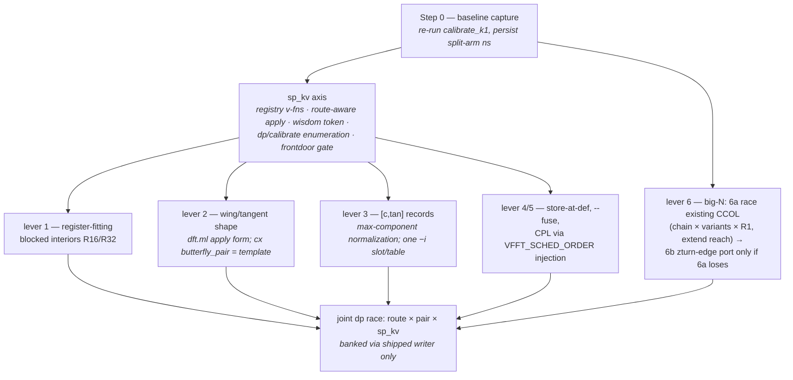
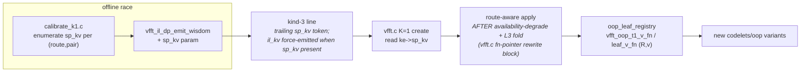

# Split-Bailey parity plan — closing the IL↔Split gap

**Status:** 🟡 **RESEARCH CLOSED 2026-08-18 — IMPLEMENTATION NOT STARTED.**
The gap is measured and itemized; the port plan below is chartered but no
code has landed. Scope set by owner: map the optimization-space and
planning-search-space differences between the IL and Split engines and port
what helps Split. **Out of scope by owner directive: re-racing existing
emitter knobs on split R16 — that sweep was already done and the emission
recipe is chosen.**

Related: `CODELET_SET.md` (repo root — the codelet-set reference),
`docs/roadmap/r32_tangent_parity_plan.md` (the IL-side precedent this plan
mirrors), `docs/performance/tangent_scaled_butterflies.md`.

---

## 1 · The finding, in one paragraph

In the K=1 Bailey band (kind-3, N=128–4096) the Split engine
(`codelets/oop`: `n1_oop` leaf + `t1_oop`/TWL/UL mids) trails the current IL
slot occupants by **12–24% instructions per complex point — but its FP
arithmetic is already at parity in every slot** (the interiors carry the
tangent-factored constant sets, including the full π/16 ladder at R32), and
Split **beats IL-monolithic at R32 in both slots**. The entire deficit is
memory traffic: the split "blocked two-pass" construction spills all 2R
vectors to stack between passes (2.7–4.3 stack ops/pt vs IL blocked forms'
0.5–1.8), plus scalar address reloads (0.83–1.40/pt; attacked via TWL-style
linear twiddle streams — measured sld 83→54 / 179→118 — and via fewer live
values from blocked interiors; `regalloc.ml` is dead by choice library-wide
and is NOT a lever). IL's lead therefore comes from its *substitute* forms (blocked,
wing, tangent) — which exist because `il_kv` gives them a raced slot — not
from being interleaved. Split's planner deficit reduces to exactly one
missing axis: a kernel-variant (`sp_kv`) analog of `il_kv`. Its route space
(10 arms) and pair space (%4 up to 128) are already richer than the IL DP's.

## 2 · Measured slot gap (static census, −O2, wide loop only)

| slot | Split today | IL classic | IL current best | Δ vs best | gap composition |
|---|---:|---:|---:|---:|---|
| leaf R16 | 6.23/pt | 5.78 (`n1t`) | 5.31 (`n1ttan`) | −15% | stack 2.66 vs 0.66/pt; FP tied 2.25 |
| mid R16 | 8.06/pt | 6.88 (`t2`) | 6.09 (`t2tan`) | −24% | stack 3.13 vs 0.66; FP tied 3.19 |
| leaf R32 | 8.05/pt | 9.44 mono · 7.30 `b48` | 7.09 (`n1tbw32t256`) | −12% | stack 3.57 vs 1.61; beats IL-mono |
| mid R32 | 10.34/pt | 10.44 mono · 8.67 `b48` | 8.44 (`t2bw32`) | −18% | stack 4.31 vs 1.84; beats IL-mono |
| leaf R64 | 10.05/pt | — | 12.57 (`n1t`, mono — no variants exist) | **+20%** | **INVERTS**: IL pays more stack (5.64 vs 4.20) + 1.98 shuf/pt |
| mid R64 | 11.77 flat · 12.76 `ul` | — | 13.84 (`t2`, mono) | **+8…+15%** | same — the IL variant pool stops at R32 |

⚠ R64 is where four of the six banked cells put their split kernels, so
slot rows ≠ cell outcomes (the arms run different pairs, e.g. 512 = IL
16×32 vs split 8×64). Consequence: the blocked-interior lever is open at
R64 for **both** families.

Split structural advantages (keep, never trade away): zero shuffle/xor tax
(IL pays 0.91–1.72/pt), half the twiddle bytes/pt (16 B vs VTW2's 32 B),
4 groups/iter (IL: 2 columns), backward = pointer swap (IL carries a full
bwd corpus), corner-turn already a raced 3-way route axis (3P/2PA/2PB).

## 3 · Optimization-space diff — verdict per mechanism

| mechanism | IL | Split | verdict |
|---|---|---|---|
| register-fitting blocked interiors (`n1tb/t2b/·48`) | kv 1/2 | absent — spill-all two-pass | **PORT, lever #1** (IL R32 evidence: stack 86+98→25+28) |
| tangent/wing butterfly *shape* (deferred-cos FMA, ROTFMA) | kv 3 | constants only; FMA share 36% vs 52% | **PORT, lever #2** (`dft.ml` apply-form change) |
| streamed/record twiddles (single cursor) | VTW2+BYTW2 | partial — TWL linear stream (banked winner 256/512) | **PORT the rest**: `[c,tan]` records, lever #3 |
| lazy load / store-at-def | LAZYLOAD/LAZYSTORE | `--oop-store-fused`/`--fuse` exist, _spec-only | **RACE**, lever #4 |
| scheduler alternatives (CPL/CPL2/asis) | `VFFT_CX_SCHED` | SU-subset only; `VFFT_SCHED_ORDER` injection already reaches the oop spill path | **RACE**, lever #5 |
| per-cell kernel-variant wisdom axis | `il_kv` (4–16 combos/pair) | none — one interior per radix | **BUILD `sp_kv`** — the enabler |
| calibrated big-N route | zturn owns all 8 kind-4 cells, all tiled, chain/width/t2q raced | split cascade EXISTS (proto engine composed via CCOL) but is fully unraced: hard-coded chain, T1S-default variants, reach ends at 65536, nothing above | **lever #6, two tracks** — 6a race what exists, 6b zturn-edge port (see §5a) |
| store-edge variants | kv 4 (T128/T256/M-128) | present as routes | no gap (different encoding) |
| sign-fold / xor-kill | needed it | split has no xors | no site — split ahead |
| tangent-factored internal constants | yes | yes (`const_cmul`) | parity — do not re-derive |

## 4 · Planning-space diff

| axis | IL (`dp_planner_il`) | Split (`calibrate_k1`) |
|---|---|---|
| route | 2 enumerated (mono, 2P_PURE); il3p/prime unplannable | 10 arms incl. TWL, log3 twins, mono-alt, CCOL |
| pair | pow2-only, R2∈{4…64} | R2 from min(N,128) down, %4, reach 128 |
| body form | `il_kv` mid×leaf nibbles | **none** |
| banked time | kind-3 `ns` = IL arm | **split arm's time never persisted** |

🔴 Consequence: there is **no baseline artifact** ranking Split vs IL per
cell. Step 0 of implementation is a calibrate_k1 run that captures the
split arms' times.

Today's banked kind-3 split routes put the hot split kernels at **R32/R64**
(mono at 128; TWL R1=4/8 + `n1_oop@64` at 256/512; 2PB 32×32/32×64 at
1024/2048; 2PA 64×64 at 4096). Base UG/UG `n1_oop` at R16 fires in **no**
banked plan — so new body variants must race **jointly with the pair axis**
(the IL lesson: 128's pair flipped when T256 entered the pool).

**Above the banked band** (`vfft.c:4289-4323`): 8192 falls to the
uncalibrated balanced-pair heuristic (2PB 64×128 — `t1@64` + `leaf@128`);
at ≥16384 the classic pair space is exhausted and **CCOL is the only split
K=1 route** — the proto/inplace stride engine run as a K=64 column batch
over `vfft_k1_cc_default_chain`, a permuted tiled transpose, then flat
`t1_oop@64`. Nothing up there is calibrated (calibrate_k1's default cells
stop at 4096; CCOL owns zero banked wins). The IL counterpart ≥8192 is the
zturn cascade — il2p two-pass honestly tops out at 4096.

🔴 **Where the split family actually competes.** The natural-order K=1
verdicts are IL-owned at every banked cell: `@nat` mode 7 (`VFFT_NAT_ILP`,
native il2p/il3p) at 128–1024 + 255, mode 6 (`VFFT_NAT_ZCASC`, zturn stfn
cascade) at ≥2048, and `@natoop` mode 6 at all five OOP-natural cells
(`wisdom_reader.h:55-75`; the `@nat` header comment's mode legend stops at 5
and is stale). The oop split family is never raced against those winners —
it serves only callers who commit `layout=SPLIT`, via the kind-3 `sp_*`
fields. **Split and IL are separate product lines serving different
callers — layout is a caller contract, and racing them against each other
is NOT this campaign's task.** The IL comparisons in §2–§4 are the
diagnostic instrument (how missing optimizations were found), never the
scoreboard. The only success metric is split-after vs split-before, per
cell.

## 5 · The plan

### sp_kv wiring (mirrors `il_kv`; every touch point)

Constraints carried from the IL precedent:

- **Emitter knobs default-off; every default-argv corpus row stays
  byte-identical.** Byte-changing knobs join `provenance_env_overrides` or
  the stamp lies "(none)".
- **`[c,tan]` records need FFTW-style max-component normalization** — the
  t1 diagonal's angle set has exactly one exact −i slot per banked table and
  max|tan| ≈ N/2π (652 at 4096). A naive `[c, s/c]` record is infeasible.
  Second apply site: the string-emitted post-tw postamble in `c2c_split.ml`.
- **Wisdom races only** — variants enter the pool and the dp race decides;
  losers are pool-sunset per policy.

### 5a · Lever #6 — the big-N split gap, two tracks

**Corrected 2026-08-18 after reading `oop_execute.h` + `oop_plan.h`: a
multi-stage split cascade ALREADY EXISTS.** The proto stride engine (the
`codelets/inplace` t1/t1s/n1 family) is a chained split-plane cascade,
OOP-capable via `oop_execute.h` (stage-0 fused OOP + in-place resume, JIT
inner, defined bwd semantics), gated only by its `K % 8` caller constraint.
CCOL (`oop_plan.h:497-625`) is the composition that manufactures K=R1=64
from the columns so that engine can run at K=1: a genuine chained column
plan (contiguous per-stage streams, **no leaf-radix ceiling**,
self-validating perm discovery) + permuted transpose + flat t1 combine.

The actual gap: **this machinery is completely unraced.**

- The column chain is hard-coded per R2 (`vfft_k1_cc_default_chain`,
  `oop_plan.h:450-463`, reproducing the 2026-07-23 spike winners) and the
  table stops at R2=1024 → split K=1 reach **ends at 65536; nothing serves
  N > 65536 at all**.
- The column plan's per-stage variant axis is passed NULL → T1S default —
  the FLAT/LOG3/T1S race the batched engine has everywhere else never runs
  here.
- `calibrate_k1` enumerates CCOL only at the default chain, and no cell
  ≥ 8192 was ever calibrated. The kind-3 `cc_chain` token already exists —
  the banking path needs zero format change.

**Track 6a (cheap, do first): race what exists.** Chain search ×
per-stage variants × R1 choice for CCOL at 8192–65536, vs the 64×128
heuristic pair at 8192; extend `cc_default_chain` past R2=1024 (mind the
`VFFT_K1_CC_MAX_NF` decode bound, `oop_plan.h:482-487`) to unlock
N > 65536. No new codelets; banked via the existing kind-3 CCOL line.

**Track 6b (deeper): split-native zturn-cascade edges.** The zturn
interior is already split arithmetic (block-split mids, shuffle-free
`E_planes` edge, `cascade_z.ml:55`); only ingest `s0t` and terminators
`stf`/`stfn` are interleaved-coupled, and split-plane twins are cheaper
(pure strided plane loads/stores — the deinterleave/REINT lattices vanish;
the frozen z11 ABI's dead `zin_unused`/`zout_unused` slots carry the im
plane). Wires as `sp_route = SP_ZCASC`, chain from the kind-4 line. But it
must beat a **calibrated** CCOL (track 6a), not the uncalibrated default —
and the deleted-IL-entry-points precedent (`oop_plan.h:853-857`, "two
passes cannot amortize a layout conversion") warns against any
convert-shaped shortcut version of it.

Open questions: bwd for 6b (pointer-swap through the block format vs the
cascade's `_bwd` twins); in-place split cascade (the shadow-plane story
was interleaved); whether zturn's tcut tiling advantage survives when the
competitor is CCOL's 3-sweep four-step rather than an untiled cascade —
measurement, not prior.

## 6 · Hazards

- **JIT bypass:** `--jit` builds serve split routes from a baked kernel
  keyed (N,R1,R2,route) *before* fn-pointer dispatch — `sp_kv` must join the
  JIT key or force the bake off when kv≠0.
- **Wisdom strip cycle:** pre-sp_kv writers rewrite the whole file and strip
  the trailing token (the kind-5 `zr_kv` failure class). Rebuild every
  consumer exe; ship a frontdoor decode gate.
- **Duplicated emitter:** `c2c_split.ml`'s `emit_body_spill` is a ratified
  578-line duplicate of the engine spill emitter and `prepare_butterfly`
  mirrors gen_main's construction selector — a port touches both copies or
  does the designated `Dft.select_expansion` extraction first.
- **Lying provenance:** t1 spill codelets stamp "MONOLITHIC" while declaring
  `spill_re[32]` (the blocked test checks only the n1 clause). Census the
  body, not the header.
- **Static ≠ time:** the census picks arms; only the paired-race protocol
  produces verdicts.

## 7 · Execution checklist — go through slowly, one gate at a time

Every step has a done-criterion; nothing advances past a failed gate.
House rules apply to every measuring step: pinned core 2, alternating
same-run arms, control twin, wisdom SCRATCH copy (`$VFFT_WISDOM_DIR`),
rebuild every wisdom-writing consumer after any format/registry change.

### Phase A — baselines (no code changes)

- [x] A1. **DONE 2026-08-18.** 163 candidates, all gated. Baseline (best
      split arm per cell): 84.3 / 175.5 / 362.7 / 1043.7 / 3856.9 / 8121.7 ns
      at 128…4096. 🔴 Found: shipped `sp_*` routes STALE at 128/256/512 by
      20–33% under the current build (same-run margins; the IL arm reproduced
      its banked verdicts ≤1.5% at 4/6 cells, validating conditions). New
      winners: 2PB 4×32 · 2PB 8×32 · 2PA 64×8 · (1024 unchanged) ·
      2PA 64×32 · 2PA-L3 64×64. **PROMOTED same day (owner call)**: sp
      fields only at 128/256/512/4096, IL fields untouched, 2048 skipped
      (noise-sized), CRLF-safe edit, 4-line git diff verified, backup
      `oop_wisdom.txt.bak-20260818-a1`.
- [x] A2. **PASS** — shipped wisdom sha256-verified byte-unchanged.
- [x] A3. Note in the log: calibrator = v2 four-axis, a NON-JIT binary — under
      `--jit` builds the front door serves a different executor than the one
      measured here (same fidelity class as the C5 hazard); `_spec`/JIT bakes
      are deliberately outside the raced space (`calibrate_k1.c:89-91`).

### Phase B — big-N split planning (the CCOL fix; owner-directed priority)

Principle (library invariant): planning races and banks; create resolves
wisdom into fn pointers/args on the handle; execute never reads wisdom.

- [ ] B1. Design decision: bank column-plan variants via spike_wisdom keyed
      `(N=R2, K=R1)` (existing v8 format, zero grammar change — preferred)
      vs extending the kind-3 line. Chain stays in the existing `cc_chain`
      token either way.
- [ ] B2. `calibrate_k1`: enumerate CCOL chain × per-stage variants × R1
      (R1 ∈ {8,16,32,64} — column engine needs K=R1 ≡ 0 mod 8) at
      8192–65536; correctness gate (1e-9 vs naive DFT) before any timing.
- [ ] B3. Reach: wisdom-driven chains at create with `cc_default_chain` as
      the uncalibrated fallback; extend past R2=1024. 🔴 `VFFT_K1_CC_MAX_NF`
      array and decode-loop bound move together (`oop_plan.h:482-487`).
- [ ] B4. Create-time replay verified: banked kind-3 CCOL line (+ column
      variants source per B1) → `create_k1_cc` args; execute path untouched.
- [ ] B5. Frontdoor decode gate (banked line → served chain/variants);
      rebuild all wisdom-writing binaries; wisdom diff reviewed before
      commit.
- [ ] B6. Bank winners 8192–65536 (+ extended reach cells); verify each vs
      the split baseline / the 8192 heuristic pair. No cross-layout
      scoreboard — split improvements are measured against split.

### Phase C — sp_kv axis (enabler for body variants)

- [ ] C1. Pure registry v-fns `vfft_oop_{t1,leaf}_v_fn(R,v)` (mirror il2p's;
      0 for unemitted).
- [ ] C2. Route-aware apply, running AFTER the availability-degrade + L3-fold
      fn-pointer rewrite block (`vfft.c:4467-4501`).
- [ ] C3. Wisdom: trailing `sp_kv` token; il_kv force-emitted whenever sp_kv
      present (token-position collapse hazard); absent ⇒ 0 ⇒ today's kernels.
- [ ] C4. `calibrate_k1` enumeration + `emit_wisdom`/`plan_and_bank`
      signatures grow the param.
- [ ] C5. JIT: sp_kv joins the bake key or forces `k1_jit = NULL` when ≠0.
- [ ] C6. Decode gate + rebuild-all + strip-cycle audit of every wisdom
      writer.

### Phase D — first variant family: blocked interiors (live R32 bodies)

- [ ] D1. Emitter: register-fitting blocked construction for the oop family;
      default-off knob; every default-argv corpus row byte-identical; knob
      joins `provenance_env_overrides`.
- [ ] D2. Emit blocked `t1_oop@32` + `n1_oop_ugul@32`; census gate (stack
      traffic must actually drop) + tolerance gate vs base.
- [ ] D3. Race as sp_kv variant 1 at 1024/2048 JOINTLY with the pair axis;
      bank; pool-sunset losers.

### Phase E — tangent shape, then records

- [ ] E1. Deferred-cos wing arm in `dft.ml` (default-off, cx
      `butterfly_pair` as template); census + tolerance gates; race as
      variant 3.
- [ ] E2. `[c,tan]` records: max-component normalization + the one −i slot;
      table fill + render arm + the post-tw string postamble; race.

### Phase F — cheap arms

- [ ] F1. Store-at-def / `--fuse` arms into the raced pool beyond _spec.
- [ ] F2. External CPL/CPL2 schedule-injection arms via `VFFT_SCHED_ORDER`.

## 8 · Closed questions — do not re-derive

- Split interior FP arithmetic is at tangent-level parity (census 2026-08-18);
  the gap is traffic. Any "add tangent constants to split" proposal is
  already-done work.
- Split has no xor/sign-fold sites and no table-side shuffles — ROTFMA's
  xor-kill and VTW2's shuffle-kill have nothing to port.
- Store-edge choice already exists on the split side as the route axis.
