# 01 — Architecture

Components, file layout, and data flow.

## Data flow

```mermaid
flowchart LR
    A[VectorFFT codelets<br/>src/vectorfft_tune/generated/]
    A -->|registry| B[stride_registry_t<br/>codelet pointers per &#40;R, variant, ISA&#41;]
    B --> C[plan-level calibrator<br/>build_tuned/calibrate_tuned.c]
    C -->|stride_dp_plan_measure<br/>top-K + variant cartesian + deploy| D[wisdom v5 entry]
    D --> E[vfft_wisdom_tuned.txt<br/>shipped as build artifact]
    E -->|stride_wisdom_load| F[stride_wisdom_t<br/>in-memory table]
    F --> G[stride_wise_plan]
    G -->|wisdom hit| H[_stride_build_plan_explicit<br/>factors + variants + orient]
    G -->|prime N| I[Bluestein / Rader<br/>recurse with wisdom]
    I --> G
    H --> J[stride_plan_t]
```

The wisdom system is one layer. The calibrator measures whole plans,
writes per-(N, K) entries, the planner reads them and builds plans
exactly as recorded.

## File layout

| File | Role |
|------|------|
| `src/core/registry.h` | `vfft_variant_t`, `vfft_stage_variants`, `vfft_variant_iter_*` (Cartesian iterator over per-stage variants) |
| `src/core/dp_planner.h` | `stride_dp_plan_measure` — the three-pass top-K + variant cartesian + deploy-rebench search |
| `src/core/planner.h` | `stride_wisdom_t`, `stride_wise_plan`, `_stride_build_plan_explicit` |
| `build_tuned/calibrate_tuned.c` | per-cell driver: invokes `stride_dp_plan_measure`, deploy-rebenches survivors, commits to wisdom |
| `build_tuned/vfft_wisdom_tuned.txt` | shipped wisdom file |

## Components in one line each

| Component | Role |
|-----------|------|
| `calibrate_tuned.c:calibrate_cell_measure` | per-cell driver: MEASURE search → deploy-rebench top-K → roundtrip-verify → wisdom commit |
| `dp_planner.h:stride_dp_plan_measure` | three-pass coarse → refine → deploy with top-K cutoffs |
| `dp_planner.h:_dp_solve_topk` | top-K-at-every-level recursive DP solver (Upgrade D) |
| `dp_planner.h:_dp_variant_search` | variant cartesian iteration via `vfft_variant_iter_*`, returns top-K assignments |
| `planner.h:stride_wisdom_t` | in-memory table of `(N, K) → entry` |
| `planner.h:stride_wisdom_lookup` | linear scan, returns the entry pointer or NULL |
| `planner.h:_stride_build_plan_explicit` | builds plan from explicit `(factors, variants, orientation)` — no inference |
| `planner.h:stride_wise_plan` | top-level planner: wisdom lookup → explicit-build OR prime-handling recursion |
| `planner.h:stride_auto_plan_wis` | recursion-friendly variant of `stride_wise_plan` for Bluestein/Rader inner plans |

## The three-novelty stack

```mermaid
flowchart BT
    A[Plan-level joint search<br/>&#40;factorization × variants × orient&#41;]
    B[Top-K + multi-pass refinement<br/>noise-resistant winner selection]
    C[v5 wisdom file shape<br/>explicit per-stage variant codes]
    A --> B
    B --> C
    style A fill:#e6f3ff,stroke:#0050a0
    style B fill:#e6ffe6,stroke:#208020
    style C fill:#fff7e6,stroke:#a06000
```

Each component addresses what the previous one would expose if absent:

- **Plan-level joint search** is the response to the finding that
  per-codelet isolation wisdom doesn't compose (see ADR-001 for the
  formal record).
- **Top-K + multi-pass refinement** is the response to single-bench
  variant rankings being unstable — variant choice can flip the
  factorization ranking, so single-winner search misses real winners.
- **v5 wisdom file shape** is what makes the plan-level result
  reproducible at deploy: explicit per-stage variant codes mean the
  planner can build exactly what the calibrator measured, with no
  inference at lookup.

## Lookup hierarchy in `stride_wise_plan`

```mermaid
flowchart TD
    A[stride_wise_plan&#40;N, K, reg, wis&#41;] --> B{wisdom hit?}
    B -->|hit, v5| C[_stride_build_plan_explicit<br/>factors + variants + orient]
    B -->|hit, legacy v3/v4| D[_stride_build_plan / _dif<br/>build factors only]
    B -->|miss| E{N composes via<br/>available radixes?}
    E -->|yes| F[stride_factorize → _stride_build_plan]
    E -->|no, prime| G{Rader-friendly<br/>N-1 smooth?}
    G -->|yes| H[stride_rader_plan&#40;recurse with wisdom&#41;]
    G -->|no| I[stride_bluestein_plan&#40;recurse with wisdom&#41;]
    H --> A
    I --> A
```

The recursion paths (H, I) carry the wisdom struct through to the
inner FFT's plan creation. Calibrated inner-cells `(M, B)` get exact
variant codes; uncalibrated inner cells fall through to factorization
(F) or to the cost model. See [06_lookup_pipeline.md](06_lookup_pipeline.md)
for the full decision tree, and the FFTW comparison.

## What this folder doesn't cover

- **The codelet-generation pipeline** (`src/vectorfft_tune/`) — the
  wisdom system consumes codelets it produces, but the generators
  are out of scope here.
- **The cost model** for `VFFT_ESTIMATE` — see `docs/cost_model/`.
  Wisdom is the high-quality measured path; the cost model is the
  closed-form estimate. Both share the lower `_stride_build_plan_explicit`
  builder, but their decision logic and data sources are independent.

## See also

- [02_codelet_taxonomy.md](02_codelet_taxonomy.md) — variant / dispatcher / protocol levels
- [04_layer2_plan_level.md](04_layer2_plan_level.md) — wisdom file format
- [05_calibrator_pipeline.md](05_calibrator_pipeline.md) — the three-pass search
- [06_lookup_pipeline.md](06_lookup_pipeline.md) — plan creation from wisdom
- [09_decisions.md](09_decisions.md) — ADR record
