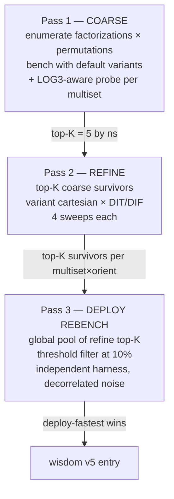

# 05 — Calibrator pipeline

The three-pass top-K + deploy-rebench search that produces v5 wisdom
entries. Lives primarily in `src/core/dp_planner.h:stride_dp_plan_measure`,
driven from `build_tuned/calibrate_tuned.c`.

This is what makes plan-level wisdom **reproducible** under measurement
noise — without the multi-pass design, the variant axis (which can flip
the factorization ranking) would be too noisy to pick a single winner
that survives across recalibration runs.

## The three passes



Each pass narrows the candidate pool while gathering more reliable
timing data on the survivors.

## Configuration knobs

From `dp_planner.h`:

```c
#define MEASURE_TOPK_DEFAULT          5    /* top-K at coarse → refine */
#define MEASURE_DP_TOPK_MULTISETS     3    /* top-K at outermost DP recursion */
#define MEASURE_MAX_CANDIDATES        1024 /* coarse candidate cap */
#define MEASURE_COARSE_RUNS           2    /* coarse sweeps for variance reduction */
#define MEASURE_REFINE_RUNS           4    /* refine sweeps for variance reduction */
#define MEASURE_DEPLOY_THRESHOLD_PCT  10   /* survivors within X% of refine-best */
#define MEASURE_DEPLOY_TOPK_MAX       5    /* hard cap on deploy survivors */
#define MEASURE_EXH_THRESHOLD         2048 /* exhaustive vs DP-driven split */
```

The headline `K_top` is `MEASURE_TOPK_DEFAULT = 5` (the cutoff between
coarse and refine). The DP `K_top = 3` is a separate, lower-level knob
on the recursive solver — see [Pass 1](#pass-1--coarse-collect-candidates)
below.

## Pass 1 — Coarse: collect candidates

Two enumeration paths chosen by `(N, pow2-ness)`:

### Path A — Exhaustive (small N, all non-pow2 N)

For `N ≤ 2048` OR any non-pow2 N:

```c
factorization_list_t flist;
stride_enumerate_factorizations(N, reg, &flist);  /* every multiset */

for each multiset:
    permutation_list_t plist;
    stride_gen_permutations(base_factors, nf, &plist);  /* every order */

    for each permutation:
        ns = _dp_bench(N, perm, K, reg);  /* default variants */
        cands.push({perm, ns});
```

This is brute-force over (factorization × permutation). Cheap because
the factorization space is small — bounded by `N`'s prime structure for
non-pow2 N, and bounded by tractable stage counts for small pow2.

### Path B — DP-driven top-K (large pow2 N)

For pow2 N > 2048:

```c
n_plans = _dp_solve_topk(N, K, reg, plans, MEASURE_DP_TOPK_MULTISETS);
                                    /* = 3 */

for each plan in plans (≤ 3):
    permutation_list_t plist;
    stride_gen_permutations(plan.factors, plan.nfactors, &plist);

    for each permutation:
        ns = _dp_bench(N, perm, K, reg);
        cands.push({perm, ns});
```

The recursive top-K DP (`_dp_solve_topk`, Upgrade D, 2026-04-27) keeps
**runners-up at every recursion level**, not just the outermost. This
matters because:

> A multiset that would have been pruned by top-1 sub-DP can still
> surface here when wrapped under a different outer radix.

For example: at a sub-problem M=512, the top-1 DP picks `[8, 8, 8]`.
But when M=512 is wrapped as the inner part of a 4096-stage plan, the
right inner factorization might be `[4, 16, 8]` because the outer R=4
benefits from a different stride pattern. Top-K-at-every-level keeps
both alternatives alive.

### LOG3-aware coarse probe (Upgrade F, 2026-04-29)

Per-permutation, after the default-variants bench, *also* bench with
LOG3 forced on every stage where a LOG3 codelet is registered (per
the registry's `vfft_variant_available` check):

```c
vfft_variant_t log3_variants[FACT_MAX_STAGES];
int has_log3_eligible = 0;
for each stage s:
    if (s == 0)                                            log3_variants[s] = FLAT;
    else if (vfft_variant_available(reg, R, DIT, LOG3))   { log3_variants[s] = LOG3; has_log3_eligible = 1; }
    else if (vfft_variant_available(reg, R, DIT, T1S))     log3_variants[s] = T1S;
    else                                                   log3_variants[s] = FLAT;

if (has_log3_eligible) {
    ns_log3 = bench_with_explicit_variants(perm, log3_variants);
    if (ns_log3 < ns) ns = ns_log3;  /* keep the better */
}
```

Why: LOG3 is high-leverage for prime radixes (R=11/13/17/25 — Winograd
codelets benefit from log3's twiddle-derivation interleaving by ±30%
because the Winograd butterfly's intermediate-result registers can
absorb log3's derivation chains without spilling). Without this
priming, a LOG3-friendly multiset would lose the coarse pass with
default variants and get pruned before refine has a chance to try
LOG3 on it.

The probe doubles coarse cost on multisets with any LOG3-registered
radix. Refine still picks the actual best variants — this just keeps
the right multiset alive at the coarse → refine cutoff.

### Coarse best-of-runs (multiset-axis variance reduction)

After the first coarse sweep, run additional sweeps over the same
candidate set and keep each candidate's min:

```c
for run in 2..MEASURE_COARSE_RUNS:
    for each cand:
        ns = _dp_bench(cand.factors, K, reg);
        if (ns < cand.cost_ns) cand.cost_ns = ns;
```

`MEASURE_COARSE_RUNS = 2` — a single extra pass. Reduces variance-
driven ranking flips that knocked the right multiset out of top-K in
earlier pilots.

## Pass 2 — Refine: top-K × variant cartesian

Sort coarse candidates by `cost_ns` ascending; take top-K (default 5).
For each:

```c
for k in 0..n_topk:
    cand = cands[k];
    for orient in {DIT, DIF}:
        vfft_variant_iter_t it;
        vfft_variant_iter_init(&it, cand.factors, cand.nf, orient, reg);

        do {
            vfft_variant_t v[FACT_MAX_STAGES];
            vfft_variant_iter_get(&it, v);

            ns = bench_with_explicit_variants(cand.factors, v, orient);
            /* MEASURE_REFINE_RUNS=4 sweeps per variant assignment */

            track top-K cheapest variant assignments globally;
        } while (vfft_variant_iter_next(&it));
```

Two important details:

1. **Cartesian iterator over per-stage variants.** `vfft_variant_iter_*`
   walks the joint space of all `(stage, variant)` assignments where
   the variant is registered for the radix in that orientation. Stage 0
   is fixed at FLAT. Stages 1+ have up to 4 options each (FLAT/LOG3/T1S/
   BUF in DIT, FLAT/LOG3 in DIF). For an nf-stage plan the search size
   is up to `4^(nf-1)` × 2 orientations.

2. **`MEASURE_REFINE_RUNS = 4` sweeps per variant assignment.** Each
   variant gets timed 4 times; minimum across sweeps is its refine
   cost. This smooths variant-axis noise — at low-K cells (K=4) the
   measurement noise floor is around 5–10% of the per-iter time, so a
   single bench can mis-rank close variants.

Refine cost per cell, ballpark: `K_top × V_avg × 2 orient × refine_runs ×
bench`. For N=4096 K=256 with V_avg ≈ 256 variant assignments per
multiset/orient:

```
5 × 256 × 2 × 4 × 100ms ≈ 1024s
```

The actual time is lower because most variant assignments fail to
build (no registered codelet for that protocol on that R). The
benchmark loop short-circuits failed builds.

### Top-K refine survivors per call

Each `_dp_variant_search` call (one multiset × one orientation) returns
its own **top-K refine winners**, not just the single best. With
`MEASURE_DEPLOY_TOPK_MAX = 5`, each call yields up to 5 best variant
assignments along with their costs.

These are pooled in Pass 3.

## Pass 3 — Deploy rebench (Upgrade H, 2026-04-29)

The global pool collects all per-call top-K survivors:

```
pool = []
for k, orient in (k_top × {DIT, DIF}):
    per_call_top = _dp_variant_search(...)
    pool.extend(per_call_top)

sort pool by cost_ns
threshold = pool[0].cost_ns × (1 + MEASURE_DEPLOY_THRESHOLD_PCT/100)  # 1.10
keep pool[i] where pool[i].cost_ns ≤ threshold, capped at MEASURE_DEPLOY_TOPK_MAX
```

Each survivor gets one `bench_plan_min` call from `calibrate_tuned.c`.
The deploy harness is **independent from the refine harness**:

- Different warmup (deploy uses 10-rep warmup vs refine's adaptive)
- Fresh plan creation (re-build + first-touch effects unmasked)
- Bench-plan-min protocol (5 trials × N reps, take min) vs refine's
  adaptive timer

This decorrelation is the noise-resistance trick. If two refine
candidates are tied within 5%, the noise that ranked them is
correlated within the refine harness. Deploy's independent harness
gives a second, decorrelated estimate; the deploy-fastest robustly
breaks the tie.

```c
double deploy_ns = 1e18;
for (int i = 0; i < n_top_k; i++) {
    plan = _stride_build_plan_explicit(N, K, top_k[i].factors, ..., orient);
    cand_ns = bench_plan_min(plan, N, K);
    if (cand_ns < deploy_ns) {
        deploy_ns = cand_ns;
        /* promote this candidate to be the wisdom entry */
        commit_to_decision(top_k[i]);
    }
}
```

## Calibrator phases (calibrate_tuned.c)

The cell-level driver wraps `stride_dp_plan_measure` with additional
pre/post phases:

| Phase | Code | Purpose |
|-------|------|---------|
| **Setup** | `calibrate_cell_measure` entry | allocate buffers, init context |
| **MEASURE** | `stride_dp_plan_measure` | the three-pass pipeline above |
| **Deploy rebench** | per-top-K loop | independent-harness final ranking |
| **Blocked refine** | `try_blocked_refine` | try blocked executor for K ≤ 8 medium N |
| **Roundtrip verify** | `roundtrip_err` | correctness gate (err < 1e-12) |
| **Commit** | `stride_wisdom_add_v5` | write entry to in-memory wisdom |
| **Save** | end-of-run | flush to `vfft_wisdom_tuned.txt` |

Phases run sequentially per cell; after all cells are done, the wisdom
file is written.

## EXTREME mode (PATIENT-style joint cartesian)

```c
typedef enum {
    CALIB_MODE_MEASURE = 0,    /* default: top-K + variant cartesian */
    CALIB_MODE_EXTREME = 1,    /* full joint cartesian */
} calibrate_mode_t;
```

EXTREME runs *every* coarse candidate through the full refine variant
cartesian, with no top-K cutoff. This is the FFTW PATIENT analog —
expensive but optimal.

Cost vs MEASURE (N=4096 K=256):

| Mode | Wall time | Quality |
|------|-----------|---------|
| MEASURE-topk (default) | ~200 s | within 3–12% of EXTREME |
| EXTREME | ~3000 s | optimal |
| Speedup | **15×** | small quality loss |

EXTREME is **opt-in** — set the calibrator's mode at command-line
launch. Shipped wisdom uses MEASURE.

## Variance-resistance ladder (summary)

The whole pipeline is layered to handle measurement noise:

| Layer | Reduces |
|-------|---------|
| `MEASURE_COARSE_RUNS = 2` | multiset-axis noise (avoids mis-ranking the right multiset out of top-K) |
| LOG3-aware coarse probe (Upgrade F) | systematic mis-pruning of LOG3-friendly multisets |
| Top-K = 5 cutoff | keeps multiple multiset candidates alive past coarse |
| Top-K-at-every-level DP (Upgrade D) | exposes sub-problem runners-up that wrap differently outside |
| `MEASURE_REFINE_RUNS = 4` | variant-axis noise (worse than multiset-axis at low-K) |
| Per-call top-K refine survivors | preserves refine alternatives for cross-call comparison |
| Global pool sort + 10% threshold filter (Upgrade H) | drops obvious losers without missing within-noise ties |
| Deploy rebench with independent harness (Upgrade H) | breaks variant-axis ties via decorrelated-noise estimator |
| Roundtrip-error gate | catches the rare correctness regression at the same cost |

## Upgrade history

All landed during v1.2 development:

| Upgrade | Date | Purpose |
|---------|------|---------|
| A | 2026-04-26 | DP cache key changed from `N` to `(N, K_eff)` |
| B | 2026-04-26 | Timing harness mirrors FFTW's adaptive timer |
| C | (no date) | `believe_subplan_cost` toggle (FFTW BELIEVE_PCOST analog) |
| D | 2026-04-27 | Top-K-at-every-level recursive DP solver |
| E | 2026-04-27 | Hybrid: pow2 N>threshold uses DP top-K, non-pow2 stays exhaustive |
| F | 2026-04-29 | LOG3-aware coarse probe |
| G | 2026-04-29 | Per-variant best-of-runs (`MEASURE_REFINE_RUNS = 4`) |
| H | 2026-04-29 | Global top-K pool + threshold filter + deploy rebench |

Structurally: A/B (foundation) → D/E (top-K propagation through DP) →
F/G/H (noise resistance via priming + best-of-runs + deploy decorrelation).

## See also

- [04_layer2_plan_level.md](04_layer2_plan_level.md) — the wisdom file the calibrator writes to
- [06_lookup_pipeline.md](06_lookup_pipeline.md) — the consumer side
- [`src/core/dp_planner.h:stride_dp_plan_measure`](../../src/core/dp_planner.h) — the three-pass code
- [`build_tuned/calibrate_tuned.c:calibrate_cell_measure`](../../build_tuned/calibrate_tuned.c) — the per-cell driver
