# 06 — Lookup pipeline

How `stride_wise_plan` consumes wisdom at plan creation time. Three
paths — wisdom hit, wisdom miss with smooth N, prime N. Bluestein and
Rader recursion through the planner are explicit goals, not accidents,
and we'll compare with FFTW's analogous design at the end.

## Top-level flow

```mermaid
flowchart TD
    A[stride_wise_plan&#40;N, K, reg, wis&#41;] --> B{wisdom hit?}
    B -->|hit, v5| C[has_variant_codes?]
    C -->|yes| D[_stride_build_plan_explicit<br/>factors + variants + orient]
    C -->|no, v3/v4 legacy| E[_stride_build_plan_dif if use_dif_forward<br/>else _stride_build_plan]
    B -->|miss| F{N composes via<br/>available radixes?}
    F -->|yes| G[stride_factorize → _stride_build_plan]
    F -->|no, prime| H{Rader-friendly<br/>N-1 smooth?}
    H -->|yes| I[stride_rader_plan&#40;recurse with wisdom&#41;]
    H -->|no| J[stride_bluestein_plan&#40;recurse with wisdom&#41;]
    I --> A
    J --> A
    style D fill:#e6ffe6,stroke:#208020
    style G fill:#fff7e6,stroke:#a06000
    style I fill:#fffae6,stroke:#a06000
    style J fill:#fffae6,stroke:#a06000
```



- **Green (D)** is the production path. Wisdom-driven explicit build:
  the exact plan the calibrator measured to be fastest, with all
  per-stage variant codes set from the wisdom entry. No inference, no
  fallback heuristics.
- **Yellow (I, J)** are prime-handling recursion. The outer plan is
  Bluestein or Rader; `stride_auto_plan_wis` recurses with the wisdom
  struct so the inner FFT gets the same treatment as a top-level call.

The other branches (E, G — wisdom miss, legacy v3/v4 entries) are
**transitional**. They build a plan from a factorization but without
the calibrator's per-stage variant guidance. Today they pull variant
choices from per-codelet predicates as a stop-gap; that dependency is
scheduled for removal once the calibration grid covers all production
cells (including Bluestein/Rader inner sizes) and the cost model
handles whatever's left. New code should not assume the miss-path
predicate consultation is permanent infrastructure.

## Path 1 — Wisdom hit, v5 entry

`_stride_build_plan_explicit` builds the exact plan recorded in wisdom:

```c
const stride_wisdom_entry_t *e = stride_wisdom_lookup(wis, N, K);
if (e && e->has_variant_codes) {
    vfft_variant_t variants[STRIDE_MAX_STAGES];
    for (int s = 0; s < e->nfactors; s++)
        variants[s] = (vfft_variant_t)e->variant_codes[s];

    plan = _stride_build_plan_explicit(
        N, K, e->factors, e->nfactors,
        variants, e->use_dif_forward, reg);

    plan->use_blocked = e->use_blocked;
    plan->split_stage = e->split_stage;
    plan->block_groups = e->block_groups;
}
```

No predicate consultation. The wisdom dictates per-stage variants.
`_stride_build_plan_explicit` walks the variants and attaches the
right codelet pointers per stage:

| Variant code | DIT codelet | DIF codelet | Notes |
|--------------|-------------|-------------|-------|
| FLAT | `t1_fwd[R]` | `t1_dif_fwd[R]` | base case |
| LOG3 | `t1_fwd_log3[R]` | `t1_dif_log3_fwd[R]` | log3 derivation |
| T1S | `t1_fwd[R]` + `t1s_fwd[R]` overlay | (not available in DIF) | executor prefers t1s |
| BUF | `t1_buf_fwd[R]` | (not available in DIF) | buffered flat dispatcher |

Returns NULL if the variant code references a codelet that isn't
registered for `(R, orient)`. That's a registry inconsistency, not a
runtime fallback case — the calibrator's iterator should have already
filtered impossible assignments via `vfft_variant_available`.

## Path 2 — Wisdom miss, smooth N (transitional)

```c
stride_factorization_t fact;
if (stride_factorize(N, K, reg, &fact) == 0)
    return _stride_build_plan(N, K, fact.factors, fact.nfactors, reg);
```

`stride_factorize` runs the cost-model-free greedy factorizer; the
result is built via `_stride_build_plan`. This is what runs today
when wisdom doesn't cover an `(N, K)` and the size is smooth enough
to factor directly.

The variant-attachment logic in `_stride_build_plan` is currently
predicate-driven — a vestigial path that's being unwound as wisdom
coverage grows. Production callers should be hitting Path 1 (wisdom
hit) for any cell that matters; Path 2 is a stop-gap, not a feature
to design around.

## Path 3 — Prime N, recurse with wisdom

```c
if (_stride_is_prime(N)) {
    if (_stride_is_rader_friendly(N)) {
        int nm1 = N - 1;
        size_t B = _bluestein_block_size_T(nm1, K, num_threads);
        stride_plan_t *inner = stride_auto_plan_wis(nm1, B, reg, wis);
        return stride_rader_plan(N, K, B, inner);
    }
    else {
        int M = _bluestein_choose_m(N);
        size_t B = _bluestein_block_size_T(M, K, num_threads);
        stride_plan_t *inner = stride_auto_plan_wis(M, B, reg, wis);
        return stride_bluestein_plan(N, K, B, inner, M);
    }
}
```

Two prime-handling algorithms:

- **Rader** (when `N-1` is smooth) — turns the N-point prime DFT into
  a (N-1)-point convolution. Inner FFT is at size `N-1`.
- **Bluestein** (general prime) — pads to a smooth size `M ≥ 2N-1`,
  uses chirp-z multiplication. Inner FFT is at size `M`.

Both recurse through `stride_auto_plan_wis`, which carries the wisdom
struct through. If the inner `(M, B)` or `(N-1, B)` cell has a wisdom
entry, the inner plan is built from it (Path 1 above). Otherwise the
inner plan falls through to predicates or factorization.

`stride_auto_plan_wis` is the outer `stride_wise_plan`'s recursion-
friendly variant — same logic, but doesn't refuse to recurse if its
own (N, K) wasn't found.

## Bluestein/Rader wisdom recursion: comparison with FFTW

This pattern — passing planner state through prime-handling recursion
— is **shared with FFTW**. Both `dft/bluestein.c:206` and
`dft/rader.c:241` in FFTW 3.3.10 do the equivalent:

```c
/* FFTW's bluestein.c */
cldf = X(mkplan_f_d)(plnr,                          /* ← planner passed through */
                     X(mkproblem_dft_d)(...),
                     NO_SLOW, 0, 0);

/* Our planner.h */
stride_plan_t *inner = stride_auto_plan_wis(M, B, reg, wis);
                                                       /* ↑ wisdom passed through */
```

What differs is the **shape of the wisdom carried**:

| | FFTW | VectorFFT |
|---|------|-----------|
| Wisdom representation | accumulated planner state (hashtable of seen problem signatures → best plans) | fixed-cell table indexed by `(N, K)` with explicit per-stage variant codes |
| Inner-FFT lookup | "have I solved this problem signature before?" | "is the inner `(M, B)` cell calibrated?" |
| Variant selection in inner | hidden in FFTW's solver search | explicit per-stage codes + same Layer 1 fallback as outer |

Both libraries get the same architectural benefit: prime sizes
inherit calibration quality from their inner FFT cells. The pattern
itself is not novel; the **shape of what's carried** is what differs.

The novelty section in [00_thesis.md](00_thesis.md) is honest about
this — we don't claim novelty for the recursion design.

## Inner-cell calibration coverage

For Bluestein/Rader to benefit from wisdom recursion, the inner cells
need to be in the calibrator's grid:

- **Bluestein inner** — `(M, B)` where `M` is the smooth padding size
  for the prime `N`, and `B` is the K-block size for the FFT-IFFT
  convolution. The calibrator's grid includes the M values that
  `_bluestein_choose_m` produces for the bench's prime sizes
  (127, 251, 257, 401, 641, 1009, 2801, 4001 — see
  `calibrate_tuned.c:GRID_N`).
- **Rader inner** — `(N-1, B)`. Same calibrator grid coverage.

If the inner cell is missing, the inner plan falls through to Path 2
(predicate-driven). Quality degrades but doesn't crash.

## Threading awareness in inner-K

`_bluestein_block_size_T` is a thread-aware K-block-size chooser:

```c
size_t _bluestein_block_size_T(int M, size_t K, int num_threads);
```

Larger `num_threads` produces smaller blocks (more parallel work
units). The wisdom lookup queries the resulting `B`, so a multi-
threaded run gets a different (M, B) cell from a single-threaded run.
Both should be calibrated if both are used in production.

## Lookup performance

`stride_wisdom_lookup` is a linear scan of the in-memory table. With
~200 entries shipped, that's ~5 µs in cold cache. Cell hits dominate
the time (Path 1 dominates Path 2/3 in production).

For users with very large wisdom files (a hashtable would be needed
above ~1000 entries) the implementation can be swapped without
changing the API. Currently linear is fine.

## What plan-build does NOT do

To stake the design boundaries explicitly:

- **No re-measurement.** Plan-build never times anything. If wisdom is
  missing, predicates or factorization fill the gap; we don't fall
  back to "measure it now" because plan-build is supposed to be µs,
  not seconds.
- **No cost-model consultation.** `stride_estimate_plan` is the
  cost-model entry point; `stride_wise_plan` only uses wisdom +
  predicates. They share the lower `_stride_build_plan_explicit` /
  `_stride_build_plan` plumbing but their decision logic is
  independent.
- **No cross-cell extrapolation.** Wisdom for `(N=1024, K=256)` is
  not used to inform `(N=1024, K=128)`. Each cell stands alone. The
  calibrator's grid choice covers production K values explicitly.

## See also

- [04_layer2_plan_level.md](04_layer2_plan_level.md) — what's stored in the wisdom file
- [03_layer1_per_radix.md](03_layer1_per_radix.md) — the predicate fallback path
- [`src/core/planner.h:stride_wise_plan`](../../src/core/planner.h) — the entry point
- [`src/core/planner.h:_stride_build_plan_explicit`](../../src/core/planner.h) — variant-aware builder
- [`src/core/planner.h:stride_auto_plan_wis`](../../src/core/planner.h) — the recursion vehicle
- FFTW 3.3.10 [`dft/bluestein.c`](../../vcpkg/buildtrees/fftw3/src/fftw-3-29b71c9c47.clean/dft/bluestein.c) and [`dft/rader.c`](../../vcpkg/buildtrees/fftw3/src/fftw-3-29b71c9c47.clean/dft/rader.c) for comparison
