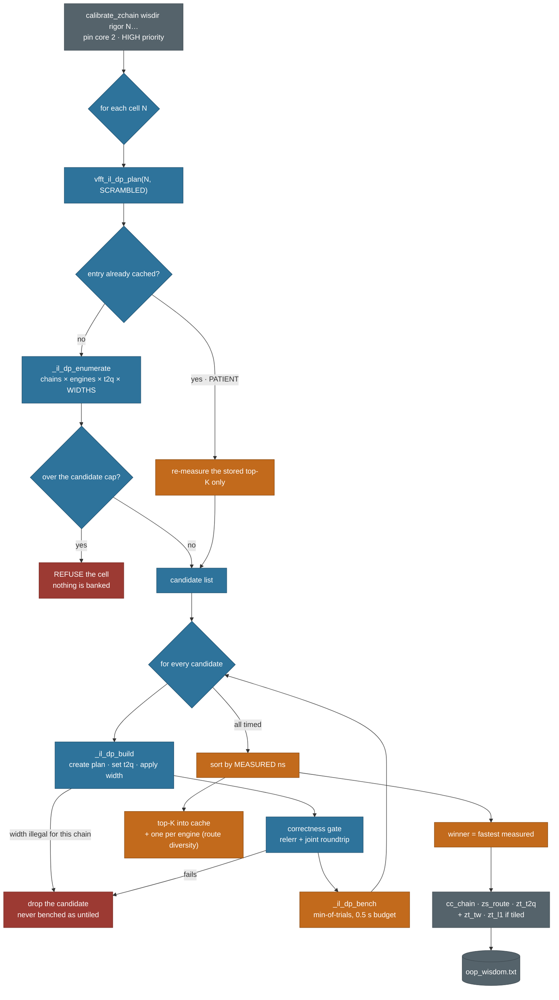
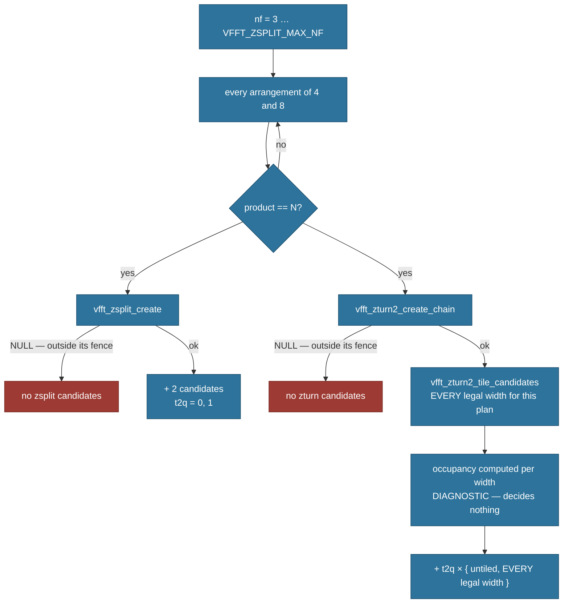
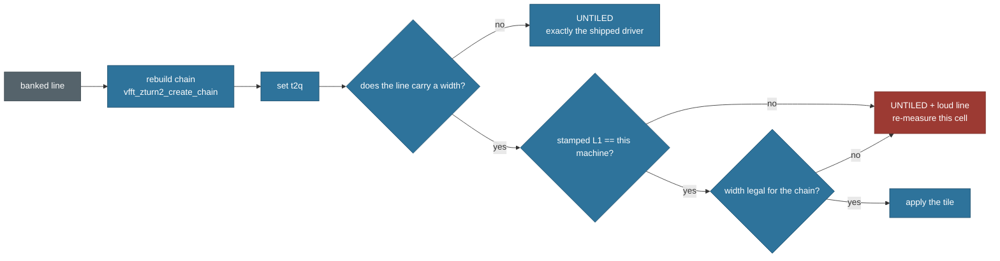

# 10 — ZTURN cascade calibration flow

The K=1 SCRAMBLED cascade (`kind-4` wisdom) has its **own** calibrator, separate
from the plan-level pipeline in [05_calibrator_pipeline.md](05_calibrator_pipeline.md).
It lives in `src/core/planning/dp_planner_il.h` and is driven by
`build_tuned/benches/calibrate_zchain.c`.

This document is the sequence, end to end, plus the one distinction that governs
how to read it.

> **The governing question for every step: was this decided by a model, or by
> the clock?** Nothing the model does ever *ranks* a plan. It only decides what
> gets built and timed. The winner is always the fastest measured candidate.

Colour in the diagrams below encodes exactly that:

| | meaning |
|---|---|
| 🟦 **blue** | model — arithmetic only, no measurement |
| 🟧 **amber** | clock — a real timed run decides |
| 🟥 **red** | refused or dropped |
| ⬜ **grey** | I/O and persistence |

---

## 1. The run



The model/clock boundary is a single edge: `_il_dp_build` → `_il_dp_bench`.
Everything above it decides *what to try*; everything below it is a stopwatch.
**No cost model participates in the ranking.**

Two consequences worth stating explicitly:

- A chain that looks bad in one configuration cannot be disqualified by that,
  because each configuration is its own candidate. (Benchmark-derived, this
  host, 2026-08-02: at N=16384 the all-radix-4 chain measured *slower* than the
  banked chain untiled, and *fastest of everything* once tiled.)
- **Overflowing the candidate cap refuses the cell rather than truncating it.**
  Silently keeping a prefix would bank "the best of a biased subset" — the
  enumerator walks `nf` ascending, so a truncation systematically eats the
  highest-`nf` chains first.

---

## 2. Inside the enumerator — per chain



Points that are easy to get wrong:

- **Chain legality is never re-implemented here.** Each chain is validated by the
  engine's own `create`; a chain outside a fence returns `NULL` and that engine is
  skipped for it. A second copy of a validator drifts.
- **Widths are ZTURN-only.** The legacy zsplit engine has no tiled path.
- **Widths are enumerated per chain, against that chain's own ladder.** The same
  tile size costs different amounts on different chains, because the twiddle half
  depends on where the radix-8 passes sit.
- **The untiled candidate is always emitted**, even where tiling looks
  attractive. Tiling is a per-cell verdict, not a default — remove the untiled
  arm and "tiled is faster here" becomes unfalsifiable.
- **A width the fence rejects DROPS the candidate**; it must never fall back to
  untiled under a tiled label, which would record "this width is no faster" for
  an arm that never ran.

---

## 3. Why there is no width filter at all

Occupancy — the fraction of L1 taken by tile plus its twiddle window — is an
**exact byte count**, not a fitted quantity. It is computed and reported for
every candidate because it *explains* results. It decides nothing.

There *was* a filter: an occupancy band plus a keep-the-closest-to-a-target
rule, both fitted to a handful of cells on one machine. Both were **removed by
decision** (2026-08-02), for two reasons:

1. **A wrong filter here is undetectable from its own output.** An excluded
   width is never benched and leaves no trace in the results — the only failure
   mode in this search invisible to its own evidence. (And occupancy is a bad
   ranker anyway, benchmark-derived: at N=8192 a tile at ~99.9% of L1 fusing
   four passes measured faster than one at ~49.7% fusing three. Occupancy
   cannot see passes fused, per-call cost, associativity, or anything else
   sharing L1.)
2. **Calibration time is the product, not overhead.** MKL can hardcode per-N
   parameters because it targets one vendor's chips; this library cannot, so it
   measures. A long calibration is the tax paid for running well on
   configurations nobody tuned for.

The audit run the filter could never provide about itself, performed once it
was gone: unfiltered N=16384 benched **179 candidates instead of 70 and
produced the same winner** — in 15 seconds, not the minutes the filter was
supposedly saving.

The only bound left is the caller's array size (`VFFT_IL_DP_TILE_KEEP`, sized
to hold every legal width), and exceeding it is reported as a **sizing bug**,
never silently resolved by preference. `build_tuned/benches/zturn_tile_census.c`
prints the full legal space with occupancies without running the planner.

---

## 4. What gets banked

```
N 1 4 zs_t2q cc_chain ns [zs_route zt_t2q [zt_tw zt_l1]]
```

| field | meaning |
|---|---|
| `cc_chain` | chain, encoded as decimal digits of log₂ of each factor (`232223` = `4.8.4.4.4.8`) |
| `zs_route` | winning engine — 1 = ZTURN |
| `zt_t2q` | terminator twin pick for the winning route |
| `zs_t2q` | the *fallback* route's pick, so a legacy fallback still has one |
| `zt_tw` | tile width in **complex points**; **0 = UNTILED** |
| `zt_l1` | the L1 data-cache size in bytes the width was measured against |

Both trailing pairs are optional and are emitted only when they carry
information, so a verdict that used neither re-banks byte-identically to the
older format. **`zt_tw == 0` meaning untiled is what makes every pre-existing
line replay as the shipped driver — there is no sentinel to forget.**

`zt_l1` is the only banked quantity that describes the *machine* rather than the
transform. A chain or a radix ports anywhere; a tile width does not.

---

## 5. Replay



There is deliberately **no amber here**: nothing is measured at replay. All of
this happens inside `_vfft_create_inner` — the *planning* side. Nothing in this
flow, including the CPUID query behind `vfft_cpu_l1d_bytes()`, may reach an
execute path; `build_tuned/exec_purity_audit.py` exists to enforce that.

A missing width, a mismatched cache, or a width the chain cannot express all
resolve the same way: **untiled, and say so.** Never "use it anyway" — a tile
sized for a cache that isn't there loses its entire benefit at once rather than
degrading, which is the failure mode least likely to be noticed.

Two operational rules, both bought with real incidents (2026-08-02):

- **Explicit env beats wisdom.** If `VFFT_TCUT` is set to *anything* (including
  `off`), the banked width is NOT applied — same convention as
  `VFFT_FORCE_ZROUTE`. Without this, `bench_1d_vs_mkl --tcut=off` against a
  width-carrying wisdir silently ran TILED, and every off-vs-tiled A/B compared
  tiled against tiled.
- **A stale binary STRIPS new wisdom fields on writeback.** A bench compiled
  before the width field existed re-banked `oop_wisdom.txt` through its old
  writer during a create-time stamp and silently dropped the width pair from
  every line; the next (current) binary then honestly measured a degraded file.
  The round-trip gate cannot catch this — the old binary passes its *own* round
  trip. After adding a wisdom field, **rebuild every binary that can write
  wisdom before any of them touches a calibrated file**; when a banked width
  vanishes, suspect a stale writer's writeback first.

---

## Reproducing

```sh
# 🔴 always a SCRATCH wisdir; never let a calibration probe write banked wisdom
cp src/dag-fft-compiler/generator/generated/*.txt $SCRATCH/wisdir/

python build_tuned/build.py --src build_tuned/benches/calibrate_zchain.c --vfft --compile
VFFT_IL_DP_VERBOSE=1 calibrate_zchain.exe $SCRATCH/wisdir 1 16384

# the legal width space for a cell, with occupancies — no timing, no machine state
python build_tuned/build.py --src build_tuned/benches/zturn_tile_census.c

# nothing from this flow may run per transform
python build_tuned/exec_purity_audit.py
```

Related:

- [../performance/zturn_cascade_tiling.md](../performance/zturn_cascade_tiling.md)
  — **what a tile width *is***: the loop interchange, why the reorder is legal,
  why the working set is ~2× the tile, and the measurements. Read that first if
  the `zt_tw` field here is the unfamiliar part.
- [../roadmap/cascade_load_path_restructure.md](../roadmap/cascade_load_path_restructure.md)
  — the ZTURN restructure campaign this calibrator serves.
- [05_calibrator_pipeline.md](05_calibrator_pipeline.md) — the split-engine
  pipeline this one is *not*.
- [06_lookup_pipeline.md](06_lookup_pipeline.md),
  [09_decisions.md](09_decisions.md).
