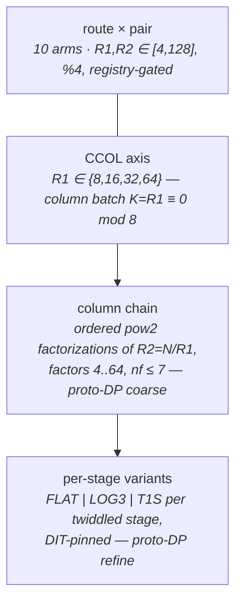

# `core/oop/` — out-of-place C2C engine

Complex→complex FFT where **`src ≠ dst`** (input preserved, output to a separate
buffer) — the OOP counterpart to the in-place engine in `core/engine/`. Same
**column/split** layout (element *e* of transform *t* at `[e·K + t]`, matching the
stride executor and MKL's `DFTI_REAL_REAL`).

**Why OOP exists.** Two reasons: (1) some callers need the input intact (and a
dedicated OOP path is faster than copy-then-in-place); (2) it's the win for the
**high-K real-FFT pack tax** — an OOP stage-0 reads the real input *directly* with
separate in/out strides, killing the de-interleave copy that the split layout otherwise
owes (see `docs/performance/high_k_real_fft_architecture_wall.md` §3a). Productionized,
it **beats MKL 1.46×–2.64×** across all 10 calibrated cells (`docs/oop_c2c_engine.md`).

---

> This section family covers the **caller-batched** lanes (kinds 0–2,
> `K ≡ 0 mod 8`). The **single-transform split lane** (kind-3 `sp_*` axis —
> one caller FFT, lane-batched internally) is documented in **"The
> split_oop search space"** section below.

## The 2 axes and 3 kinds

A plan is a tagged union (`vfft_oop_plan_t`) over three execution **kinds**, and
choosing one is a **two-axis** decision (the axes are coupled — best factorization
depends on kind, best kind depends on its best factorization):

- **Axis 1 — kind:** LEAF vs BAILEY2 vs MODEB.
- **Axis 2 — factorization:** BAILEY2's `R1×R2` pair, or MODEB's multi-factor list.

| kind | what it is | order |
|------|-----------|-------|
| **LEAF** | `N≤128` with a single OOP leaf codelet — one call, column layout. (Two-stage at single-codelet N costs a measured 15–20% transposed-intermediate tax → direct is the rule.) | natural |
| **BAILEY2** | fused four-step two-factor (`N=R1·R2`): s1 = `R1` calls of the `R2`-point `n1_oop` leaf with the **transpose fused into the stores**; s2 = one `t1p(R1)` pass in-place on `dst` with a K-replicated twiddle table. | natural `X[k2+R2·k1]` |
| **MODEB** | general-N via the **in-place stride engine, OOP-adapted** (`oop_execute.h`): stage 0 runs OOP (reads `src`, writes `dst`), stages 1.. run in-place on `dst` — no extra copy. Takes wisdom/DP factor lists. **Requires DIT.** | scrambled (digit-perm) |

MODEB inherits the in-place engine (the 238/238-vs-MKL winner) redirected to a separate
output — so it's the **workhorse**: its DP-optimal multi-factor decomposition beats the
2-factor BAILEY2 in most cells. BAILEY2/LEAF use dedicated column-layout OOP codelets
and emit **natural order**; MODEB is scrambled (digit-reversed), bit-identical to the
in-place dataflow.

### The rule spine (`oop_plan.h::vfft_oop_plan_create`)
`K % 8 != 0` is rejected outright — **K must be a multiple of 8** (the vector-lane ABI
contract; a sub-8 K overruns each leg slice, measured as heap corruption — so K=256 etc.
is exactly what the path wants, K=4 is the illegal one). Then: **LEAF** (N≤128 with a leaf
codelet) → **BAILEY2** (best unmasked divisor pair) → **MODEB** (from the supplied factors).

**Aliasing mask (BAILEY2).** A Bailey stage whose j-stride (doubles) is a multiple of
**4096 (a 32KB stride) with > 8 streams** is *masked* and skipped (`oop_plan.h:79`). This
is the empirically-measured catastrophic-aliasing boundary: at a 32KB-multiple stride,
consecutive streams land in the same L1 sets *and* tend to collide in L2 too, so neither
cache absorbs them. (A stride that aliases only the **4KB / 512-double L1 set period**
— `size/associativity = 32KB/8` — e.g. `13·512` doubles, is caught by L2 under the DFT
arithmetic and measures fine; the catastrophe needs *both* levels aliasing, hence 4096
not 512.) Both stages are checked (`R2·K` with R1 streams; `R1·K` with R2 streams). Masked
cells fall through to MODEB (whose small-radix wisdom factorizations fit associativity).
Among unmasked pairs the static preference is **balanced-first** (min `|R1−R2|`), then the
**fatter leaf** (max R2); the tuner overrides per cell.

### MODEB's OOP adapter (`oop_execute.h`)
The `n1` codelets are contractually out-of-place (7-arg: pass `in==out`, `is==os` for
in-place). DIT stage 0 is untwiddled in every group → run it `src→dst` (same strides,
same geometry), then resume stages 1.. in-place on `dst` via a **shallow plan view with
the stage table shifted by one**. Output is bit-identical to running the in-place generic
executor on a copy, and `src` is preserved. Rejected (`-1`, never UB): DIF plans (stage 0
carries twiddles there) and any twiddled stage-0 group.

---

## The codelet ABIs (`oop_codelets.h`, `oop_leaf_registry.h`)

Two distinct ABIs (mixing them is a deliberate compile error):
- **REGULAR** (11-arg, `vfft_oop11_fn`) — runtime strides:
  `fn(sr,si, dr,di, Wr,Wi, in_leg, in_grp, out_leg, out_grp, me)`.
- **SPEC** (7-arg, `vfft_oop7_fn`) — strides **baked at codegen** (`rv = r·8`):
  `fn(sr,si, dr,di, Wr,Wi, me)`.

Within each ABI, three codelet kinds:
- **`n1`** — no-twiddle leaf (`W=NULL`).
- **`t1p`** — twiddled stage, **FLAT** — the *default* (fewer FMA).
- **`t1p_log3`** — twiddled stage, **LOG3** — a **port-rebalancing opt-in** (spends idle
  FMA-port slack to relieve LOAD-port pressure: more FMA, fewer twiddle loads). It wins
  *only* when a stage is load-bound with FMA slack — **not a strict upgrade** over flat.

> **Known wart:** BAILEY2's s2 currently **hardcodes `t1p_log3`** (`oop_plan.h:101`, the
> `p->t1p = vfft_oop_t1p_fn(R1)` assignment; rationale TODO at `:90`). The
> flat-vs-log3 choice should move into the planner's port/memboundness model — the
> auto-emitted `oop_codelets_t` already exposes both `t1p[R]` and `t1p_log3[R]` as
> distinct slots. Until then the hardcode is the documented default, not an oversight.

`oop_leaf_registry.h` is the hand-written fast-path switch (`vfft_oop_leaf_fn`,
`vfft_oop_t1p_fn`); `oop_codelets.h` is the ABI-typed struct the **auto-emitted**
`oop_registry_{isa}.h` populates (coverage-complete; coexists during the transition).
ISA is a per-binary choice (`__AVX512F__` → avx512 + GROUPW=8, else avx2 + GROUPW=4).

---

## Planning layers — how a plan gets chosen

| file | role |
|------|------|
| `oop_plan.h` | the 3-kind plan + LEAF/BAILEY2 constructors + `vfft_oop_execute_fwd/bwd` dispatch + the rule spine |
| `oop_execute.h` | MODEB's OOP adapter onto the stride engine (boundary-fused, no copy) |
| `oop_auto.h` | wisdom/hint auto-create + the **BAILEY2 pair tuner** (`vfft_oop_tune_pairs`) |
| `oop_dp.h` | DP-backed MODEB + the **2-axis joint chooser** (`vfft_oop_plan_create_dp_best`) |
| `oop_wisdom.h` | the separate `oop_wisdom.txt` (2-axis format) + load/lookup + **runtime pure-lookup** constructor |
| `oop_leaf_registry.h` / `oop_codelets.h` | codelet externs (hand switch) / ABI-typed auto-registry struct |
| `oop_mt.h` | OOP lane-slice MT — threads over the lane axis of an out-of-place plan |
| `zturn_mt.h` | cascade MT kernels plus the ZTURN dispatcher and its racer |
| `k1_commit.h` | K=1 wisdom replay, race-and-bank, and commit — the front door to the three K=1 tiers (mono ≤64, Bailey 128–1024, cascade ≥2048) |
| `c2c_ip_create.h` | c2c IN-PLACE create tier: the caller-supplied-batch arm and the self-allocating arm. Padded vs unpadded is the `(N,K)` vs aligned `(N,Kp)` wisdom cell, not a branch |
| `c2c_oop_create.h` | c2c OUT-OF-PLACE create tier — a separate serving with its own wisdom family, not in-place with a copy bolted on |

**The pair tuner (`vfft_oop_tune_pairs`)** is the entire searched residue for BAILEY2:
it enumerates unmasked divisor pairs (+ the direct LEAF at N≤128), times each finished
plan **same-binary, round-robin, min-of-15-rounds**, and returns the winner. Everything
else about BAILEY2 is rule, not search.

**The 2-axis joint chooser (`vfft_oop_plan_create_dp_best`, calibration-time):**
1. *Axis 2, native kinds:* the tuner picks LEAF or the best BAILEY2 pair.
2. *Axis 2, MODEB:* the DP planner (`dp_planner.h`) picks the best multi-factor decomposition.
3. *Axis 1:* time the two champions round-robin, **keep the faster.** (LEAF short-circuits.)

This is what resolves the K-dependent kind flip by *measurement*: at **N=1024**, BAILEY2
`32×32` wins at K=120, but at K=256 every unmasked pair aliases → DP-MODEB `4⁵` wins
(**0.74×→1.49× MKL** — the loss is fixed by searching both axes, not a hand rule).

**Lifecycle (mirrors rfft/c2r/c2c — each has its own wisdom):** the offline calibrator
runs `dp_best` over a grid → writes `oop_wisdom.txt`; the runtime
`vfft_oop_plan_create_wisdom(N,K,&wis,reg)` does a **pure lookup + build, no measurement**
(rule/DP fallback on miss). One line per `(N,K)` encodes both axes:
`N K kind [params] ns` (0=LEAF; 1=BAILEY2 `R1 R2`; 2=MODEB `nf f0..`).

---

## The split_oop search space (kind-3, one caller transform)

The **split_oop engine** serves a caller who asks for **one** split-layout FFT
of length N. Terminology: "split" implies the SIMD **lane batch** — split
layout has no intra-complex parallelism, so the 4 AVX2 lanes (8 on a future
AVX-512 port) always hold 4 independent same-shaped problems. Here those are
the **decomposition's own sub-DFTs** (four-step: N = R1·R2 → R1 independent
R2-point DFTs, GROUPW of them per iteration) — versus the caller-batched
kinds above, where the lanes are the caller's own transforms (hence their
`K % 8` contract, which this lane exists to not need). The wisdom cell key is
`(N, K=1)`: K in wisdom counts **caller** transforms.

Planner: `core/planning/dp_planner_split_oop.h` (`vfft_sp_dp_plan_and_bank`;
`benches/calibrate_k1.c` is a thin driver — calibrators hold no planning
logic). Verdicts bank on the kind-3 line's `sp_*` fields (+ `cc_chain` when
CCOL wins); create resolves wisdom into plan arguments; execute reads nothing.

### The searched axes

**Route × pair** (kernel binding: leaf = radix **R2** run R1 times; mid =
radix **R1** over R2 columns):

| route | kernels |
|---|---|
| `3P` / `3P-ip` | `n1_oop(R2)` → SIMD transpose sweep → flat `t1_oop(R1)` |
| `2PA` | `n1_oop(R2)` → `t1_oop_ul(R1)` (transpose in the mid's load lattice) |
| `2PB` | `n1_oop_ugul(R2)` (transpose in the leaf's stores) → flat `t1_oop(R1)` |
| `TWL` | 2PA with the linear consumption-order twiddle stream (`t1_oop_ul_twl`) |
| `3P-L3` / `2PA-L3` | log3 mid twins swapped in at create |
| `MONO` / `MONO-ALT` | whole-N kernel, no leaf/mid: the SOLO kernels `radixN_z_n1[_bwd]` at every N in 2..64 (form 0; in place the alias-tolerant `n1c` twins) and the fused `mono64_8x8_il` (form 1, N=64) — the planner races the forms against the pairs (`vfft_k1_mono_il_form_fn`, 2026-09-04) |
| `CCOL` | the nested space below |

**CCOL** — the only route with no leaf-radix ceiling; one candidate =
`t1_oop(R1)` mid + an entire **proto-engine column plan** at `(R2, K=R1)`,
i.e. the caller-batched engine above used as a component:

1. **R1 ∈ {8,16,32,64}** — picks the flat mid and the column batch width
   (R1=4 violates the column engine's `K % 8`; `t1_oop@128` does not exist).
2. **Column chain** — ordered pow2 factorizations of R2 (factors 4–64,
   `nf ≤ VFFT_K1_CC_MAX_NF = 7`; the `cc_chain` wisdom token encodes digits
   2–6). Stage 0 = `n1` (the fused OOP boundary, `oop_execute.h`); coarse
   search + top-K by the proto DP (`measure.h`).
3. **Per-stage variants** — {FLAT `t1_dit`, LOG3 `t1_dit_log3`, T1S
   `t1s_dit`} per twiddled stage, **DIT-pinned** (the OOP boundary rejects
   DIF). Refine = the variant cartesian on each surviving chain.

The winning inner tuning banks as an ordinary spike-wisdom line keyed
`(R2, K=R1)` — shared with genuinely batched callers at the same key. Write
policy: a DIF-tuned shared line is **never overwritten** (different
objective); write only when the cell is absent or an existing DIT line is
beaten. At create, the CCOL replay accepts the spike line's variants only
when it is DIT and its factors equal the decoded `cc_chain`; otherwise the
column plan falls back to T1S defaults.

### Outside the space (current scope, not design limits)

- **No kernel-variant (`sp_kv`) axis yet** — one interior per radix; the
  raced diversity is route-encoded (UL/ugul/TWL/L3). Chartered:
  `docs/roadmap/split_bailey_parity_plan.md`.
- `t1p`/`t1p_log3` broadcast mids are unreachable at caller-K=1 (the
  per-block alignment gate never holds) — they belong to the batched kinds.
- `t1_dif_oop` (post-twiddle DIF mids) — no K=1 route selects them.
- The CCOL combine pass races only the **flat** `t1_oop`; its UL/TWL/log3
  twins are a possible future extension.
- Under `--jit` builds the split routes are served by whole-route bakes
  keyed `(N,R1,R2,route)` — verdicts raced here are measured on the non-JIT
  executors.
- Odd/prime N (native split Rader/Bluestein routes) are chartered future
  members of this enumeration — see the planner header.

## Results & gotchas

Pure-lookup rebuild beats MKL (NOT_INPLACE split) **1.46×–2.64× on all 10 calibrated
cells**, correctness verified (MODEB bit-exact vs in-place; LEAF/BAILEY2 roundtrip
≤1.5e-14). Full table in `docs/oop_c2c_engine.md`.

- **MODEB output is scrambled (digit-reversed) order** — correctness is *bit-exact vs the
  in-place dataflow*, not vs MKL or a swap-roundtrip (those validate natural-order
  LEAF/BAILEY2). Natural order from MODEB would cost a reorder pass (not wired).
- **Backward = pointer-swap identity** on the forward plan: `IDFT(re,im)=swap(DFT(im,re))`,
  unnormalized, same ordering as forward.
- **`K % 8 == 0` is mandatory** (lane contract; sub-8 K is rejected, not padded — v1).
- **mingw** lacks C11 `aligned_alloc` → `VFFT_OOP_AALLOC/AFREE` = `_aligned_malloc/_free`
  (must pair; not `free`).
- **DP measures** (~150 sub-benches) → calibration-time only; runtime is pure lookup.
- `oop_plan.h` Phase-1 **leaks the MODEB `mb` sub-plan** on destroy (the proto planner has
  no destroy in Phase 1) — matches the existing tests; revisit with proto plan ownership.

See also: `docs/oop_c2c_engine.md` (results + the 2-axis story), `core/engine/README.md`
(the in-place engine MODEB rides on), `docs/performance/high_k_real_fft_architecture_wall.md`
(why OOP wins the r2c pack tax).
