# `algsimp.ml` — The Algebraic Simplifier

> Deep dive into [`generator/lib/algsimp.ml`](../../generator/lib/algsimp.ml) — the
> 4070-line algebraic-simplification + common-subexpression-elimination (CSE)
> core of the DAG FFT compiler. This is the math layer that turns a naive,
> astronomically-redundant DFT expression into a tight, FMA-contracted,
> maximally-shared straight-line program.

This document was assembled from a line-by-line read of the source and
cross-checked against the live driver ([`pipeline.ml`](../../generator/lib/pipeline.ml),
[`gen_main.ml`](../../generator/lib/gen_main.ml)). Every line number below was
verified against the source at the time of writing; if the file drifts, trust
the code.

---

## TL;DR

`algsimp.ml` is a from-scratch OCaml re-implementation of the four core ideas in
FFTW's `genfft` codelet generator (Frigo, *A Fast Fourier Transform Compiler*,
PLDI'99), specialized for a **split-complex layout** and a **fused-multiply-add
(FMA) AVX2/AVX-512 backend**:

1. **A hash-consed DAG IR.** Every distinct subexpression is interned exactly
   once. Structural equality collapses to integer-tag equality, so CSE is
   *automatic* — the Cooley–Tukey butterfly's shared partial sums fall out
   mechanically, with no butterfly code anywhere.
2. **Smart constructors that simplify at build time.** `mk_add`/`mk_sub`/`mk_mul`/
   `mk_neg` fold identities (`x*0`, `x*1`, `x+0`, `x-x`), canonicalize sign and
   floating-point noise, and reassociate sums into butterfly-exposing trees as
   they construct.
3. **A pass cascade** that factors shared multiplies (Winograd structure for
   primes), shares partial sums, and contracts `mul`+`add` pairs into single FMA
   instructions to match hand-tuned codelet instruction counts.
4. **Network transposition** (implemented, currently dormant) — the genfft trick
   of transposing the linear DAG, simplifying its adjoint, and transposing back
   to expose sharing the forward direction hides.

The one deliberate extension over genfft: **stronger constant canonicalization**
(`%.13e` rounding — 13 decimal places, i.e. 14 significant figures) so the
generator is robust to `cos`/`sin` rounding noise at non-power-of-two radices.

---

## Table of contents

- [Part I — Why this file exists](#part-i--why-this-file-exists)
- [Part II — The IR foundation](#part-ii--the-ir-foundation)
- [Part III — Smart constructors & normalization](#part-iii--smart-constructors--normalization)
- [Part IV — Lowering: `of_expr`](#part-iv--lowering-of_expr)
- [Part V — The optimization passes](#part-v--the-optimization-passes)
- [Part VI — The live pipeline order](#part-vi--the-live-pipeline-order)
- [Part VII — End-to-end worked example](#part-vii--end-to-end-worked-example)
- [Part VIII — Instrumentation](#part-viii--instrumentation-stats--printing)
- [Appendix A — Pass status table](#appendix-a--pass-status-table)
- [Appendix B — Environment flags](#appendix-b--environment-flags)
- [Appendix C — Glossary & references](#appendix-c--glossary--references)

---

## Part I — Why this file exists

### The redundancy problem

A DFT of size *N*, expanded naively from the Cooley–Tukey recursion, is a *tree*
with catastrophic textual redundancy. The header comment quantifies it: at
**R=64 the textual node count is ~95 million while the unique post-hash-cons
count is ~7 thousand** — a ~13,000× redundancy ratio that grows ~6.5× per
doubling of *N* (algsimp.ml:185–193). Represent that as a tree and every pass
scales with the textual size; that is the O(N⁴) wall observed at R=128.

The fix is the central design decision of the whole file: make the IR a
**maximally-shared DAG via hash-consing**. Two structurally-equal subexpressions
become *the same physical record with the same integer tag*. This buys three
things at once:

- memory and time proportional to the *unique* node count, not the textual count;
- **automatic CSE** — sharing is a side effect of construction;
- **O(1) equality** — every downstream pass keys on `tag` instead of doing a deep
  structural compare.

### Lineage: FFTW's genfft

The file is an explicit descendant of FFTW's `genfft/algsimp.ml`. The mapping of
paper concepts to this code:

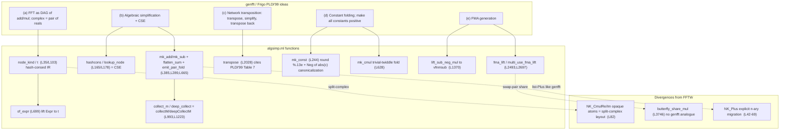

**Primary references**

- M. Frigo, *A Fast Fourier Transform Compiler*, PLDI'99 — <https://www.fftw.org/pldi99.pdf>
  (Most Influential PLDI Paper, 2009).
- M. Frigo & S. G. Johnson, *The Design and Implementation of FFTW3*, Proc. IEEE
  93(2), 2005, §6 "The genfft codelet generator" — <https://www.fftw.org/fftw-paper-ieee.pdf>.

The deep theory: hash-consed CSE over a **linear** network is exactly what makes
Cooley–Tukey butterflies and Winograd small-*N* kernels emerge without being
programmed. Network transposition is the DAG-level expression of the
*transpose/dual of a linear operator* — simplifying the dual exposes sharing the
primal hides, which is why it mechanically yields the known minimal-op
real-input/Hermitian variants.

### Where `algsimp` sits in the compiler

`algsimp` is driven by the codelet generator. The math layer
([`dft.ml`](../../generator/lib/dft.ml) / [`dft_r2c.ml`](../../generator/lib/dft_r2c.ml))
expands a DFT into raw `Expr.expr` assignments; `algsimp` lowers and rewrites
them into a hash-consed DAG; scheduling, register allocation, and C emission
consume the result.

```mermaid
flowchart TD
  CLI["gen_main.ml: parse flags, radix n, isa"] --> FEED["FEED: Dft / Dft_r2c expand<br/>-> raw, spill_markers, spill_ct"]
  FEED --> RESET["Algsimp.reset ()"]
  RESET --> POL["policy_n (dct1/dst1 -> internal rdft size)"]
  POL --> HC["Algsimp.of_assignments ~reassoc<br/>(hash-cons -> Algsimp.t DAG)"]
  HC --> P1["dedup_sub_pairs (env VFFT_NO_SUBDEDUP off)"]
  P1 --> AGG{"aggressive?<br/>(algorithm == Direct)"}
  AGG -->|yes| P2["factor_common_muls<br/>factor_by_atom<br/>dedup_sub_pairs"]
  AGG -->|no: no-op| P2
  P2 --> P3["collect_m (env VFFT_COLLECT_M)"]
  P3 --> DC{"VFFT_DEEP_COLLECT?"}
  DC -->|yes| DCL["FIXPOINT loop x5:<br/>deep_collect; collect_m<br/>(early-exit on tag stability)"]
  DC -->|no| SS
  DCL --> SS{"is_direct?"}
  SS -->|no| SSP["share_subsums ~aggressive"]
  SS -->|yes: skip| FG
  SSP --> FG{"apply_fma_lift?<br/>(algo != Split_radix + env)"}
  FG -->|no| EMIT
  FG -->|yes| FROZ["lift_spill_markers (pre)<br/>-> frozen_tags (if spill)"]
  FROZ --> CAS["FMA CASCADE (fixed order):<br/>1 fma_lift<br/>2 factor_const_muls<br/>3 multi_use_fma_lift<br/>4 fma_addend_factor<br/>5 multi_use_fma_lift<br/>6 fma_addend_factor<br/>7 multi_use_fma_lift<br/>8 fma_addend_factor<br/>9 multi_use_fma_lift<br/>10 flatten_fma_mul_addend"]
  CAS --> SPI{"spill && markers?"}
  SPI -->|yes| SPR["lift_spill_markers (post)<br/>remap_tag thru 8 remaps<br/>(flatten EXCLUDED)<br/>-> Emit_c.make_spill_info"]
  SPI -->|no| EMIT
  SPR --> EMIT["deduped DAG + spill_info"]
  EMIT --> OOP{"--oop?"}
  OOP -->|yes| COOP["Codelet_oop.emit_codelet<br/>(reset + Pipeline.prepare_codelet)"]
  OOP -->|no| ECC["Emit_c.emit_codelet"]
  ECC --> SCH["Schedule (su / bisection / topo) uses Algsimp.preds"]
  SCH --> RA["Regalloc (liveness via Algsimp.preds, consumes spill_info)"]
  RA --> CGEN["C source w/ SIMD intrinsics"]
```

```
Dft / Dft_r2c  --(Expr.expr assigns + spill_markers)-->  ALGSIMP
                                                            |
   of_assignments / dedup / factor / share / fma cascade    | (Algsimp.t DAG)
                                                            v
           lift_spill_markers + remap chain  -->  Emit_c.make_spill_info
                                                            |
   deduped (Algsimp.t list) + spill_info  ------------------+
        |                         |                         |
        v                         v                         v
   Schedule.su/bisection     Regalloc (liveness       Emit_c / Codelet_oop
   (Algsimp.preds)            via Algsimp.preds)       (render C + intrinsics)
```

> **Critical invariant:** `Algsimp.reset ()` **must** precede `of_assignments`
> (it clears the global hash-cons table and the tag counter). The pipeline does
> *not* reset internally — it documents that the caller must (pipeline.ml:119–126).
> Forgetting it leaks tags across codelet generations and the spill remap chain
> resolves to dead nodes.

---

## Part II — The IR foundation

> Source: algsimp.ml:1–222

### `node_kind` — the IR vocabulary

Every IR node is one of **ten** constructors (algsimp.ml:35) — shown as nine
rows below, since the two `Cmul` outputs share a row:

| Constructor | Meaning | Notes |
|---|---|---|
| `NK_Const of float` | a literal scalar | canonicalized (see `mk_const`) |
| `NK_Load of elem_ref` | read an input/twiddle element | the DAG's leaves |
| `NK_Neg of t` | unary negation | sign-hoisted aggressively |
| `NK_Add of t * t` | binary add | operands tag-sorted |
| `NK_Sub of t * t` | binary subtract | non-commutative, not sorted |
| `NK_Mul of t * t` | binary multiply | operands tag-sorted |
| `NK_Plus of (int * t) list` | **n-ary signed sum** `Σ sᵢ·tᵢ` | genfft-style; *staged, currently dormant* |
| `NK_CmulRe / NK_CmulIm of t*t*t*t` | the two outputs of a complex multiply | **opaque atoms** — reassoc never recurses in |
| `NK_Fma of t*t*t*bool*bool` | fused multiply-add `±(a·b) ± c` | one machine instruction; the two bools are `neg_mul, neg_add` |

The four FMA variants encoded by `(neg_mul, neg_add)` (algsimp.ml:85–101):

| `neg_mul` | `neg_add` | meaning | x86 |
|:--:|:--:|---|---|
| F | F | `(a·b) + c` | `vfmadd` |
| F | T | `(a·b) − c` | `vfmsub` |
| T | F | `−(a·b) + c` | `vfnmadd` |
| T | T | `−(a·b) − c` | `vfnmsub` |

`NK_CmulRe`/`NK_CmulIm` and `NK_Fma` are **opaque**: reassociation and transpose
deliberately do not recurse into them, preserving split-complex and fused
structure. The "Tried: common-multiplicand factoring" note (algsimp.ml:591–607)
records that breaking cmul sharing *increased* R=32 from 662→817 scalar ops
(+23%) — so opacity is load-bearing, not laziness.

The node record itself is trivial — and that triviality is the point:

```ocaml
and t = {
  tag : int;
  node : node_kind;
}
```

The `tag` **is** the identity. `a == b ⟺ a.tag = b.tag ⟺` structurally equal.

### Hash-consing: how sharing happens

```ocaml
let hcons_table : (node_kind, t) Hashtbl.t = Hashtbl.create 1024
let next_tag = ref 0

let hashcons (nk : node_kind) : t =
  match Hashtbl.find_opt hcons_table nk with
  | Some existing -> existing
  | None ->
    let tag = !next_tag in
    incr next_tag;
    let entry = { tag; node = nk } in
    Hashtbl.add hcons_table nk entry;
    entry
```

Children are interned *before* their parent (construction is bottom-up), so when
`hashcons` runs on a parent, all its `t` children already have tags. Structural
hashing of `nk` therefore recurses into child *records* that are physically
identical for equal subtrees — cheap. Every smart constructor funnels through
`hashcons`.

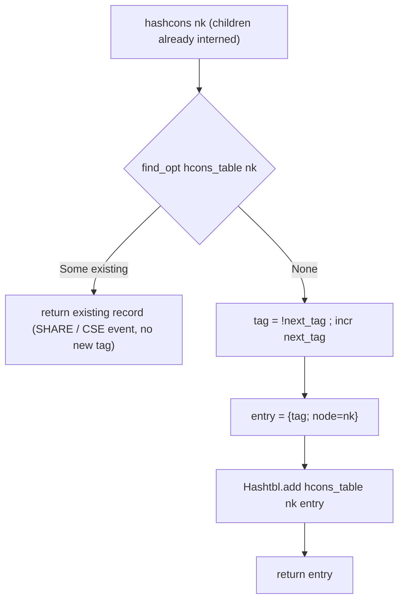

The redundancy collapse, visually — a source tree where two products and their
leaves are repeated, becoming a DAG where `out_a` and `out_b` both point at the
same `Mul#3`/`Mul#4`:

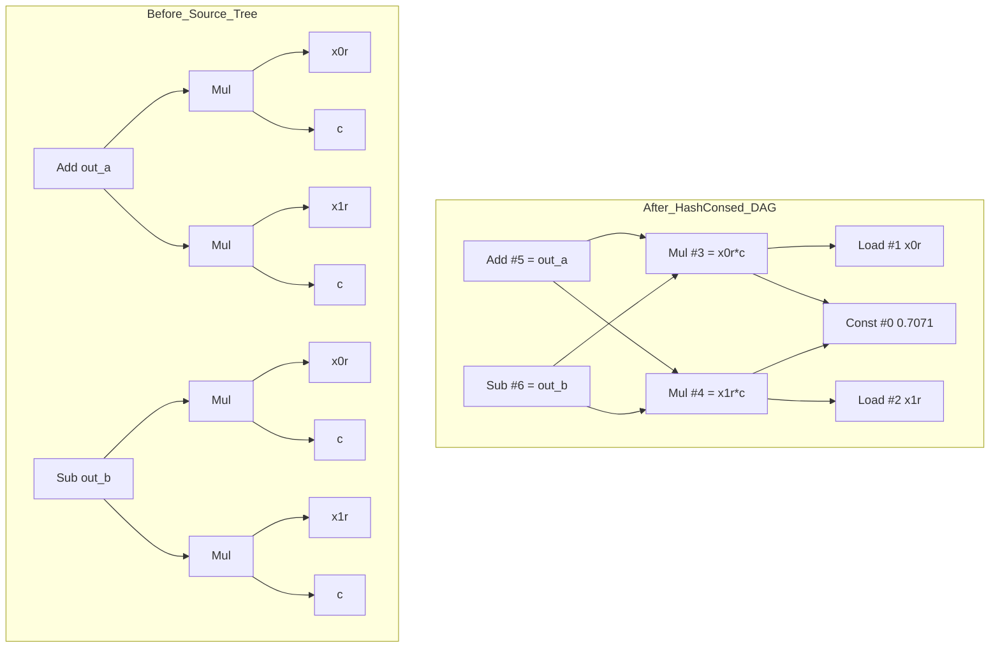

`lookup_node` (algsimp.ml:178) is the non-creating probe — "does this node
already exist?" — used by `share_subsums` and `deep_collect` to test for a
pre-existing shareable node *without* interning a new one.

### Two orthogonal memo tables

There are **two** caches, and confusing them is a classic trap:

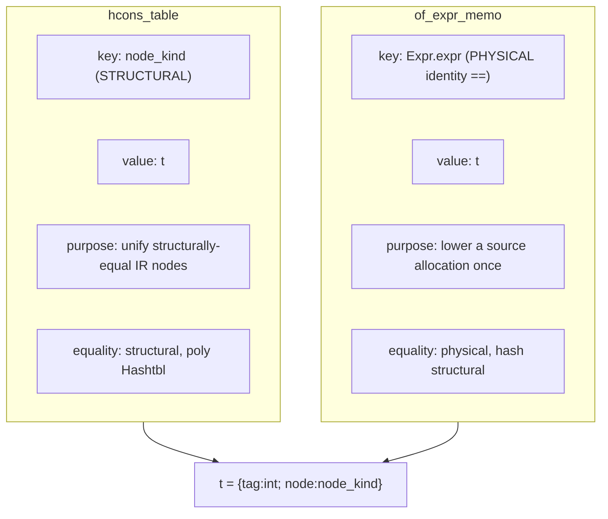

- **`hcons_table`** keys on the *structure* of the target IR `node_kind`. It is
  what makes CSE happen.
- **`of_expr_memo`** (built from `ExprPhysHash`/`ExprMemo`, algsimp.ml:207–214)
  keys on the *physical identity* (`==`) of the *source* `Expr` value. The math
  layer stores one `Expr` allocation and reads it many times
  (`pass1_re.(n1_idx).(k2)`); physical-identity memoization lowers each
  allocation once instead of re-walking it per reference. A memo miss is always
  safe — it just re-walks and produces the same hash-consed `t`.

`reset ()` (algsimp.ml:216) clears both tables and zeroes `next_tag`.

### Traversal: `preds` and `topo_sort_reachable`

`preds` (algsimp.ml:115) is the single canonical DAG-edge function — it returns
the immediate children of any node and is reused by schedule, regalloc, liveness,
and every counter. `topo_sort_reachable` (algsimp.ml:133) DFS-collects reachable
nodes into a tag-keyed table, then sorts by tag. **Because tags are assigned in
construction order and children always precede parents, ascending tag order is a
valid topological (dependencies-first) order** — no separate Kahn's algorithm
needed.

> `NK_Plus` is fully defined and has helper constructors, but no production path
> generates it yet. Match sites that haven't been migrated call
> `nk_plus_unreachable` (algsimp.ml:156) and `failwith` loudly rather than
> silently mishandle it. See [Appendix A](#appendix-a--pass-status-table).

---

## Part III — Smart constructors & normalization

> Source: algsimp.ml:223–698

This is the "algebraic simplification" half of the file. Every constructor does
its simplification **first**, then hash-conses — so simplification and CSE are
fused into one bottom-up build.

### Constant canonicalization — `mk_const`

```
c (raw float)
  |  if c == 0.0 -> keep 0.0, else round via %.13e
  v
rounded
  |-- |rounded| < 1e-14 ............ NK_Const 0.0
  |-- |rounded - 1| < 1e-14 ........ NK_Const 1.0
  |-- |rounded + 1| < 1e-14 ........ NK_Const -1.0
  |-- rounded < 0 .................. NK_Neg (NK_Const (-rounded))   <-- sign hoisted
  |-- otherwise ................... NK_Const rounded
  (every leaf is hashcons'd -> shared)
```

Two design choices here are load-bearing:

1. **`%.13e` rounding** (13 decimal places ⇒ 14 significant figures) plus
   `zero_threshold = 1e-14` (algsimp.ml:223) snaps computational noise —
   `cos(π/2) = 6e-17` — to exact
   `0`, and snaps `±1` and near-integers. This is the *deliberate extension over
   genfft* that makes the generator robust at non-power-of-two radices where
   twiddle constants come from `cos`/`sin`.
2. **Negative constants are canonicalized to `Neg(|c|)`** (algsimp.ml:252–259).
   This unifies `Mul(x, -c)` with `Mul(x, c)`: the multiply by the *positive*
   constant is shared by hash-consing, and the sign becomes a `Neg` that a later
   peephole absorbs. Disabling this would silently double the multiply count for
   sign-paired twiddles. It is the mechanical version of the hand-coded
   `vnc = -vc` idiom, and genfft reports the same "make all constants positive"
   trick gave a 10–15% speedup.

### The signed-term sum model

For reassociation, every `Add`/`Sub`/`Neg` chain is viewed as a flat list of
signed terms `(sign, leaf)`:

```ocaml
let rec flatten_sum (sign : int) (e : t) : (int * t) list =
  match e.node with
  | NK_Add (a, b) -> flatten_sum sign a @ flatten_sum sign b
  | NK_Sub (a, b) -> flatten_sum sign a @ flatten_sum (-sign) b
  | NK_Neg inner  -> flatten_sum (-sign) inner
  | _ -> [(sign, e)]
```

- `cancel_signs` (algsimp.ml:337) tallies signed coefficients per tag, drops
  terms that sum to zero (`x − x`), and sorts canonically by tag.
- `split_interleaved` (algsimp.ml:353) splits a list into even/odd indices — the
  key to butterfly emergence (below).
- `flatten_sum_through_fma` (algsimp.ml:314) is a deeper variant that *also* sees
  through early-peephole `NK_Fma` nodes, used only by `collect_m`/`deep_collect`
  to re-expose a fused mul + addend as separate terms.

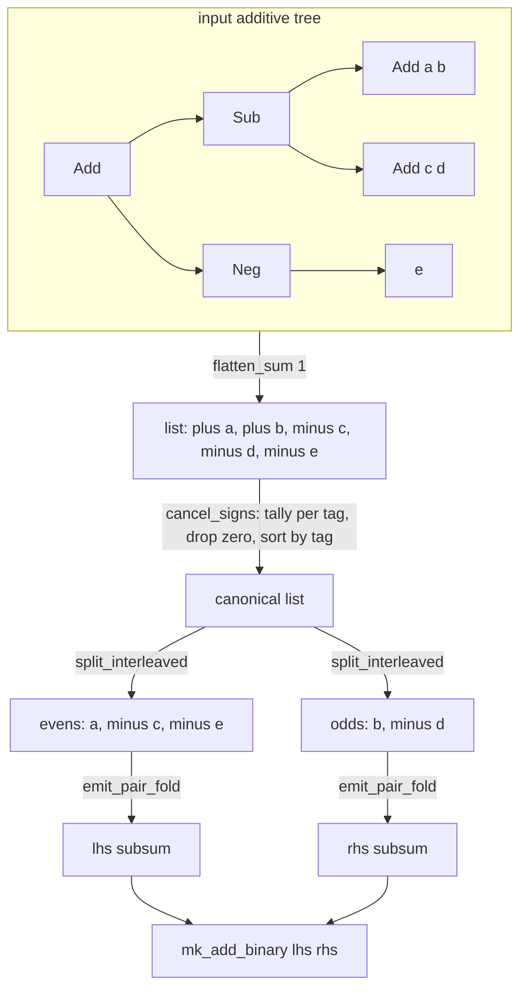

### The constructors and their peepholes

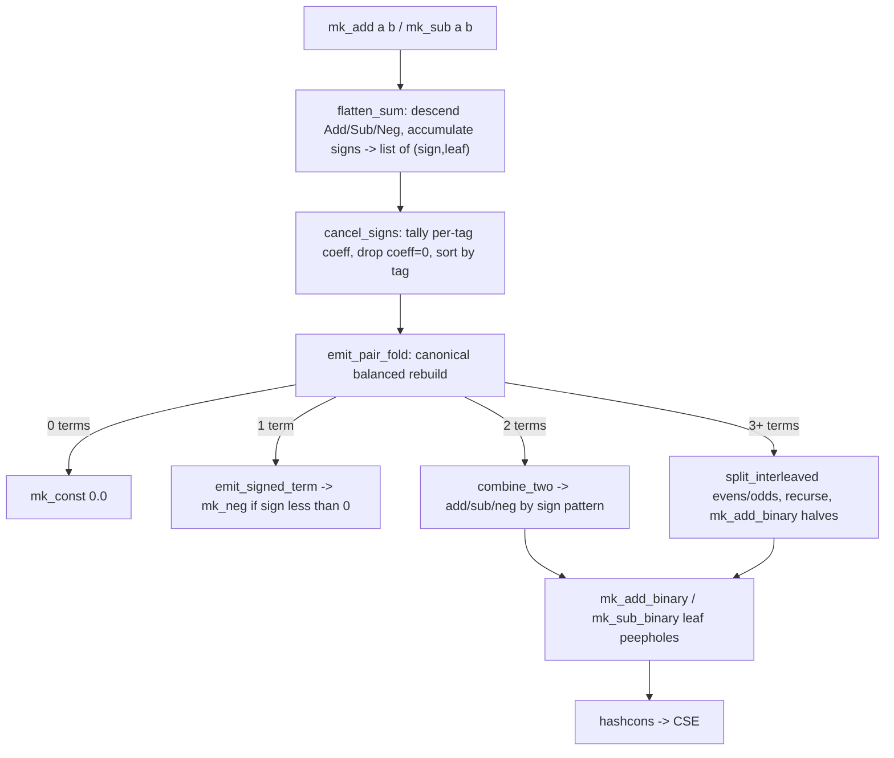

- **`mk_add` / `mk_sub`** (algsimp.ml:385/391): user-facing. Flatten → cancel →
  pair-fold. Two mathematically-equal sums, however the math layer wrote them,
  produce identical sorted term lists and therefore identical hash-consed trees —
  cross-subtree CSE for free.
- **`mk_mul`** (algsimp.ml:396): folds `0`/`1`/`−1`, folds const×const, hoists
  `Neg` out of either operand, and tag-sorts the two operands so `a*b` and `b*a`
  share.
- **`mk_neg`** (algsimp.ml:372): folds `Neg(Neg x) = x` and `Neg(Const)`.
- **`mk_add_binary` / `mk_sub_binary`** (algsimp.ml:414/426): the *leaf*
  constructors used by the pair-fold (they do **not** re-flatten, avoiding
  infinite recursion). They carry the two most important peepholes:
  - `Add(x, Neg y) → Sub(x, y)` and `Sub(x, Neg y) → Add(x, y)` — absorb the
    canonicalized-negative-constant sign.
  - **`Sub(Neg(Mul(x,y)), z) → NK_Fma(x, y, z, true, true)`** (algsimp.ml:440–459)
    — fires *at construction time* during `dedup_sub_pairs`' rebuild, turning a
    pattern that would otherwise emit as `vsubpd(vxorpd(-0.0, …), …)` (3–4
    instructions + a `-0.0` mask in `.rodata`) into a single `vfnmsub`.

Concrete cancellation — `mk_sub` of `(a+b)` and `(b+c)` collapses the shared
`±b` globally and hash-conses to one `Sub(a,c)`:

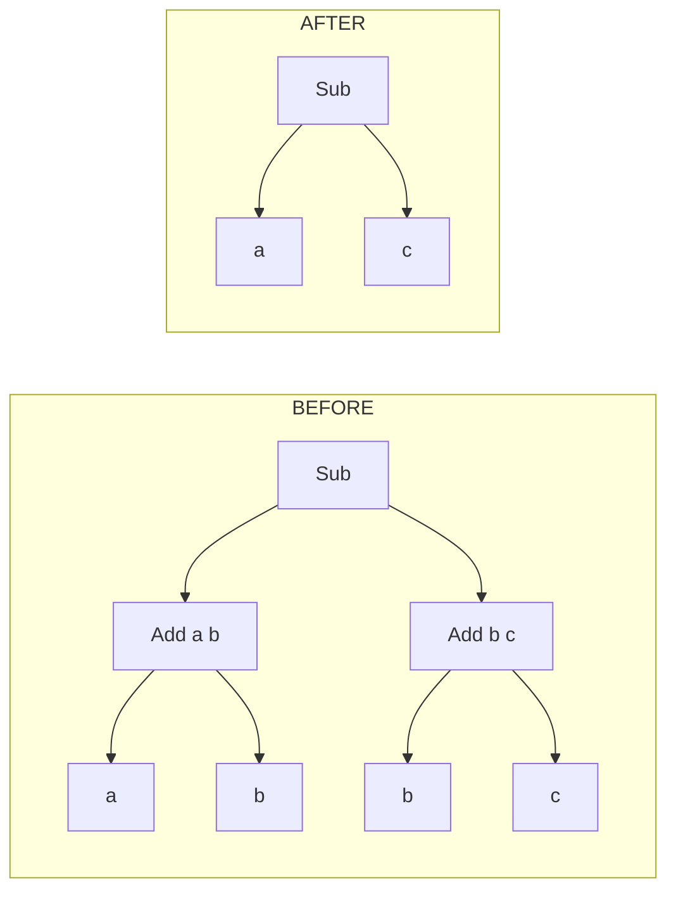

### `emit_pair_fold` — where butterflies are born

`emit_pair_fold` (algsimp.ml:665) rebuilds a sorted signed-term list into a
*balanced* binary tree by recursive **interleaved** (even/odd) splitting rather
than a left-linear fold. For four sorted inputs the halves are
`(input[0], input[2])` and `(input[1], input[3])` — *exactly* the even/odd
butterfly structure of radix-4 Cooley–Tukey. The balanced shape is also what
exposes sub-sums to `share_subsums` and local `Add`-of-`Mul` shapes to
`fma_lift`; a naive `fold_left` would be arithmetically equal but lose both.

### Complex multiply — `mk_cmul`

`mk_cmul xr xi wr wi` (algsimp.ml:628) returns the `(re, im)` pair of a complex
product. For **compile-time-known trivial twiddles** it folds:

| twiddle | output | ops |
|---|---|---|
| `wr=1, wi=0` | `(xr, xi)` | none |
| `wr=0, wi=1` (`+i`) | `(−xi, xr)` | 0 (just sign) |
| `wr=0, wi=−1` (`−i`) | `(xi, −xr)` | 0 |

For runtime twiddles it emits the opaque `NK_CmulRe`/`NK_CmulIm` atoms, which
hash-cons independently — if two cmuls share operands, both their `re` and `im`
outputs share.

### `NK_Plus` (staged, dormant)

`mk_plus`/`lower_plus`/`lower_plus_terms` (algsimp.ml:488–589) implement a genfft-
style n-ary signed sum with full canonicalization (flatten nested plus, absorb
neg into sign, sum constants, cancel opposite signs, sort by tag, collapse
singletons). It is wired only behind `collect_m`/`deep_collect` and lowered back
to binary before any non-`NK_Plus`-aware reader. **No default path produces it.**

---

## Part IV — Lowering: `of_expr`

> Source: algsimp.ml:699–823

`of_expr` (algsimp.ml:699) lowers a source `Expr.expr` into the hash-consed IR.
It is physical-identity-memoized (Part II) and does three notable things:

1. **The `reassoc` flag** chooses `mk_add`/`mk_sub` (flatten + reassociate) vs
   `mk_add_binary`/`mk_sub_binary` (preserve the input tree shape). Structured
   Cooley–Tukey input uses `reassoc=false` (the tree shape *is* the
   optimization); flat direct-DFT expansion uses `reassoc=true` to find shared
   sub-sums.
2. **Cmul pattern detection.** The math layer emits a complex multiply as
   `Sub(Mul(xr,wr), Mul(xi,wi))` (re) and `Add(Mul(xr,wi), Mul(xi,wr))` (im).
   `of_expr` matches these (algsimp.ml:714, 730) and lifts them to `Cmul` atoms —
   *unless* any operand is a constant, in which case it falls back to plain
   `Mul`/`Sub`/`Add` (the `is_const` guard) so constant-folding still applies.

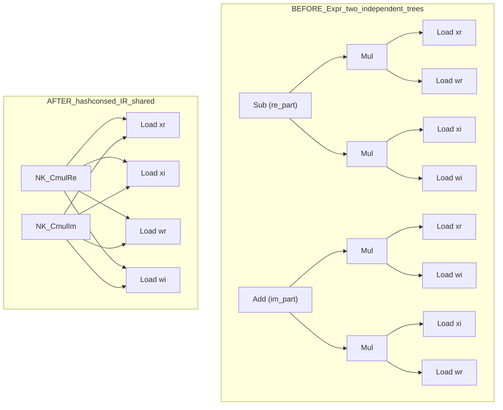

3. **Spill markers.** `lift_spill_markers` (algsimp.ml:780) walks the math layer's
   `Dft.re_expr`/`Dft.im_expr` for each PASS-1 spill marker *after*
   `of_assignments`, retrieving the same hash-consed tags. These `spill_tag_marker`
   records become the *frozen tags* that the FMA cascade must not rewrite away
   (see Part V).

---

## Part V — The optimization passes

This is the meat. Each pass is a memoized bottom-up DAG rewrite over the
`(elem_ref * t) list` of assignments. They share a common shape: walk children,
rebuild with smart constructors (so peepholes re-fire), and use `==` physical
checks to avoid rebuilding unchanged subtrees.

Passes fall into three buckets — **default-on**, **env-gated** (off by default),
and **dormant** (implemented but not wired into any driver). The
[pass status table](#appendix-a--pass-status-table) is the quick reference;
below is the detail.

### `dedup_sub_pairs` — opposite-orientation subtraction merge *(default-on)*

> algsimp.ml:824

After reassociation the DAG may contain both `Sub(a,b)` and `Sub(b,a)`, computed
independently though they are negatives of each other. This **global** pass picks
a winner by usage count (ties broken by lower tag, for determinism), rewrites the
loser's uses to `Neg(winner)`, and lets the `Add(x, Neg y) → Sub(x, y)` peephole
collapse the result during the memoized rebuild.

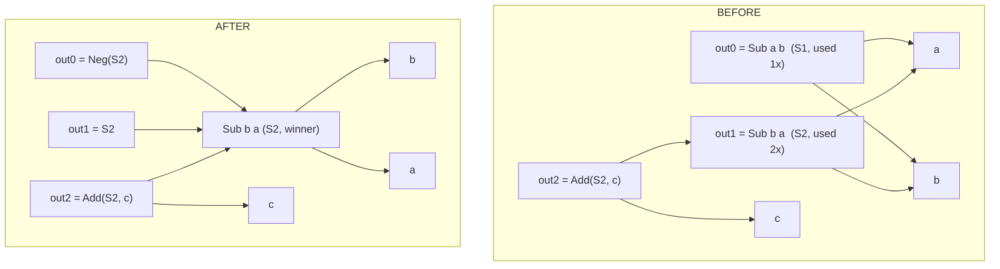

It runs **twice** in the default pipeline — once right after lowering and again
after the aggressive factoring passes (both gated off only by `VFFT_NO_SUBDEDUP`).

### `collect_m` / `deep_collect` — coefficient collection *(env-gated, off)*

> algsimp.ml:993 (`collect_m`), algsimp.ml:1223 (`deep_collect`)

`collect_m` is FFTW's `collectM`: within one `Add`/`Sub` subtree, group terms by
their non-constant *atom* and sum coefficients —
`ax + bx + cx → (a+b+c)·x` (3 mul + 2 add → 1 mul). A cheap `subtree_has_collectible`
pre-check gates the expensive flatten-group-emit path, so balanced FMA-friendly
trees with nothing to merge keep their shape.

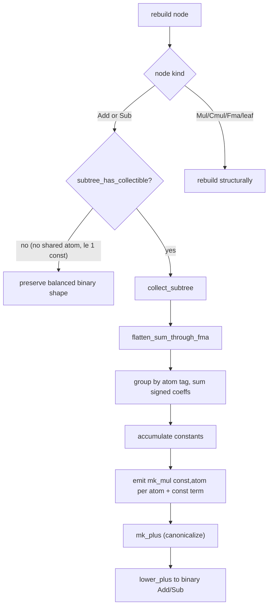

`deep_collect` (`deepCollectM`, default depth 5) goes further: it **distributes**
`Const × Sum` through nested sums to expose inner atoms to the outer collection.

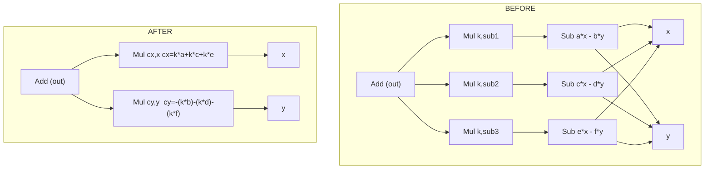

Because distribution *adds* ops up front, `deep_collect` only commits the result
when it strictly wins. Two gates (algsimp.ml:1311, 1327):

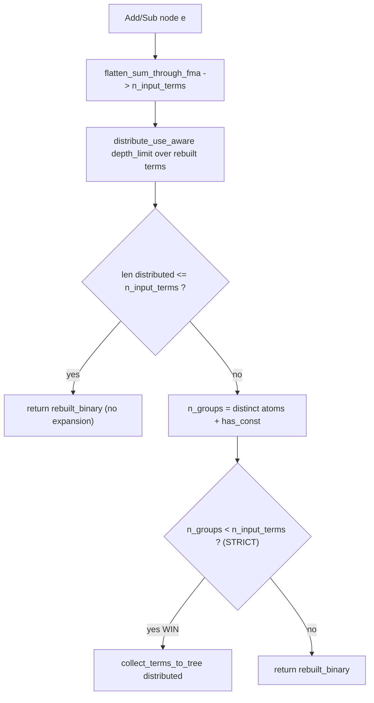

The strict `n_groups < n_input_terms` guard (not `<=`) exists specifically to
avoid the R=20 regression where expansion-without-merging passed a looser check.
`distribute_use_aware` further requires that at least one resulting `Mul` already
exists in the hash-cons table (`any_mul_exists`), so distribution never adds net
new nodes speculatively.

> Both are **off by default**: `collect_m` runs if `VFFT_COLLECT_M=1` **or**
> `VFFT_DEEP_COLLECT=1`; `deep_collect` runs **only** if `VFFT_DEEP_COLLECT=1`.
> Default codelet op counts include neither.

### `factor_common_muls` / `factor_by_atom` — distributive factoring *(aggressive / primes-only)*

> algsimp.ml:1460 / 1683

These are the Winograd-structure extractors for **monolithic primes**
(R=3,5,7,11,…). They are **pass-through unless `~aggressive:true`**.

- `factor_common_muls` buckets terms by the **constant** operand of a `Mul`:
  `c·a + c·b → c·(a+b)`.
- `factor_by_atom` buckets by the **non-constant** operand:
  `c₁·a + c₂·a → (c₁+c₂)·a` — and since the `cᵢ` are constants, `c₁+c₂` folds at
  construction, collapsing *N* muls to one.

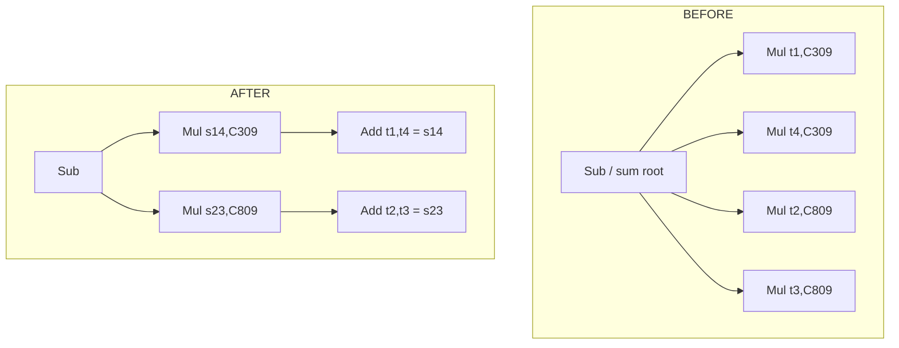

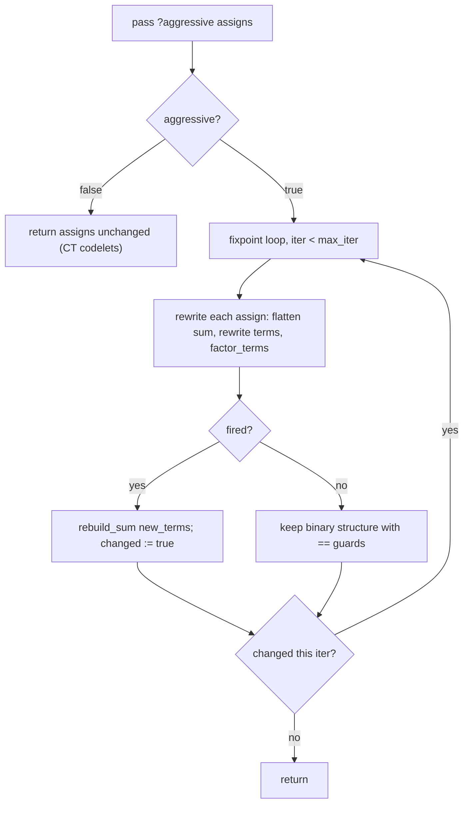

> **Why primes-only.** In CT-decomposed codelets the same `Mul(xr, k)` is shared
> between a cmul's Re and Im outputs (use_count ≥ 2). Naively factoring destroys
> that sharing — net **+1 mul**. The aggressive path disables the use-count safety
> entirely because for monolithic primes the "shared mul" the safety would protect
> is an illusion (the factored `c·(xⱼ+x_{N−j})` *is* the shared Winograd sum). Run
> aggressive on a CT codelet and R=16 regressed **+94 ops** — so the flag is bound
> to `algorithm == Direct` and nothing else.

### `share_subsums` — reuse pre-existing partial sums *(aggressive=false ⇒ runs for CT)*

> algsimp.ml:1829

Greedily rewrites a flat sum to reuse an already-interned 2-term sub-sum. The
motivating case is a monolithic prime's `X[0]` output, `x0+x1+x2+x3+x4`, where the
factoring pass already built `s14 = x1+x4` and `s23 = x2+x3`; `X[0]` becomes
`x0 + s14 + s23` (saving 2 ops). It only substitutes a pair `(a,b)` when
`lookup_node (NK_Add(a,b))` exists *and* has an external user.

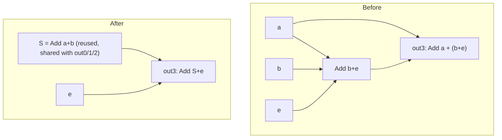

> Note the inverted gating vs the factoring passes. In the driver, `is_direct`
> ⟺ `aggressive`. `share_subsums` is called with `~aggressive`, but the driver
> only *invokes* it when `not is_direct` — i.e. for **CT codelets**, where it
> runs the body. For Direct primes it is skipped, because splitting conjugate-pair
> FMA chains there costs +4 ops/pair (the driver comment cites R=11: 172 vs 150,
> R=13: 256 vs 204).

### `transpose` — network transposition *(DORMANT)*

> algsimp.ml:2028

The genfft duality trick: treat the DAG as a linear network, compute the adjoint
`T[N] = Σ_parents w·T[P]` (so outputs become input loads and vice-versa), simplify
the adjoint, transpose back. Per Frigo PLDI'99 Table 7 this saves muls on sizes
5, 10, 13, 15. It handles only pure-linear DAGs (Add/Sub/Neg/Mul-by-const) and
skips non-const `Mul`, `Cmul`, `Fma`.

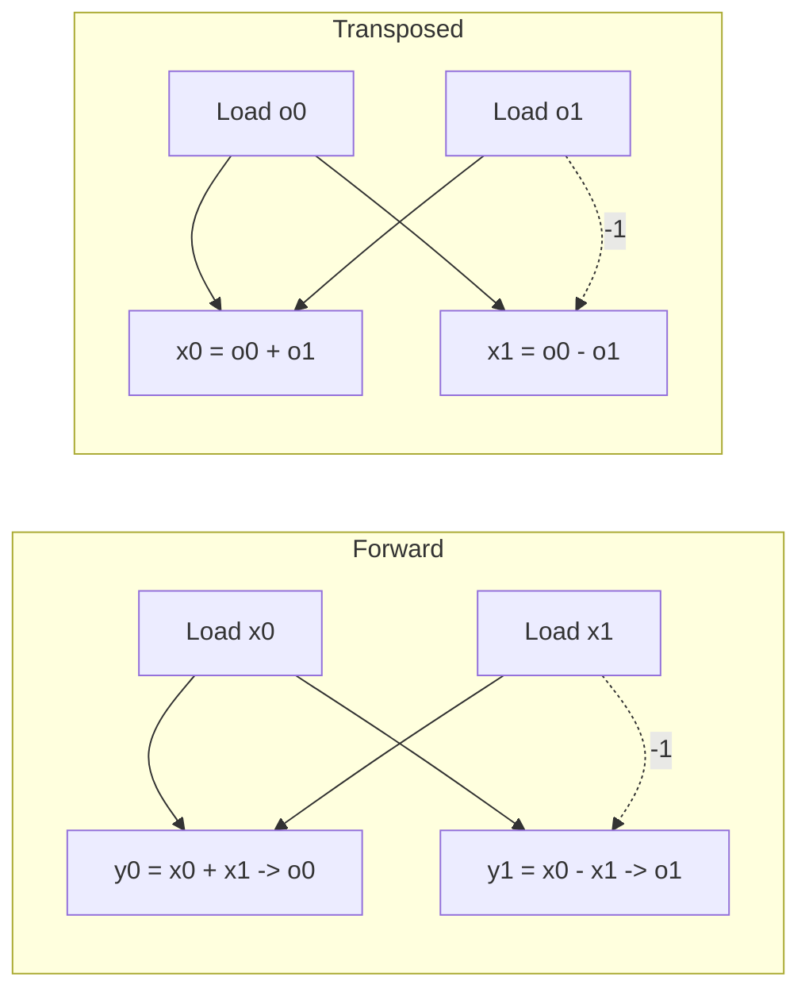

> **Status: implemented but not wired.** The driver's transpose fixed-point loop
> was gated on `aggressive && not is_direct`, which is always false (since
> `aggressive ⟺ is_direct`), so it never ran and was removed; `post_trans = shared`
> (pipeline.ml:186–191). The function is kept for a future change to the
> `aggressive` flag.

### The FMA cascade

After `fma_lift`, the pipeline runs a fixed 9-pass cascade
(`factor_const_muls` → 4×`multi_use_fma_lift` interleaved with 3×`fma_addend_factor`
→ `flatten_fma_mul_addend`). All of these treat `Fma` as opaque, and all accept an
optional `frozen_tags` set + return a `tag_remap` so spill markers can be
retargeted.

#### `fma_lift` — single-use mul+add → FMA *(default-on, gated by algorithm)*

> algsimp.ml:2493

Contracts `Add`/`Sub`-of-`Mul` into one `NK_Fma` **only when the inner `Mul` is
single-use** (`liftable_mul = single_use`, algsimp.ml:2552). The single-use
restriction is critical: lifting a *shared* mul duplicates the multiply across N
parallel FMAs (doc-28 measured a **33–48% regression on R=32**, 910 vs 717 FP
instructions). Shared muls are left as `Mul`+`Add` for either the C compiler's
`-ffp-contract` or the separate `multi_use_fma_lift` pass.

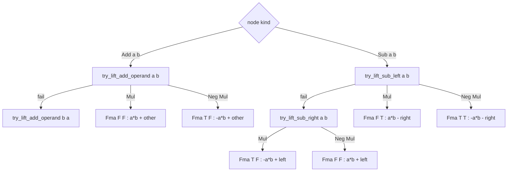

`fma_lift` is **gated by algorithm**: enabled for `Direct` and `Cooley_Tukey`,
disabled for `Split_radix` (unless `VFFT_FORCE_FMA_LIFT=1`). The whole cascade is
skipped when `fma_lift` is off.

> The standalone `lift_sub_neg_mul` pass (algsimp.ml:1370) performs the
> `Sub(Neg(Mul),c) → vfnmsub` rewrite *unconditionally* — it is strictly better
> because that pattern already emitted as 3–4 instructions with a `-0.0` mask. In
> the default pipeline this rewrite is delivered by the **`mk_sub_binary`
> construction-time peephole** rather than the standalone pass.

#### `factor_const_muls` — safe FMA-enabling factor *(default-on, post-fma_lift)*

> algsimp.ml:2262

The use-count-safe version of `factor_common_muls`:
`Add(Mul(K,X), Mul(K,Y)) → Mul(K, Add(X,Y))` — but only when **every** use of both
input muls is itself such a factor pattern with the same `K` (so the originals
become dead). This is a local bottom-up rewrite (no flatten), so shared
intermediate sums survive, and it iterates to a fixed point (max 20 rounds). It
exists to recreate the factored form FFTW's genfft builds directly for the
`|cr|=|ci|=1/√2` twiddle family — feeding the resulting `Mul(K,sum)` to
`multi_use_fma_lift`.

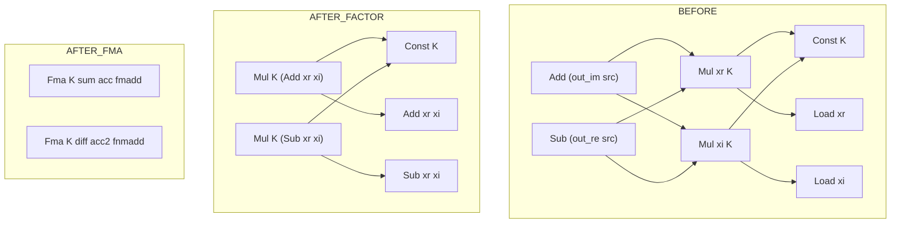

#### `multi_use_fma_lift` — absorb shared muls *(default-on, runs 4×)*

> algsimp.ml:2697

Relaxes `fma_lift`'s single-use rule: a `Mul` with N>1 uses is absorbed **iff
every consumer is an `Add`/`Sub` direct operand** (or a `Neg` thereof). Each
consumer gets its own FMA; the standalone mul dies (Δ = −1 op). It is free at the
hardware level because the multiply happens inside each FMA's µ-op anyway. A
two-phase design: phase 1 classifies each mul as absorbable via a monotone
lattice (once `false`, always `false`); phase 2 rewrites.

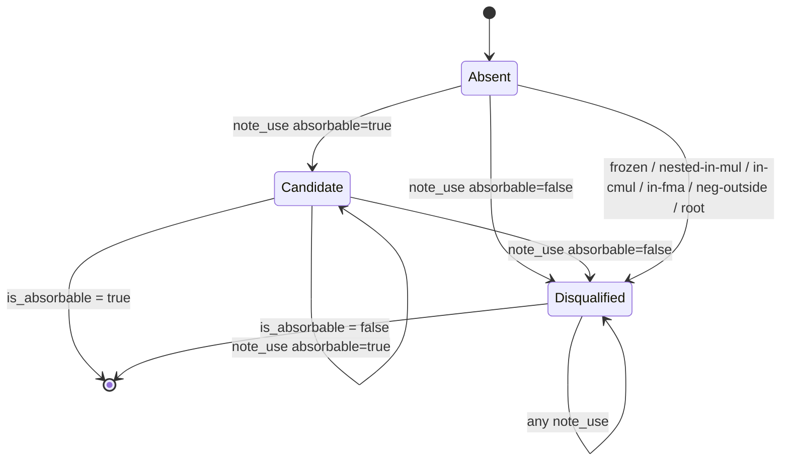

```mermaid
flowchart TD
  subgraph BEFORE
    A1["a"] --> P1["Mul a,b  (use_count=2)"]
    B1["b"] --> P1
    P1 --> U1["Add (P, c1)"]
    C1["c1"] --> U1
    P1 --> U2["Sub (P, c2)"]
    C2["c2"] --> U2
  end
  subgraph AFTER
    A2["a"] --> F1["Fma a,b,c1  nm=F na=F  fmadd"]
    B2["b"] --> F1
    D1["c1"] --> F1
    A2 --> F2["Fma a,b,c2  nm=F na=T  fmsub"]
    B2 --> F2
    D2["c2"] --> F2
    X["Mul a,b  DEAD (no remaining use)"]
  end
```

#### `fma_addend_factor` — factor same-K FMA addends *(default-on, runs 3×)*

> algsimp.ml:2960

Recognizes `Fma(K, X, Mul(K, Y), …)` where the FMA's mul-slot and its addend mul
share constant `K`, and folds to `Mul(K, X±Y)` (or `Neg(Mul(K, …))`). The fresh
`Mul(K, sum)` is then a clean candidate for the *next* `multi_use_fma_lift` — which
is why the two passes alternate in the cascade. Fires only when **all** uses of
the addend mul are such factor-pattern FMAs.

```mermaid
flowchart TD
  subgraph BEFORE
    K1["K (const)"] --> M["Mul K,Y  (use_count=2, both FMA addends)"]
    Y1["Y"] --> M
    K1 --> FA["Fma K,X1, M  nm=F na=F"]
    X1n["X1"] --> FA
    M --> FA
    K1 --> FB["Fma K,X2, M  nm=F na=F"]
    X2n["X2"] --> FB
    M --> FB
  end
  subgraph AFTER
    S1["Add X1,Y"] --> G1["Mul K, S1"]
    K2["K"] --> G1
    S2["Add X2,Y"] --> G2["Mul K, S2"]
    K2 --> G2
    Mdead["Mul K,Y  DEAD"]
  end
```

#### `flatten_fma_mul_addend` — residual mul-addend → 2-FMA chain *(default-on, density-gated)*

> algsimp.ml:3200

The cascade's tail. Handles `Add(P, Fma(a,b,Mul(c,d)))` where the addend mul's
constants *don't* match the FMA's, by re-associating into a 2-FMA chain
`Fma(c,d, Fma(a,b,P))` — eliminating both the standalone mul and the outer add
(1 mul + 1 fma + 1 add/sub → 2 fma).

```mermaid
graph TD
  subgraph Before
    S["Sub"]
    F["Fma a,b ; nm=F na=F"]
    M["Mul c,d (single-use addend)"]
    P1["p"]
    S --> F
    S --> P1
    F --> M
  end
  subgraph After
    O["Fma c,d ; nm=F na=F (outer)"]
    I["Fma a,b ; nm=F na=T (inner: a*b - p)"]
    P2["p"]
    O --> I
    I --> P2
  end
```

This pass is **op-count neutral but not always faster**, so it is
**density-gated**. The 2-FMA chain shortens the critical path *per chain*, but it
buries `c*d` inside an FMA that can't issue until the inner FMA completes —
removing standalone muls that the out-of-order scheduler used as "free fill". The
measured tradeoff:

| Radix | candidates | Δtotal ops | runtime |
|---|---:|:--:|---|
| R=25 | 4 | 0 | −3.12% (faster) |
| R=32 | 4 | 0 | −2.81% (faster) |
| R=64 | 20 | 0 | **+6.75% (slower)** |

So the multi-use relaxation is enabled only when the rewrite-eligible FMA count
≤ `multiuse_density_threshold = 12` (algsimp.ml:3405). Override with
`VFFT_FMA_MULTIUSE=0/1`. Single-use rewrites always proceed; the gate only affects
the multi-use relaxation. (FFTW sidesteps this by emitting standalone muls and
letting the C compiler decide — VFFT emits FMA intrinsics directly, so it must
make the call here.)

#### `butterfly_share_mul` — swap-pair mul sharing *(DORMANT)*

> algsimp.ml:3746

Recognizes a swap-pair where two FMAs compute sum/diff of the same two products
in opposite roles — `F = Fma(a,b, Mul(p,q))` and `F' = Fma(p,q, Mul(a,b))` — each
inlining its own product (use_count 1). It rewrites `F` to share `F'`'s
`Mul(a,b)` addend (swapping the sign flags, value-preserving), bumping
`Mul(a,b)` to use_count 2 so `emit_c` declares it once and orphaning `Mul(p,q)`.
Net 4 ops → 3.

```mermaid
graph TD
  subgraph Before
    F1["F = Fma a,b ; add=Mul p,q"]
    F2["F' = Fma p,q ; add=Mul a,b"]
    Mpq1["Mul p,q (use=1, inlined)"]
    Mab1["Mul a,b (use=1, inlined)"]
    F1 --> Mpq1
    F2 --> Mab1
  end
  subgraph After
    G1["F = Fma p,q ; add=Mul a,b ; flags swapped"]
    G2["F' = Fma p,q ; add=Mul a,b"]
    Mab2["Mul a,b (use=2, DECLARED)"]
    Mpq2["Mul p,q (use=0, ORPHAN)"]
    G1 --> Mab2
    G2 --> Mab2
  end
```

> **Status: implemented but not wired** into `pipeline.ml`/`gen_main.ml`. It has
> no genfft analogue (it is specific to this codebase's `emit_c` inlining model).
> It is documented here for completeness; it does not run in the live pipeline.

---

## Part VI — The live pipeline order

The exact order in `Pipeline.prepare_codelet` (pipeline.ml:127–251), with status:

| # | Pass | Status / gate |
|--:|---|---|
| 1 | `of_assignments ~reassoc` | always (lowering) |
| 2 | `dedup_sub_pairs` | default-on (off if `VFFT_NO_SUBDEDUP`) |
| 3 | `factor_common_muls ~aggressive` | primes only (`aggressive`) |
| 4 | `factor_by_atom ~aggressive` | primes only |
| 5 | `dedup_sub_pairs` | default-on |
| 6 | `collect_m` | **off** (`VFFT_COLLECT_M`/`VFFT_DEEP_COLLECT`) |
| 7 | `deep_collect`+`collect_m` ×5 fixpoint | **off** (`VFFT_DEEP_COLLECT`) |
| 8 | `share_subsums ~aggressive` | CT codelets only (`not is_direct`) |
| — | ~~`transpose`~~ | **dormant** (loop removed, `post_trans = shared`) |
| 9 | `fma_lift` | default-on; off for `Split_radix` |
| 10 | `factor_const_muls` | cascade |
| 11 | `multi_use_fma_lift` | cascade |
| 12 | `fma_addend_factor` | cascade |
| 13 | `multi_use_fma_lift` | cascade |
| 14 | `fma_addend_factor` | cascade |
| 15 | `multi_use_fma_lift` | cascade |
| 16 | `fma_addend_factor` | cascade |
| 17 | `multi_use_fma_lift` | cascade |
| 18 | `flatten_fma_mul_addend` | cascade (density-gated multi-use) |
| — | ~~`butterfly_share_mul`~~ | **dormant** (not wired) |

Two subtleties worth internalizing:

- **The cascade is not a real fixpoint** — it's a manually-unrolled 3× repetition
  of `(multi_use_fma_lift, fma_addend_factor)` plus a `fma_lift`/`factor_const_muls`
  head and a `multi_use_fma_lift`/`flatten` tail. Only the `VFFT_DEEP_COLLECT`
  loop is a genuine bounded fixpoint.
- **Spill-marker remap is the silent-failure point.** `fma_lift` runs first with no
  remap; the following 8 passes each return a `tag_remap`. A spill marker's tag is
  walked through all 8 remaps *in cascade order* to find where its value moved.
  **`flatten_fma_mul_addend`'s remap is intentionally excluded** — a spillable mul
  absorbed into a 2-FMA chain must remain a separate spillable value, not be
  remapped to the post-flatten FMA (which would force a reload to recompute the
  chain). Getting any of this wrong makes a spill store point at a dead node and
  PASS-2 reload garbage.

---

## Part VII — End-to-end worked example

### A. Complex multiply (runtime twiddle)

Math-layer `Expr` (tags `xr=t1, xi=t2, wr=t3, wi=t4`):

```
re = Sub(Mul(xr, wr), Mul(xi, wi))
im = Add(Mul(xr, wi), Mul(xi, wr))
```

**Route 1 — cmul-atom (all operands runtime).** `of_expr` matches the pattern
(algsimp.ml:714) and, since nothing is constant, calls `mk_cmul`:

```
t10 = cmul.re(t1,t2,t3,t4)   ; xr*wr - xi*wi
t11 = cmul.im(t1,t2,t3,t4)   ; xr*wi + xi*wr
```

Both come from the *same* `mk_cmul`, so re/im share. Op count (`stats_reachable`):
`cmuls = 2` → scalar `arithmetic_ops = 3·2 = 6` (= 4 mul + 2 add, textbook) but
vector instructions = `2·2 = 4` (each cmul lowers to 1 mul + 1 fmadd).

**Route 2 — explicit then `fma_lift` (e.g. `wr` constant ⇒ pattern bypassed).**
`of_expr` emits plain trees (6 ops), then `fma_lift` contracts the single-use
products:

```mermaid
graph TD
  subgraph BEFORE_explicit_6ops
    a1["t1 xr (Load)"]
    a2["t2 xi (Load)"]
    a3["t3 wr (Load)"]
    a4["t4 wi (Load)"]
    m5["t5 Mul xr*wr"]
    m6["t6 Mul xi*wi"]
    m8["t8 Mul xr*wi"]
    m9["t9 Mul xi*wr"]
    s7["t7 Sub -> out.re"]
    a12["t12 Add -> out.im"]
    a1-->m5; a3-->m5
    a2-->m6; a4-->m6
    a1-->m8; a4-->m8
    a2-->m9; a3-->m9
    m5-->s7; m6-->s7
    m8-->a12; m9-->a12
  end
  subgraph AFTER_fma_lift_4instr
    b1["t1 xr"]
    b2["t2 xi"]
    b3["t3 wr"]
    b4["t4 wi"]
    n6["t6 Mul xi*wi"]
    n9["t9 Mul xi*wr"]
    f7["t7 Fma xr*wr - t6  (fmsub) out.re"]
    f12["t12 Fma xr*wi + t9 (fmadd) out.im"]
    b2-->n6; b4-->n6
    b2-->n9; b3-->n9
    b1-->f7; b3-->f7; n6-->f7
    b1-->f12; b4-->f12; n9-->f12
  end
```

`t7 = Sub(Mul(t1,t3), t6)` → `Fma(t1,t3,t6, F, T)` (fmsub);
`t12 = Add(Mul(t1,t4), t9)` → `Fma(t1,t4,t9, F, F)` (fmadd). Result: **2 Mul +
2 Fma = 4 instructions** — converging with Route 1.

### B. Radix-2 butterfly

Inputs `a=t1, b=t2`; math layer `out0 = Add(a,b)`, `out1 = Sub(a,b)`.
`mk_add`/`mk_sub` flatten to `[(1,t1);(1,t2)]` / `[(1,t1);(-1,t2)]`, and
`emit_pair_fold` builds `t20 = Add(t1,t2)` and `t21 = Sub(t1,t2)`:

```mermaid
graph TD
  a["t1 a (Load)"]
  b["t2 b (Load)"]
  add["t20 Add a+b -> out0"]
  sub["t21 Sub a-b -> out1"]
  a-->add
  b-->add
  a-->sub
  b-->sub
```

`t1` and `t2` are hash-consed once; `t20` and `t21` *physically* share them. The
shared-input butterfly is just the shared predecessor edges — **2 ops, already
minimal, zero butterfly-specific code**. (`butterfly_share_mul` does *not* apply
here — it only fires on swap-pair FMAs from *twiddled* butterflies, and it is
dormant anyway.)

---

## Part VIII — Instrumentation (stats & printing)

> Source: algsimp.ml:3907–4070

`stats_reachable` (algsimp.ml:3923) counts node kinds over the reachable set
(dead construction debris excluded). It reports op counts at **three**
granularities, and the divergence is intentional:

- **DAG nodes** — ISA-agnostic structural breakdown.
- **Vector instructions** — what is actually emitted:
  `adds + subs + muls + negs + 2·cmuls + fmas`. Each cmul = 1 mul + 1 fused
  fmadd = **2** instructions.
- **Scalar-equivalent ops** — FLOP-style:
  `adds + subs + muls + negs + 3·cmuls + 2·fmas`. Each cmul = 3 scalar ops, each
  fma = 2.

> Do not conflate the cmul counts: `arithmetic_ops` charges **3** per cmul,
> `vec_arith` charges **2**. A `Neg(Const)` is charged **0** ops — it emits as a
> broadcast load of the negated literal, not a runtime negation.

`print_dag` (algsimp.ml:4040) and `string_of_node_kind` (algsimp.ml:4020) render
the DAG as a tag-ordered listing for debugging. All three routines (`stats`,
`print`, the FMA flatten's diagnostics) share one tag-keyed seen-guarded DFS
skeleton; they differ only in the per-first-visit action:

```mermaid
flowchart TD
  A["roots : t list"] --> B{"visit e"}
  B --> C{"Hashtbl.mem seen e.tag ?"}
  C -->|"yes (already seen)"| D["return -- dedup, no re-count/re-print"]
  C -->|"no"| E["Hashtbl.add seen e.tag"]
  E --> F["per-routine action at first visit"]
  F --> G["stats_reachable: incr one ref by node_kind; Neg of Const counts 0"]
  F --> H["print_dag: store node, emit later sorted by tag"]
  E --> I["List.iter visit (children of e)"]
  I --> B
```

---

## Appendix A — Pass status table

| Pass | Line | Status | Trigger |
|---|--:|---|---|
| `of_expr` / `of_assignments` | 699 / 752 | **always** | lowering |
| `lift_spill_markers` | 780 | always (when spill) | spill codelets |
| `dedup_sub_pairs` | 824 | **default-on** | off if `VFFT_NO_SUBDEDUP=1` |
| `collect_m` | 993 | **env-gated off** | `VFFT_COLLECT_M=1` or `VFFT_DEEP_COLLECT=1` |
| `deep_collect` | 1223 | **env-gated off** | `VFFT_DEEP_COLLECT=1` |
| `lift_sub_neg_mul` | 1370 | dormant as a pass¹ | — |
| `factor_common_muls` | 1460 | **primes only** | `~aggressive` (algorithm `Direct`) |
| `factor_by_atom` | 1683 | **primes only** | `~aggressive` |
| `share_subsums` | 1829 | **CT codelets** | invoked when `not is_direct` |
| `transpose` | 2028 | **dormant** | loop removed (always-false gate) |
| `factor_const_muls` | 2262 | **default-on** | FMA cascade |
| `fma_lift` | 2493 | **default-on** | off for `Split_radix` |
| `multi_use_fma_lift` | 2697 | **default-on** (×4) | FMA cascade |
| `fma_addend_factor` | 2960 | **default-on** (×3) | FMA cascade |
| `flatten_fma_mul_addend` | 3200 | **default-on** | density-gated multi-use |
| `butterfly_share_mul` | 3746 | **dormant** | not wired |
| `stats_reachable` / `print_dag` | 3923 / 4040 | diagnostics | — |

¹ The `Sub(Neg(Mul),c) → vfnmsub` rewrite *does* happen by default — but via the
`mk_sub_binary` construction-time peephole (algsimp.ml:440), not the standalone
`lift_sub_neg_mul` pass.

---

## Appendix B — Environment flags

| Flag | Effect |
|---|---|
| `VFFT_NO_SUBDEDUP=1` | disable both `dedup_sub_pairs` calls |
| `VFFT_COLLECT_M=1` | enable shallow `collect_m` |
| `VFFT_DEEP_COLLECT=1` | enable the `deep_collect`+`collect_m` fixpoint (implies `collect_m`) |
| `VFFT_FMA_MULTIUSE=0/1` | force `flatten_fma_mul_addend` multi-use relaxation off/on (default: density-gated AUTO) |
| `VFFT_FORCE_FMA_LIFT=1` | force `fma_lift` on even for `Split_radix` |
| `VFFT_DISABLE_FMA_LIFT` | force `fma_lift` off (non-`Split_radix`) |
| `SPILL_MARKER_TRACE`, `FACTOR_TRACE`, `MULIFT_TRACE`, `MULFMA_TRACE`, `FMA_ADDEND_TRACE`, `FLATTEN_FMA_MUL_TRACE`, `BSM_TRACE`, `VFFT_DEEP_COLLECT_TRACE` | per-pass `stderr` diagnostics |

---

## Appendix C — Glossary & references

**Hash-consing** — interning every distinct value so structural equality becomes
pointer/tag equality. The mechanism behind automatic CSE here.

**CSE** — common-subexpression elimination. A side effect of hash-consing in this
design, not a separate pass.

**Twiddle factor** — the root-of-unity `Wᵏ = e^{−2πik/N}` multiplied into an
odd-index sub-transform in the Cooley–Tukey step; in split-complex form a `(wr,wi)`
pair.

**Split-complex** — storing reals and imaginaries in separate arrays
(`double *re`, `double *im`) rather than interleaved, so a complex value is a pair
of real `t` nodes. The reason `Cmul` outputs are two single-output atoms.

**Winograd structure** — the reduced-multiply small-prime DFT kernels whose
shared sum/difference partials (`s = x₁+x_{N−1}`, `d = x₁−x_{N−1}`) emerge from the
aggressive factoring passes.

**Network transposition** — computing the adjoint of a linear DAG; simplifying the
adjoint exposes sharing the forward direction hides (genfft's trick, here in
`transpose`).

**FMA cascade** — the fixed `fma_lift → factor_const_muls → (multi_use_fma_lift ⇄
fma_addend_factor)×3 → multi_use_fma_lift → flatten_fma_mul_addend` sequence that
matches hand-tuned codelet instruction counts.

**References**

- Frigo, *A Fast Fourier Transform Compiler*, PLDI'99 — <https://www.fftw.org/pldi99.pdf>
- Frigo & Johnson, *The Design and Implementation of FFTW3*, Proc. IEEE 93(2), 2005 — <https://www.fftw.org/fftw-paper-ieee.pdf>
- In-repo companions: [`pass_understanding.md`](pass_understanding.md),
  [`cost_model_encoded.md`](cost_model_encoded.md),
  [`nplus_architectural_finding.md`](nplus_architectural_finding.md),
  [`spill_aware_fma_lift_investigation.md`](spill_aware_fma_lift_investigation.md)

---

*Generated from a full read of [`algsimp.ml`](../../generator/lib/algsimp.ml)
(4070 lines) cross-checked against the live driver. Pass status and line numbers
reflect the source at time of writing — re-verify against the code if it has
moved.*
