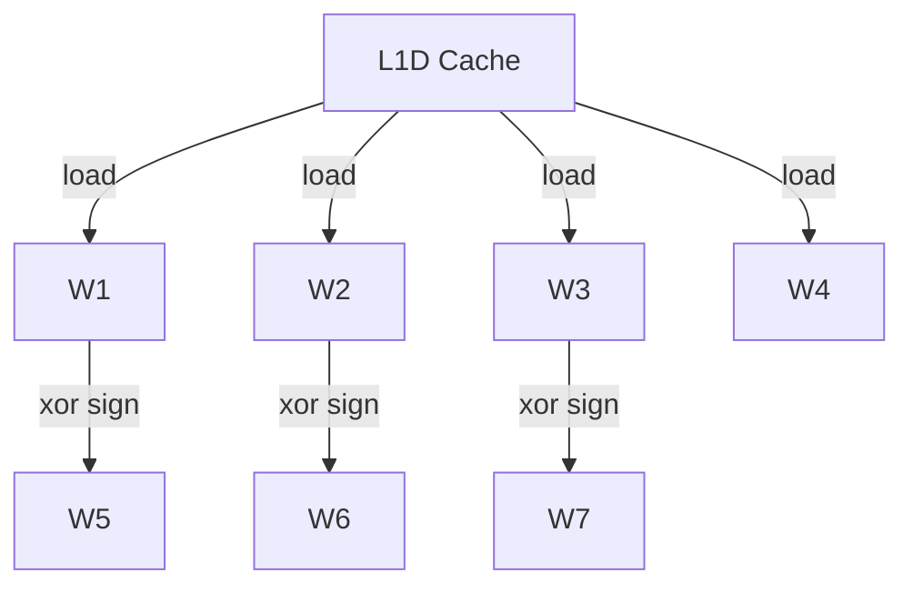
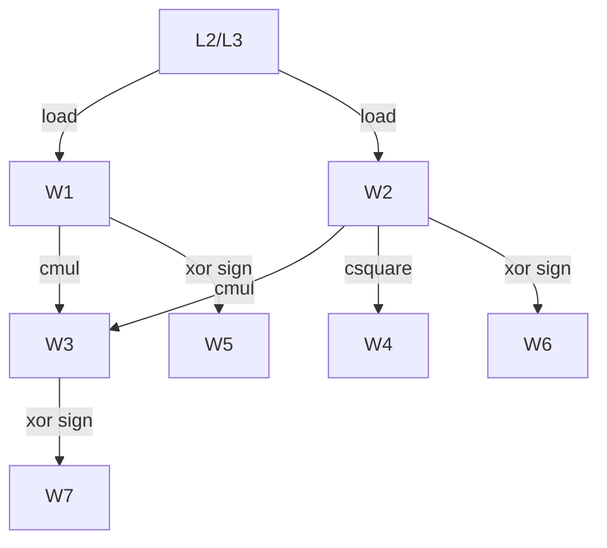
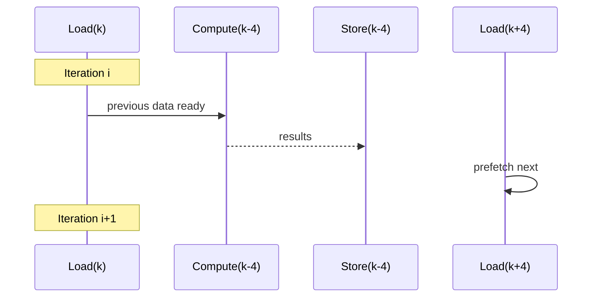

# Hybrid Twiddle System for Radix‑8 AVX2 FFT – Engineering Report

> Production kernel: **Radix‑8, AVX2/FMA, SoA doubles**, hybrid blocked twiddles, U=2 stage pipeline, adaptive NT stores, prefetch tuning.

---

## Table of Contents
1. [Motivation & Overview](#motivation--overview)
2. [Architectural Context](#architectural-context)
3. [Hybrid Twiddle Strategy](#hybrid-twiddle-strategy)
   - [BLOCKED4: K ≤ 256](#blocked4-k--256)
   - [BLOCKED2: K > 256](#blocked2-k--256)
4. [Bandwidth & Arithmetic Cost](#bandwidth--arithmetic-cost)
5. [Pipeline Design (U=2)](#pipeline-design-u2)
6. [Memory, Caches & Prefetch](#memory-caches--prefetch)
7. [Numerical Accuracy & Drift](#numerical-accuracy--drift)
8. [FTZ/DAZ: Denormals Handling](#ftzdaz-denormals-handling)
9. [Twiddle Walking + Periodic Refresh](#twiddle-walking--periodic-refresh)
10. [API & Alignment Contracts](#api--alignment-contracts)
11. [Validation Matrix](#validation-matrix)
12. [Reference Pseudocode](#reference-pseudocode)
13. [A/B Bench Plan](#ab-bench-plan)
14. [FAQ & Notes](#faq--notes)

---

## Motivation & Overview
Modern FFT kernels on x86 are frequently **bandwidth‑limited** at larger sizes and **compute‑limited** at smaller, cache‑resident sizes. The *hybrid twiddle system* reduces memory traffic without compromising maintainability:

- **BLOCKED4 (K ≤ 256)**: load 4 twiddle blocks (W1..W4), derive W5..W7 via sign flips (free). Optimize for **compute throughput** while twiddles remain in **L1D**.
- **BLOCKED2 (K > 256)**: load 2 twiddle blocks (W1, W2), derive W3=W1×W2, W4=W2² (FMA), W5..W7 via sign. Optimize for **bandwidth** when twiddles stream from **L2/L3/DRAM**.

**Result:** substantial twiddle **bandwidth savings** (≈43% in BLOCKED4, **≈71%** in BLOCKED2) at the cost of a handful of FMAs—cheap on AVX2.

---

## Architectural Context

```mermaid
flowchart LR
  A[Inputs (SoA re/im)] --> B[Stage twiddle application]
  B --> C[Radix-4 core ×2]
  C --> D[W8 post-rotations]
  D --> E[Outputs (SoA re/im)]

  subgraph Twiddles
    T1[W1]:::tw
    T2[W2]:::tw
    T3[W3]:::tw
    T4[W4]:::tw
    T5[W5=-W1]:::tw
    T6[W6=-W2]:::tw
    T7[W7=-W3]:::tw
  end

  classDef tw fill:#eef,stroke:#88a
```

- **Data layout**: Structure‑of‑Arrays (SoA), doubles, stride `K` between elements of a butterfly lane.
- **Vector width**: AVX2 (`__m256d`) processes 4 doubles/lane; loop steps `k += 4`.
- **Radix‑8** composed of two **radix‑4** cores (even/odd branches) + W8 rotations.

---

## Hybrid Twiddle Strategy

### BLOCKED4 (K ≤ 256)
- **Loads**: W1..W4 (4 blocks).
- **Derive**: W5..W7 via sign flips (XOR with −0.0 broadcast).
- **Why**: At K up to 256, 4 complex twiddle blocks × `K` fit in L1D; extra loads for W5..W7 would be wasted bandwidth.

**Pseudo‑diagram**


### BLOCKED2 (K > 256)
- **Loads**: W1, W2 (2 blocks).
- **Derive**: W3 = W1×W2 (cmul), W4 = W2² (csquare), W5..W7 via sign.
- **Why**: For large K, twiddles stream from L2/L3 ⇒ bandwidth dominates; trading ~8 FMAs per `k` for **~71% fewer twiddle bytes** wins.

**Pseudo‑diagram**


---

## Bandwidth & Arithmetic Cost

### Twiddle bytes per `k` (complex = 16 B)

| Mode | Twiddles loaded | Bytes / `k` | Savings vs 7 loads |
|---|---:|---:|---:|
| Naïve | 7 | 7 × 16 = **112 B** | — |
| **BLOCKED4** | 4 | 4 × 16 = **64 B** | **43%** |
| **BLOCKED2** | 2 | 2 × 16 = **32 B** | **71%** |

### Extra arithmetic per `k`

| Term | BLOCKED4 | BLOCKED2 |
|---|---:|---:|
| Derive W3 | 0 | **1 complex mul** |
| Derive W4 | 0 | **1 complex square** (mul + adds) |
| W5..W7 | sign flips | sign flips |
| Total extra | ~0 | ~2 complex mul equivalents (~8 FMAs) |

> On AVX2, these extra FMAs are usually absorbed by available compute headroom, while the bandwidth reduction is significant for large K.

---

## Pipeline Design (U=2)

We process **two 4‑wide butterflies per loop** (`k` and `k+4`) to improve overlap of load/compute/store.



**Key ideas**
- Prefetch **inputs** and **twiddles** for `k+8` while computing `k` and `k+4`.
- Use **NT stores** when the working set exceeds a tunable threshold and outputs are aligned.
- Hoist **W8 constants** and **sign mask** per stage.

---

## Memory, Caches & Prefetch

- **Prefetch distance** (AVX2): default 28 doubles ahead (half of a similar AVX‑512 design). Tune per µarch.
- **What to prefetch**
  - Inputs: `in_[re|im][k + {0..3}*K + dist]` (the first 4 rows provide good coverage).
  - Twiddles: only the blocks you actually load for the current mode (4 for BLOCKED4, 2 for BLOCKED2).
- **NT stores**: enable when `(K*8*2*sizeof(double)) ≥ STREAM_THRESHOLD` and outputs are 32‑byte aligned; `_mm_sfence()` after loops.

---

## Numerical Accuracy & Drift

- **BLOCKED4**: No extra FP multiplications ⇒ accuracy equivalent to table loads.
- **BLOCKED2**: Adds ~2 complex muls per `k` to synthesize W3/W4. FP error is tiny, but *deterministic*.
- **Round‑off impact**: For `double`, unit roundoff ≈ 1.11e‑16; cumulative effect is well below practical thresholds for typical N. Empirically indistinguishable from full-table twiddles for most workloads.

> If extreme accuracy is required at very large N, see [Twiddle Walking + Refresh](#twiddle-walking--periodic-refresh).

---

## FTZ/DAZ: Denormals Handling

- Enable **FTZ** (Flush‑To‑Zero) and **DAZ** (Denormals‑Are‑Zero) around stage invocations to avoid microcode slow‑paths on subnormals.
- Impact: keeps **FMA throughput steady** on tiny tails and silence regions.

```c
#include <xmmintrin.h>
unsigned prev = _mm_getcsr();
_mm_setcsr(prev | _MM_FLUSH_ZERO_ON | _MM_DENORMALS_ZERO_ON);
// run FFT stages
_mm_setcsr(prev);
```

---

## Twiddle Walking + Periodic Refresh

A further optimization for BLOCKED2 where **W1/W2 are walked** via successive multiplications and **refreshed** from tables every *R* steps.

**Pros**: reduces twiddle loads even more (potential +5–10% on large K).  
**Cons**: introduces tiny phase drift between refreshes.

| Refresh Interval R | Extra loads | Extra cmuls | Expected drift |
|---:|---:|---:|---|
| 64 | higher | lower | negligible |
| **128** | low | moderate | negligible |
| **256** | very low | moderate+ | still negligible in double |

> Practical setting: **R = 128..256**. Measure on target CPUs.

---

## API & Alignment Contracts

- Inputs/outputs are **SoA doubles**, 32‑byte aligned.
- `K % 4 == 0` (loop stride matches vector width).
- **No in‑place** operation when NT stores are active (aliasing may corrupt). Either enforce non‑aliasing or provide a slower in‑place path.

---

## Validation Matrix

| Test | Description | Expectation |
|---|---|---|
| Small K | K = 4, 8, 16 | Bit‑exact vs scalar ref (within 1–2 ULP) |
| Boundary | K = 256, 260 | Mode switch correct, no off‑by‑one |
| Large K | K ≥ 8k | BLOCKED2 faster than BLOCKED4; NT stores on |
| Round‑trip | IFFT(FFT(x)) | Max rel. error < 1e−12 |
| Aliasing | in==out | Rejected/asserted or runs slow path |
| FTZ/DAZ | tails near 1e−310 | No throughput collapse |

---

## Reference Pseudocode

### BLOCKED4 stage (conceptual)
```c
for (k = 0; k < K; k += 4) {
  load x0..x7;
  W1..W4 = load_twiddles(k);
  W5..W7 = sign_flip(W1..W3);
  apply_twiddles(x1..x7, W1..W7);
  even = radix4(x0,x2,x4,x6);
  odd  = radix4(x1,x3,x5,x7);
  odd  = apply_W8(odd);
  store butterfly(even, odd);
}
```

### BLOCKED2 stage (conceptual)
```c
for (k = 0; k < K; k += 4) {
  load x0..x7;
  W1, W2 = load_twiddles(k);
  W3 = W1 * W2;   // cmul
  W4 = square(W2);// csquare
  W5..W7 = sign_flip(W1..W3);
  // proceed as BLOCKED4
}
```

---

## A/B Bench Plan

| Case | Mode | Variant | Metrics |
|---|---|---|---|
| A | BLOCKED4 | current | cycles/k, GB/s, RMS err |
| B | BLOCKED2 | current | cycles/k, GB/s, RMS err |
| C | BLOCKED2 | +U=2 loop | ditto |
| D | BLOCKED2 | +twiddle walking (R=256) | ditto |
| E | BLOCKED2 | +walking (R=128) | ditto |

**Methodology**
- Sweep `N` from 1k..1M; pin threads; warm caches; repeat ×30.
- Report median, p10/p90; diff vs. baseline.

---

## FAQ & Notes

- **Why 256 as the cutoff?** 4 twiddle blocks × K × 16 B ≈ 16 KB at K=256 → fits in L1D along with working set; above that, pressure rises and L2 dominates.
- **Is accuracy impacted?** BLOCKED4: no. BLOCKED2: negligible; 2 extra complex muls per `k` add tiny rounding noise.
- **Can we go further?** Yes—enable twiddle walking with periodic refresh, or compress twiddles (float) with on‑the‑fly upcast for some stages (measure!).

---

*End of report.*

